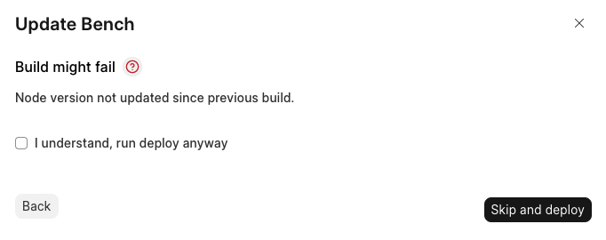
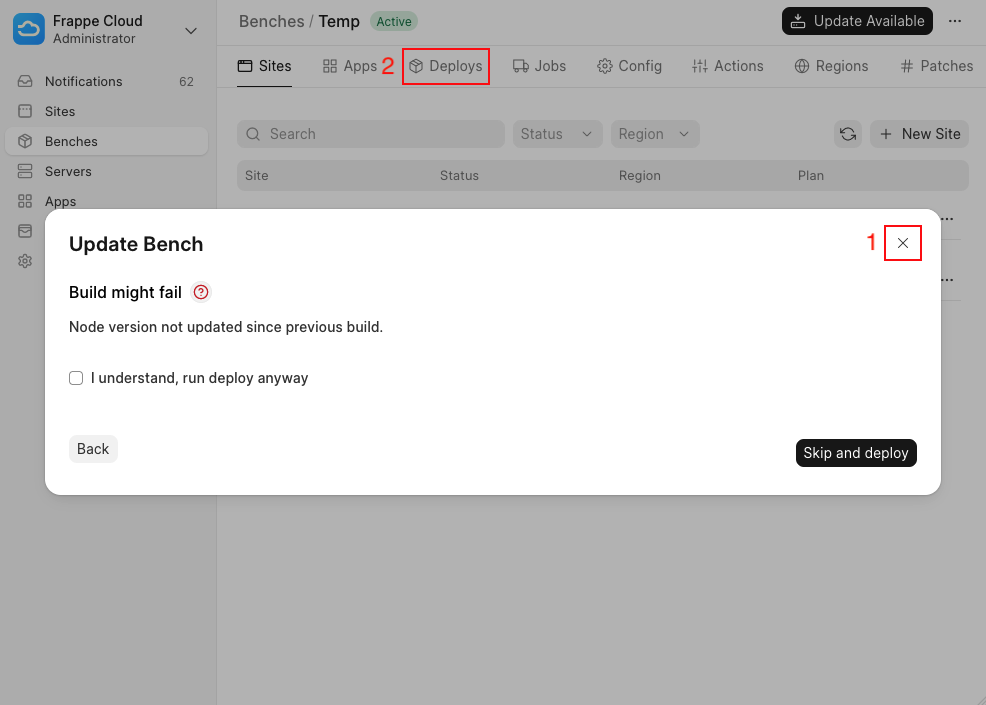
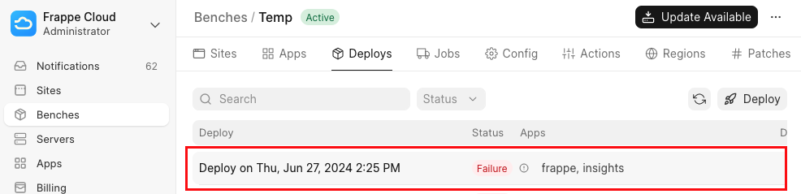
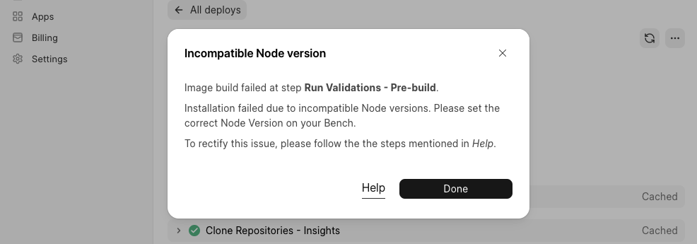

If you have come across a similar Dialog such as the one below while updating your bench group, it means that the underlying reason for why your previous build failed has not been addressed.

  

How to fix this?
----------------

1. First navigate to the Deploys under the current Bench Group:

2. Then click on the last Deploy (which should have the status *Failure* with a "!" next to it):
3. Under the Deploy, notice the red banner and click on the View button:
4. On clicking View, you will see a dialog with details about the failure and how to fix it.
5. Follow the steps in the dialog, or under the linked *Help* article and then retry the update.

  

  

