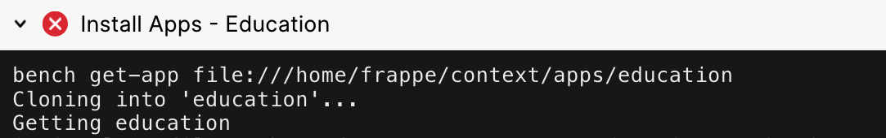

If your deploy has failed at an **Install Apps** step or at the **Run Validations - Pre-build** step, chances are that there is some kind of error in one (or several) of the apps on your bench group.

  


In such a case, retrying the deploy on Frappe Cloud without making any changes will lead to it failing in the same way.


> 💡 First step to prevent repeated failures is to view the error in the failed step's output. If you do not understand the error, you can ask in the [Frappe Cloud Telegram group](https://t.me/frappecloud).
> 
> 

One way to figure out is to try and run the app install locally.


> 🛎️ You can view common issues we come across in the **Common issues in app related build failures** section.
> 
> 

Running app installs locally
----------------------------

To install an app locally:

1. Setup a new bench on your computer.
2. Clone the repository of the app you want to install.
3. Install app using `bench get-app` with the file path.

### Setup a new bench

If you are not familiar with how to setup a bench using `bench init`, you can follow this documentation: [Install and Setup Bench](https://frappeframework.com/docs/user/en/tutorial/install-and-setup-bench). Example:


```
bench init test-install # At /some/path/test-install
```
There are several reasons to setup a new bench, here are a few:

1. Each bench maintains it's own set of Python dependencies.
2. Your main bench might have manually installed dependencies.
3. Your main bench might have manually updated apps.

### Clone the apps repository

Clone the the **specific version** of the app you want to install at a **path outside the new bench** you just setup. Example:


```
git clone https://github.com/org/app --depth 1 /some/path/app
```

> 💡 To try the exact command Frappe Cloud uses to fetch a repository, you can follow [this function](https://github.com/frappe/press/blob/2da6e1b29b9462f653d4890e35ecbb8ec2b41544/press/press/doctype/app_release/app_release.py#L147).
> 
> 

### Install app

Install the app using the path to where you cloned it.


```
bench get-app file:///some/path/app # In /some/path/test-install
```
On doing this `bench` will install your into the **test-install** bench from repository you cloned locally.

### Debug and fix

Now if there are any issues in the apps code, the `get-app` command will fail to complete.

If that does happen you can fix the code in the repository you just cloned (for example, at `/some/path/app`) and try running `bench get-app` in the same bench or a new one.

Common issues in app related build failures
-------------------------------------------


> 💡 To figure out the issue you are facing, be sure to first view the failed step's output.
> 
> 

### Module Not Found Error

The app is trying to import from a module that is not present. The module here can be another Frappe app or a Python dependency. [Reference](https://docs.python.org/3/library/exceptions.html#ModuleNotFoundError).

**To Fix**: If the module is a Python dependency, ensure that it is mentioned in your `requirements.txt` or `pyproject.toml` file. If the module is a Frappe app, ensure that it is installed on your Bench before the failing app.

### Import Error

The app is trying to import a value that is not present in that module. [Reference](https://docs.python.org/3/library/exceptions.html#ImportError).

**To Fix**: Ensure that you are using the correct version of the dependency from which the value is being imported. Ensure that the value is actually present in the module from which you are importing it.

### Syntax Error

The app has syntax errors. This can occur if your Python version is not new enough, for example using unsupported type annotations. [Reference](https://docs.python.org/3/library/exceptions.html#SyntaxError).

**To Fix**: Ensure that the syntax you are using is supported by the Python version on your Frappe Cloud Bench.

### Could not find a version that satisfies the requirement

The app has specified a dependency version that does not actually exist. [Example](https://stackoverflow.com/questions/44674838/no-matching-distribution-found-for-django).

**To Fix**: Ensure that the version of the dependency mentioned in your `requirements.txt` or `pyproject.toml` file exists and is installable by `pip`.

  


  


  


  


  


