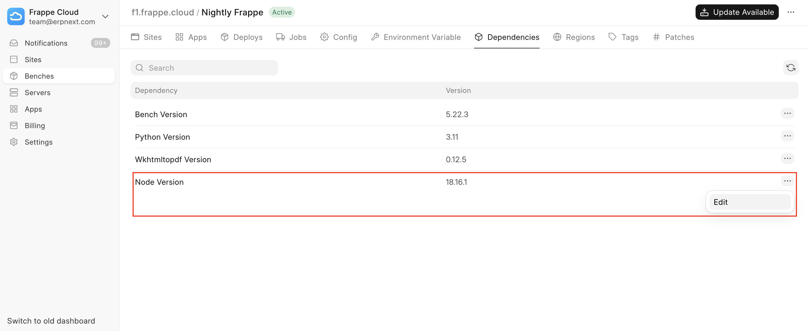
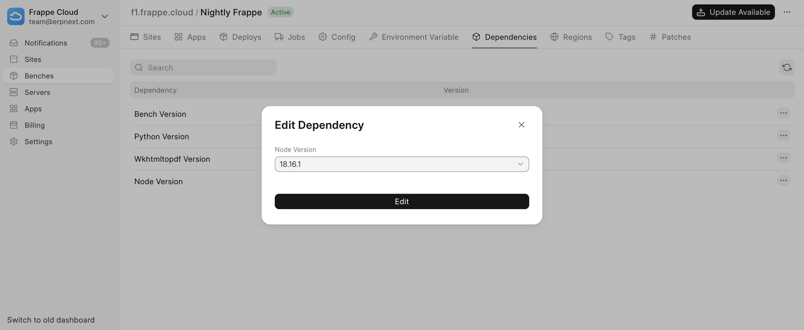

If your Frappe Cloud build is failing with an `***engine "node" is incompatible***` message such as this:


```
$ yarn install
yarn install v1.22.22
[1/5] Validating package.json...
error customization_forms@1.0.0: The engine "node" is incompatible with this module. Expected version ">=18.0.0". Got "16.16.0"
error Found incompatible module.
```
It means that Node version on your bench group is different from what is required by the app.

To fix this issue:

* Navigate to the **Dependencies** tab on your **Bench Group**
* Locate the **Node Version** entry
* Click on **Edit** under the `···` menu button:

  


> ℹ️ **Tip**
> 
> To set a custom dependency version view [this documentation page](https://frappecloud.com/docs/benches/editing-bench-dependency-version#setting-a-custom-version).
> 
> 

You should see an **Edit Dependency** dialog pop up:

  


Select the correct **Node Version,** click on **Edit** to save the setting. Then try updating your Bench Group.


> If your build still does not succeed, raise a support ticket and we'll help you out.
> 
> 

