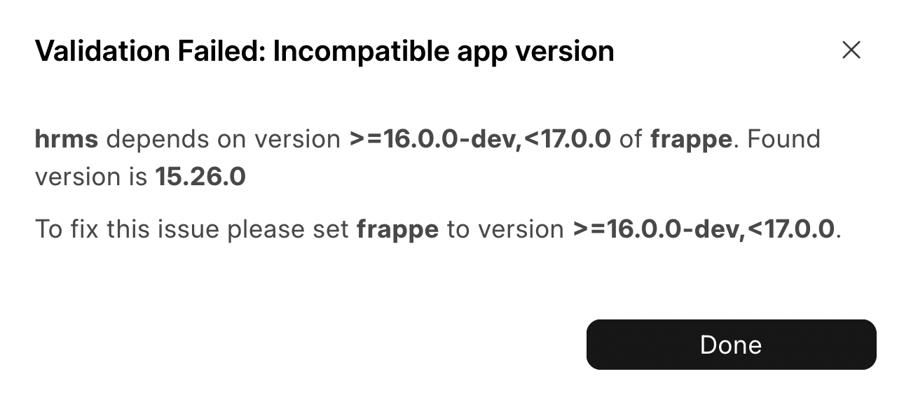
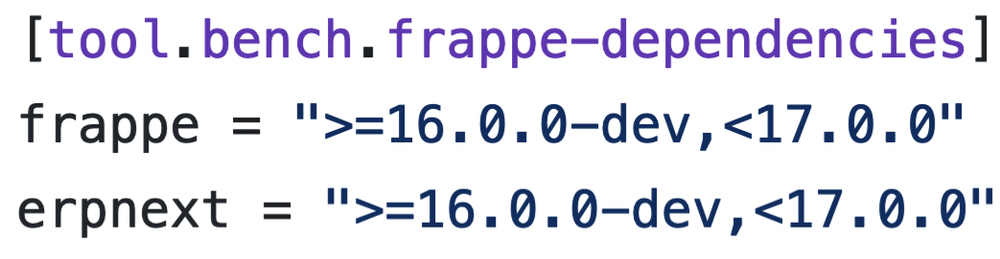
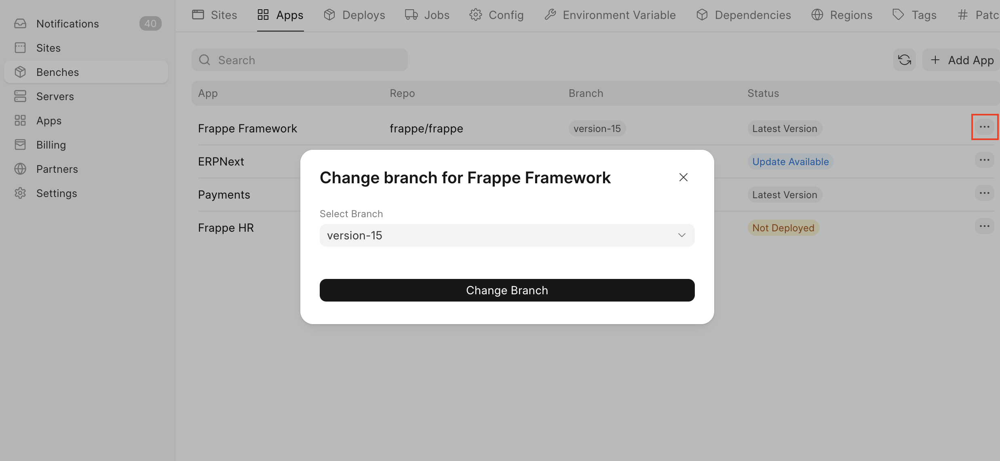
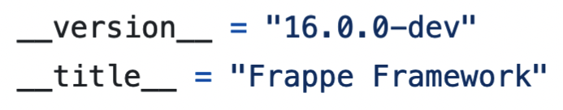

If you have been seeing a message such as this it means that an app on your bench group is not compatible with some other apps.

  

Going forward, I'll use the example of *HRMS*.

*HRMS* depends on *Frappe.* Not just any version of *Frappe,* but a version that satisfies the version (or version range) specified by it. For example: **>=16.0.0-dev,<17.0.0**.

This requirement is mentioned in an apps `pyproject.toml` file. For [example](https://github.com/frappe/hrms/blob/c1704c9767b9c78b23d67cb6b0514afc084cc0dd/pyproject.toml#L69):

  

To fix this, you will have to change to the correct branch**:**

* Navigate to the **Apps** tab on your **Bench Group**
* Locate the app to be updated
* Click on **Change Branch** under the `···` menu button:

  

If you are unsure which branch to change to, you can check the app's version by checking it's `__init__.py` file, [example](https://github.com/frappe/frappe/blob/6fb6c4035cb4bd17e22143f7c483af34a296ca0c/frappe/__init__.py#L52):  

> We change the branch because branches are used to maintain specific versions of an app. In this cause you would change *Frappe* to the `develop` branch, which at the time of writing is on version **16.0.0-dev**
> 
> 

  

