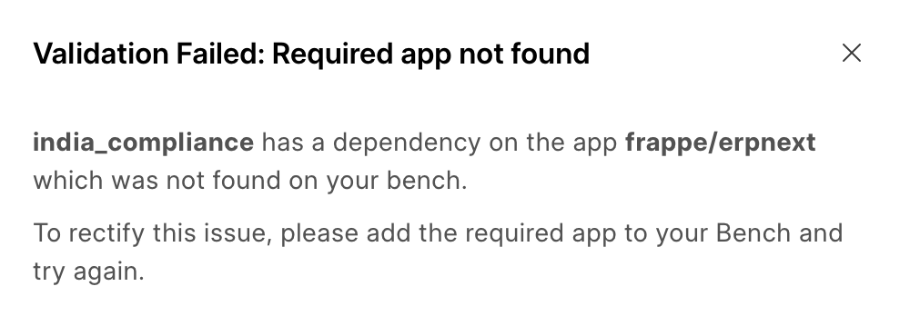
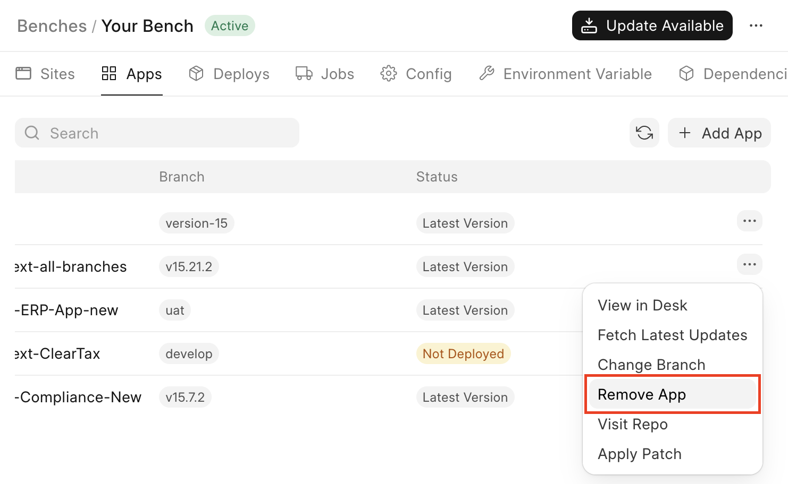
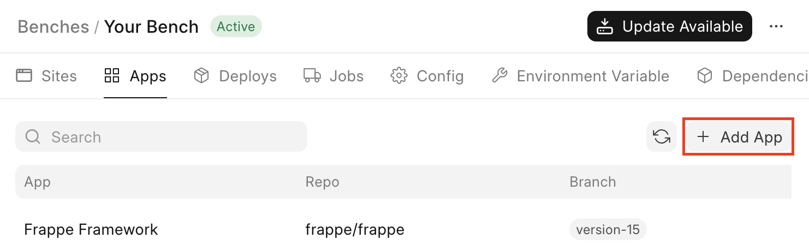

If you have been seeing a message such as this, it means that your bench group is missing a required Frappe app that is a dependency of another app on your bench group.

  

What does this mean?
--------------------

This can mean one of two things:

* The required app is not present on your bench group.
* The app present on your bench group is not from the correct org.

The message that you see might mention the **app** and the **org**. For example, **frappe/erpnext** i.e. `frappe` is the **org** and `erpnext` is the **app**. This means that your bench group should be having ERPNext from [this repository](https://github.com/frappe/erpnext) (frappe/erpnext).

If the message just mentions the **app**, for example **erpnext**, then ERPNext from any repository should do.

How to fix this?
----------------

### App org is incorrect

To fix this, you will have to remove the existing app (with the incorrect org) from your bench group.

To do so, navigate to the **Apps** tab on your bench group, scroll to your app, then click on the `···` menu button and click on **Remove App**:

  

After this is done, you will have to add the correct app. Check the next section (**App is not present**) for this.

### App is not present

To fix this navigate to the **Apps** tab on your bench group and then click on **Add App**:  

after that navigate through the Add App dialog to add the missing app.

> ⚠️ If the org is mentioned in the message above, ensure that the added app's org matches the mentioned one.
> 
> 

Why does this happen?
---------------------

Frappe Framework apps can have dependencies on other Frappe Framework apps, without which they cannot function. For example: HRMS requires ERPNext to be installed to function.

This requirement is mentioned in one of two places:

* An app's `hooks.py` file ([example](https://github.com/frappe/hrms/blob/539cbe9c8a04c11940a0d8b2f9b8710f16182565/hrms/hooks.py#L7))
* An app's `pyproject.toml` file ([example](https://github.com/frappe/hrms/blob/539cbe9c8a04c11940a0d8b2f9b8710f16182565/pyproject.toml#L70))

Using your own version of the dependency
----------------------------------------

If you need to use your own version of the dependency (example `your_org/erpnext` instead of `frappe/erpnext`), you will have to:

1. Fork the dependent app (example fork `your_org/hrms` from `frappe/hrms`)
2. Edit the `hooks.py` and `pyproject.toml` files of the fork
3. Remove dependent app (example `frappe/hrms`) from your bench group
4. Add the forked version (example `your_org/hrms`) to your bench group
