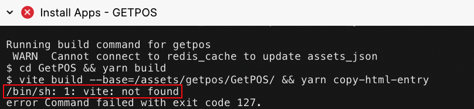
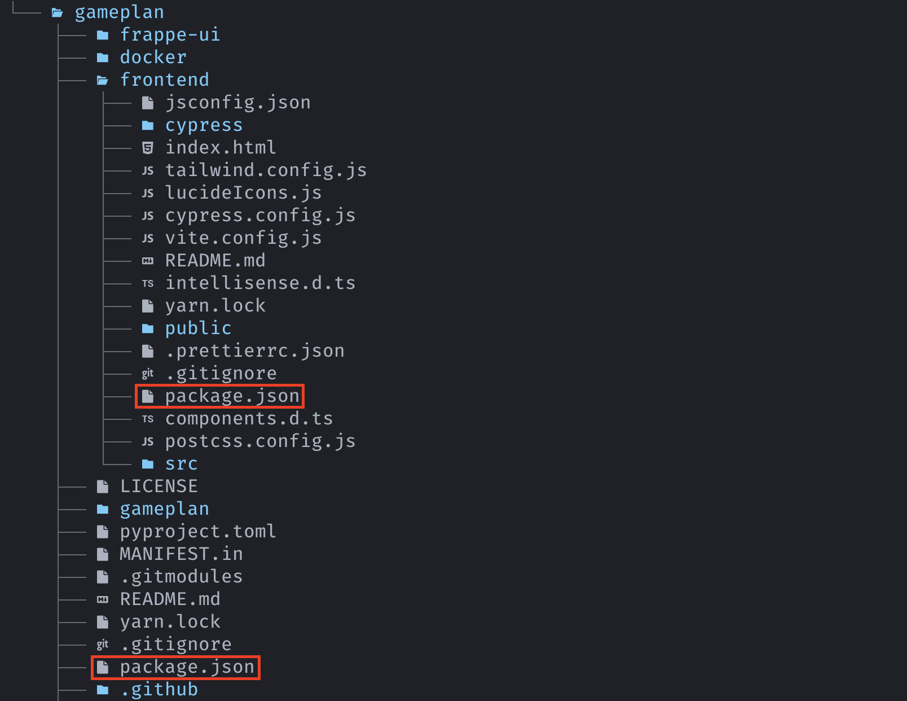

If you build has been failing at the **Install Apps** stage with `vite: not found` in the build output, such as this:

  


Then it means that the `vite` build dependency wasn't installed when your app was being installed.

Why does this happen?
---------------------

This can happen if your project has two `package.json` files such as this ([repository](https://github.com/frappe/gameplan)):

  


And if the **outer** `package.json` does not have a `postinstall` script that installs packages mentioned in the **inner** `package.json`.

How to fix this?
----------------

Ensure that your **outer** `package.json` has a `postinstall` script with a line similar to this:


```
cd frontend && yarn install
```
Here `frontend` is the folder with the **inner** `package.json`.

You can use [frappe/gameplan](https://github.com/frappe/gameplan/blob/89315d218ba91b8ccbc477930128e57595c8c07a/package.json#L5) as a reference point.

