> [Microsoft Power BI](https://www.microsoft.com/en-us/power-platform/products/power-bi) is an interactive data visualization software product developed by Microsoft with a primary focus on business intelligence (BI).
> 
> 

Step 1: Create Site Database User
---------------------------------

1. You need to first generate a database user for your site. Follow this [documentation](https://frappecloud.com/docs/database-users-and-permission-manager) to create a read-only user.
2. Typically, it takes a few seconds to configure the database user. Once it's complete, click on **View Credential**.

Step 2: Install MariaDB ODBC connector
--------------------------------------

1. Download MariaDB ODBC Connector v3.1.x ([Download link](https://mariadb.com/downloads/connectors/connectors-data-access/odbc-connector)). 

> **Note**: Please avoid installing v3.2.x as it has a [bug](https://community.fabric.microsoft.com/t5/Power-Query/Excel-Power-Query-issue-with-MariaDB-ODBC-driver/m-p/4320893) that causes it to not work with Power BI.
> 
> 

2. Install ODBC Connector.

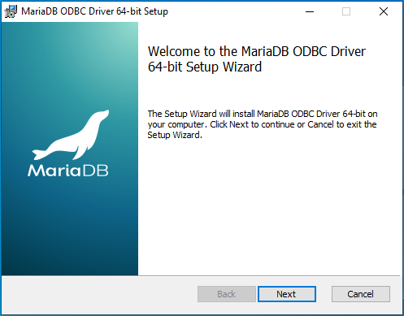  

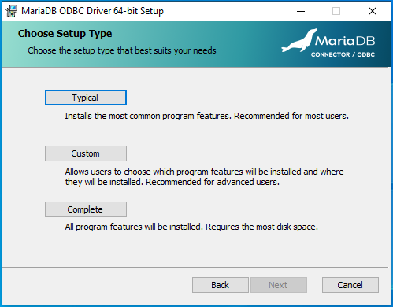  

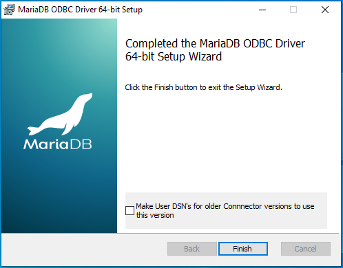

Step 3: Setup Credentials in ODBC
---------------------------------

1. Open **ODBC Data Sources** with **Run as administrator.**

> **Note :** If you have installed ODBC connector of x64 version, then you should open `ODBC Data Sources (64-bit)` and if you have downloaded and installed x32 version, then open `ODBC Data Sources (32-bit)`
> 
> 

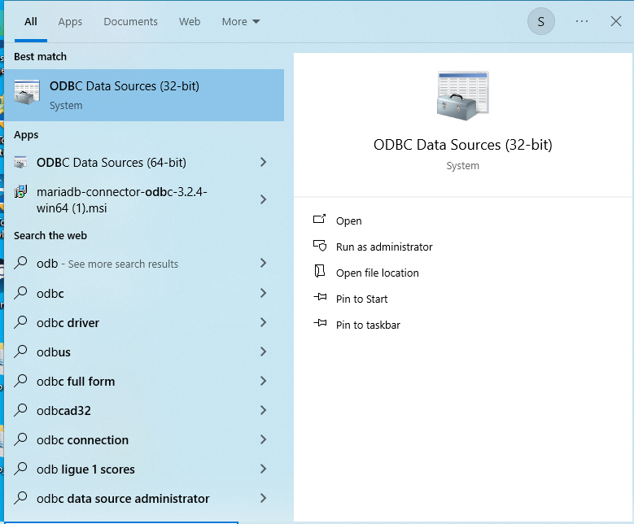
2. Click on **Add** button in **User DSN** tab.

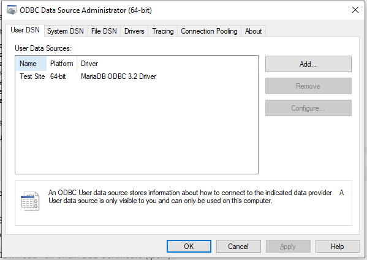
3. Choose **MariaDB ODBC 3.1 Driver**.

4. Put the **Server Name** , **Port**, **Use Name** , **Password**, **Database** in the required fields and go to next page.

> **Note:** Currently If you try to click on **Test DSN**, it will fail. We need to do few more configurations to make it working.
> 
> 

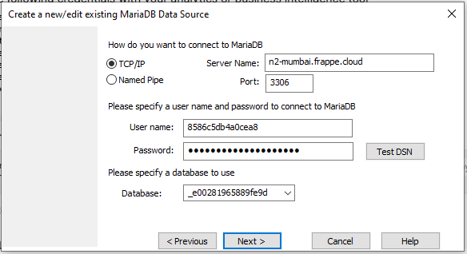
5. No information is needed on the current page. Proceed to the next page.

6. No information is needed on the current page. Proceed to the next page.

7. In current page, make sure to check **Verify Certificate** & **Force TLS Use** checkbox.

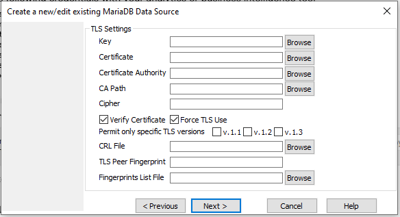
8. No information is needed on the current page. Click on **Finish** to save it.

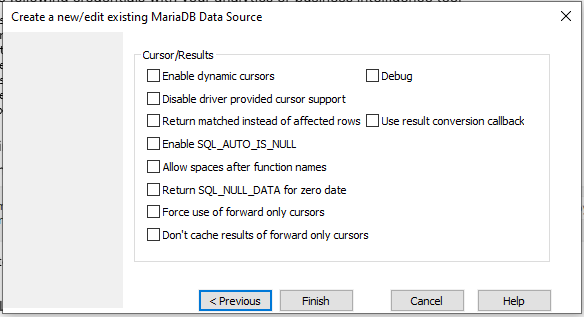

Step 4: Configure MariaDB ODBC In Power BI Desktop
--------------------------------------------------

1. Open Power BI and click on **Get Data From Other Sources**.

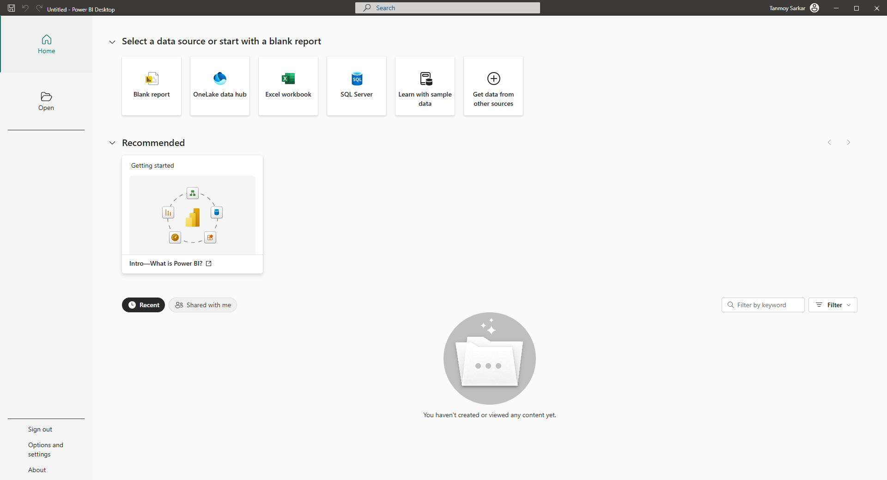
2. Search for **ODBC** and click on **Connect**.

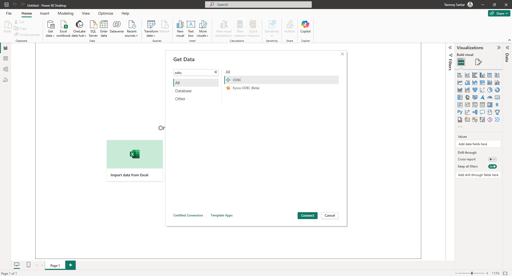
3. Choose the ODBC connection from the list. It should be the same you have created in **ODBC Data Sources Administrator** in **Step 3**.

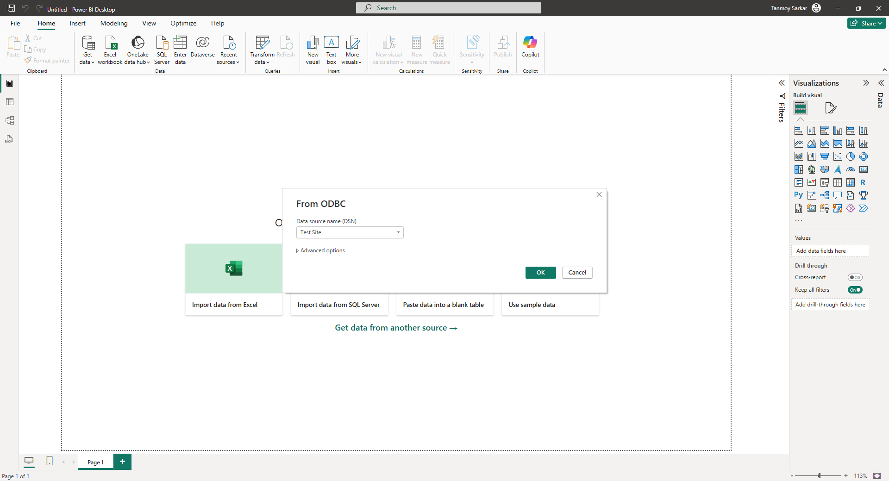
4. Now, it might ask you for username and password. Choose **Windows** from the sidebar and click on **Connect**.

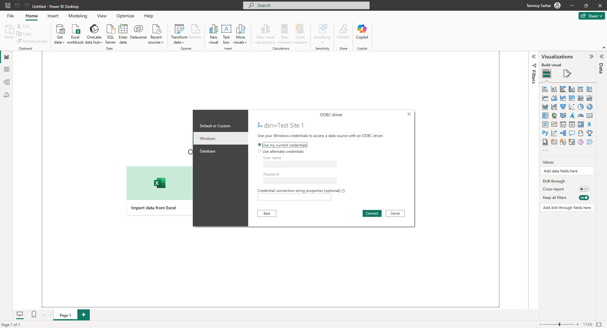
5. Once connected, you will be able to view all the tables and their previews.

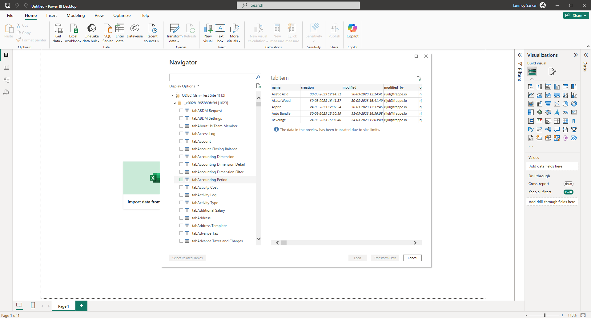
6. Now, follow the [official documentation](https://learn.microsoft.com/en-us/power-bi/) to create dashboards and reports in Power BI.
