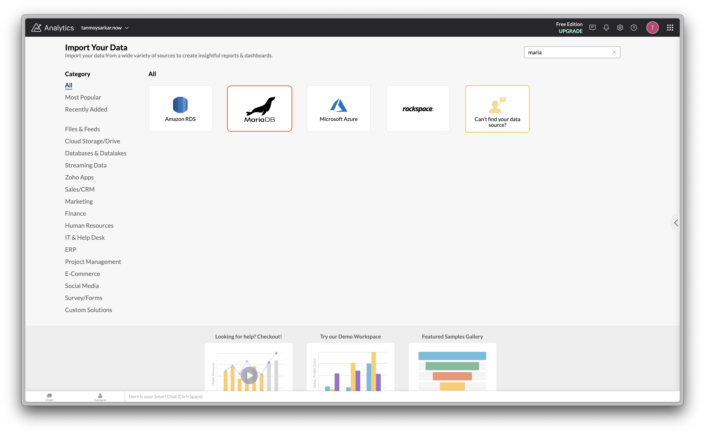
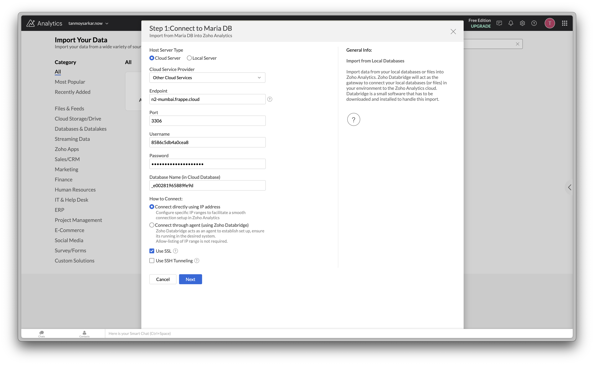
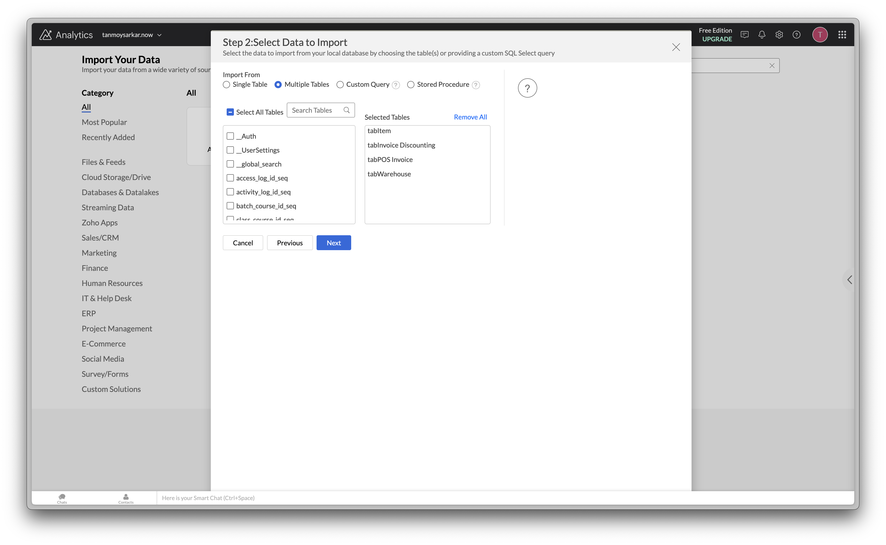
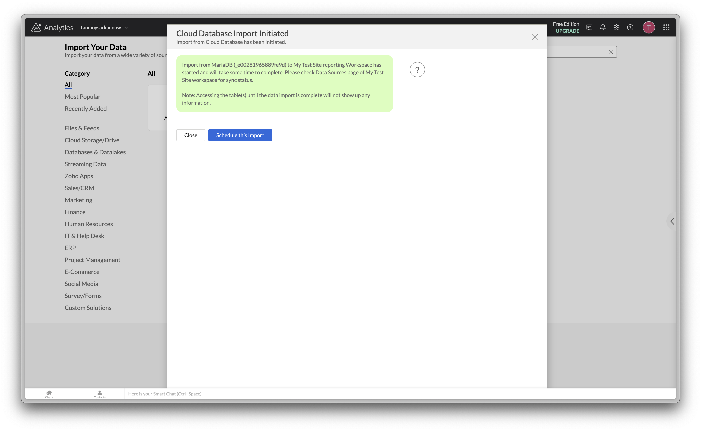
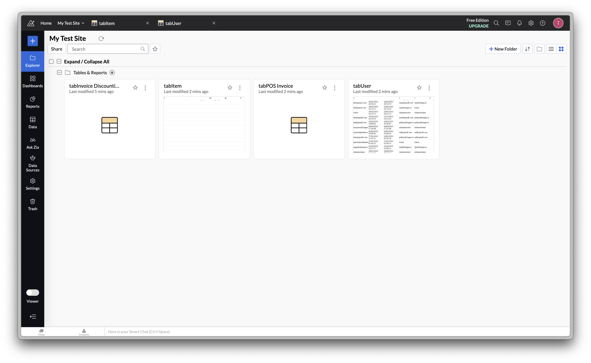

> [Zoho Analytics](https://www.zoho.com/analytics/) is a business intelligence (BI) and analytics platform that helps users analyze data, create reports, and gain insights.
> 
> 

1. You need to first generate a database user for your site. Follow this [documentation](https://frappecloud.com/docs/database-users-and-permission-manager) to create a read-only user.

  

Typically, it takes a few seconds to configure the database user. Once it's complete, click on **View Credential**.

2. Open your Zoho Analytics dashboard and go to **Import Data** page.

Search & Select **MariaDB** from the list**.**  

3. Change **Cloud Service Provider** to **Other Cloud Services** and fill all the required details.   
Make sure to check **SSL** checkbox.

4. Choose the tables to import and Schedule it.

5. You will be able to see the data sources in your dashboard.

6. Now, you can refer to the [Zoho Analytics official documentation](https://www.zoho.com/analytics/help/) to create reports and dashboards.
