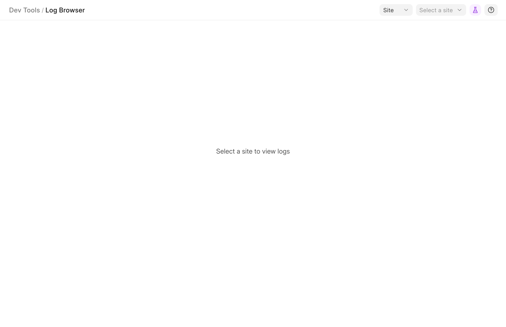
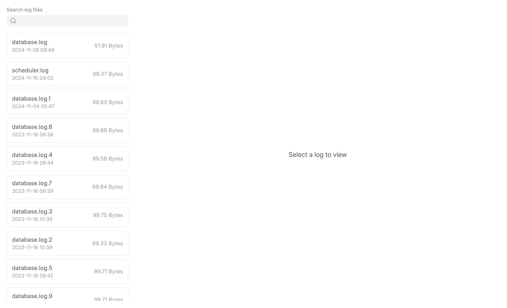
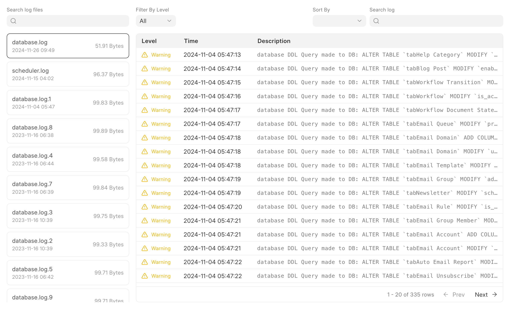

Log Browser is a handy tool to debug what has happened in your site or bench.

There are 2 modes in Log Browser - Site and Bench

In Site mode you can view and browse through the logs generated by a site and in Bench mode you can view and browse through the logs generated by a bench (not a bench group).

### Steps to use the Log Browser

* Select the mode from the dropdown.
* Select the site/bench you want to view logs from the dropdown in the top right corner

* Select the log you want to view from the log list

* Filter, sort and search through the log file as you need

> Currently we don't support merged rotated log files yet.
> 
> 

