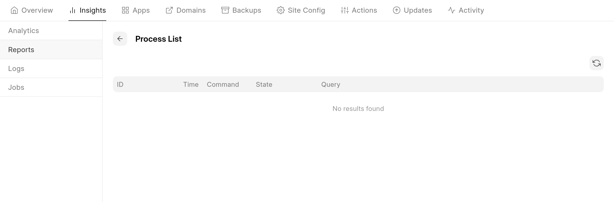

You can view running mariadb queries in your site by opening **Insights** tab, and then **Reports ->**  **Process List Report**

  

  

You'll see running queries in the above page when using your site

