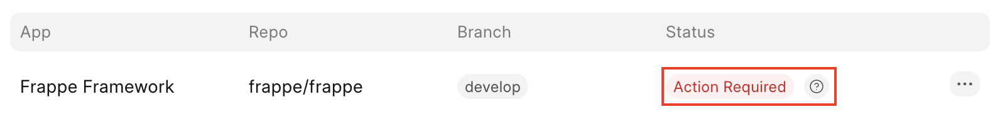
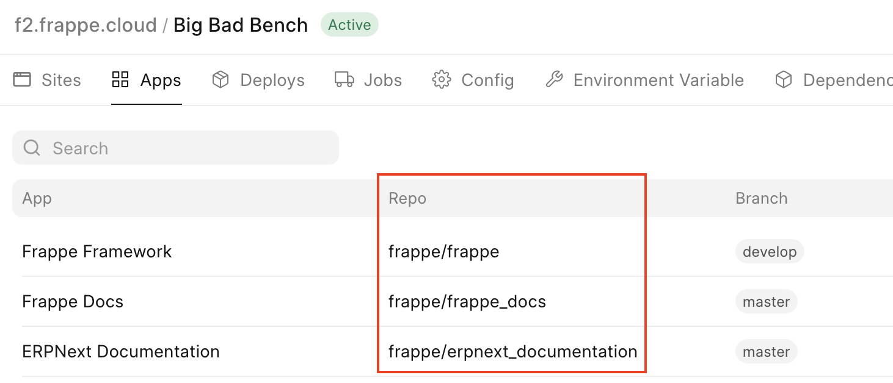
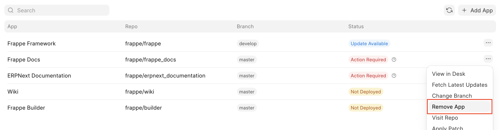
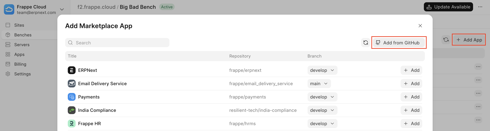
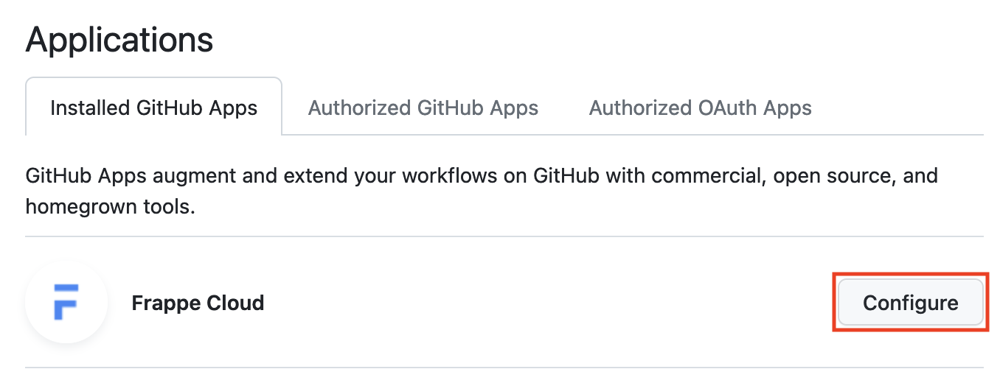
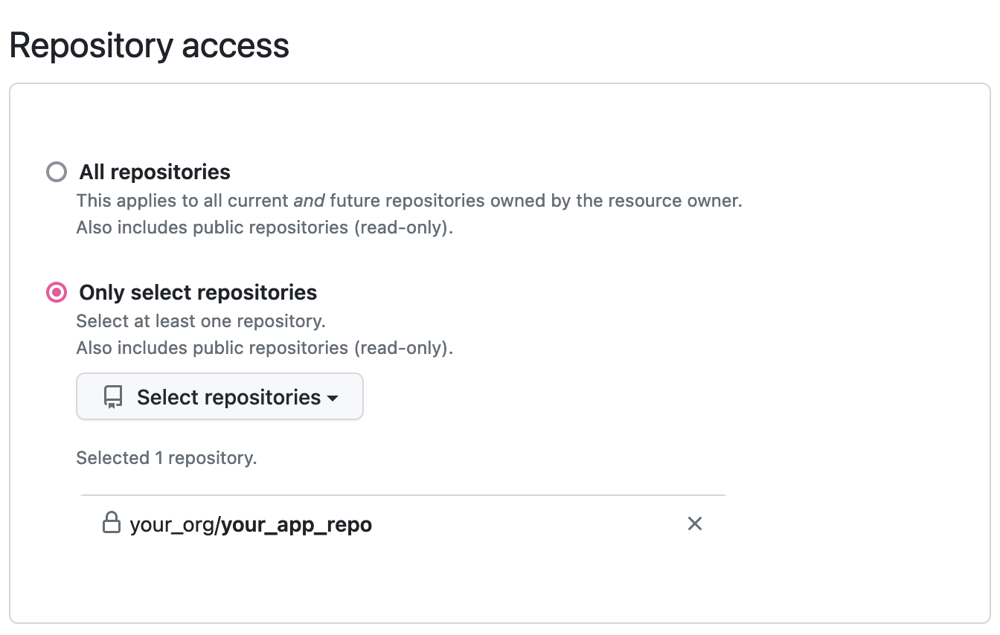
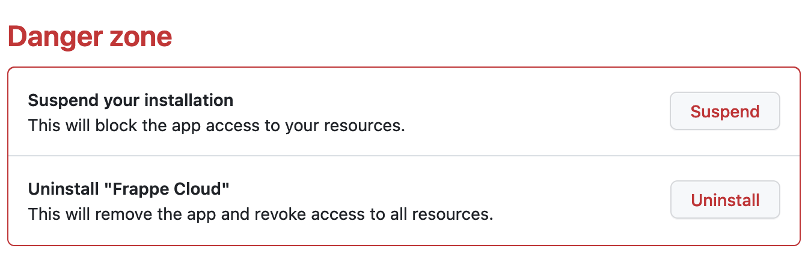
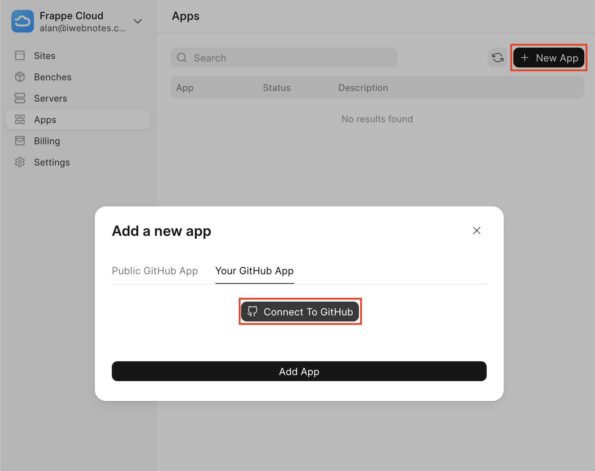
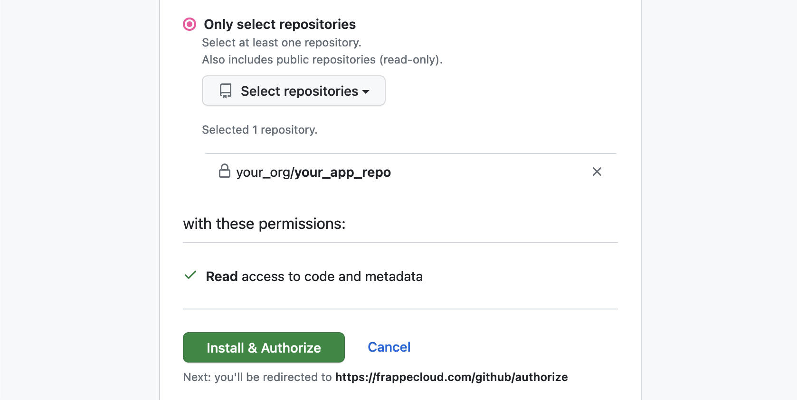

If you have been seeing the *Attention Required* status badge next to your apps:

  

It means that Frappe Cloud could not fetch the source code of your application.

This can be because of multiple reasons, here are two:

1. The **App Installation ID** of your app is missing or is invalid.
2. An **invalid URL** is being used to fetch your app.

Please see the specific sections to find out and fix the cause.

Invalid URL
-----------

To figure out if your app has an invalid URL, navigate to **Apps** under your Bench Group's page and ensure that the *repository path* of your app is correct:

  

The *repository path* could have changed due to a repository rename or other reasons.

If the *repository path* is invalid, you can first remove the App by clicking on the three-dots menu button and selecting **Remove App**:

  

Then re-add it back in by clicking on **Add App** and then **Add from GitHub**:

  

If your App has been re-added in correctly you should not see the *Attention Required* status badge anymore.

App Installation ID issue
-------------------------

If the *repository path* is valid, you might be seeing the *Attention Required* badge because of a missing or invalid **App Installation ID**.

This could be due to one of these reasons:

1. The repository visibility has been changed.
2. Repository access has not been granted to Frappe Cloud.
3. Frappe Cloud has not been added as an app.

  

To help us fix this issue you will have to re-install Frappe Cloud as a GitHub app. To do so, follow these steps:

1. Visit the Installed GitHub Apps page ([link](https://github.com/settings/installations)), and click on configure next to Frappe Cloud:
2. Ensure that your app is present in the list below if you have not checked **All repositories,** if your app is present then move onto step 3.
3. Uninstall Frappe Cloud:
4. Reinstall it by clicking on **Connect To GitHub** from the apps page on Frappe Cloud:
5. Complete the authorization flow:
6. Return to the Installed GitHub Apps page ([link](https://github.com/settings/installations)), and click on configure next to Frappe Cloud as shown in step 1. You will find that your address in your browser will be of the form: `https://github.com/settings/installations/INSTALLATION_ID` keep a note of this `INSTALLATION_ID` (this is the **App Installation ID**)

If you have re-installed the App correctly, **your App Installation ID should be reset on Frappe Cloud within 30** **minutes** of having completed the steps above, and you should not be seeing the *Attention Required* badge anymore.

If you are still seeing the Attention Required badge then p**lease raise a support ticket with us with the following information**:

* **Bench Group name** where the app cannot be installed
* **Repository URL** of the app
* `INSTALLATION_ID` from the URL mentioned above

If you have followed through with the above steps, we'll take care of the rest.

