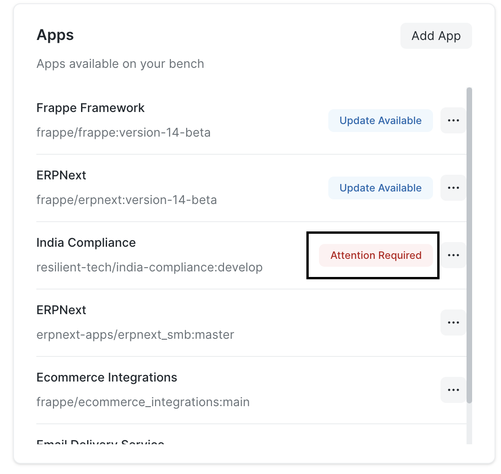
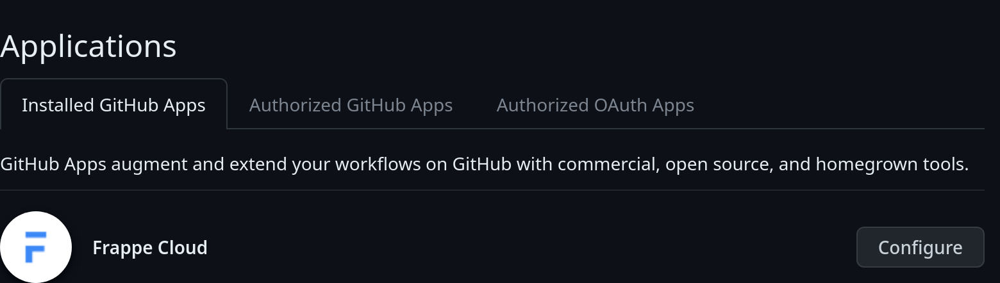
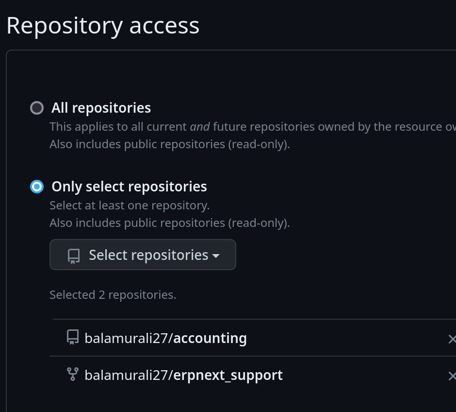
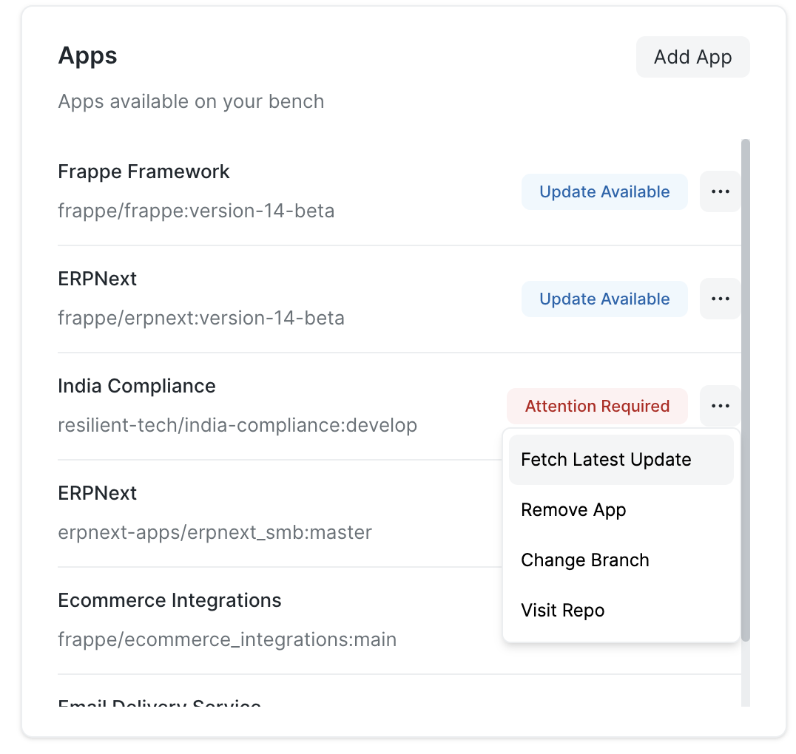
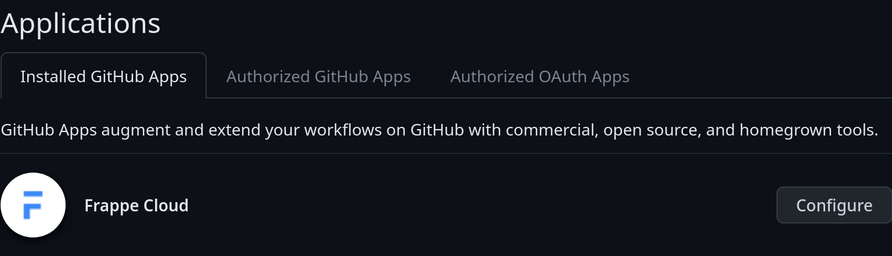

### Why does it show "Attention Required" next to my custom app?

  

This means that we are **not able to fetch the latest updates from the associated GitHub repository** for the app. This happens most probably because the Frappe Cloud GitHub app does not have the permission to access the repository. Please make sure Frappe Cloud app has proper permissions from GitHub settings:

  

  

You can then retry fetching the latest update:

  

### Workaround: Attention required even after trying the above

If you're getting the error even after adding and removing the app on Frappe Cloud, please visit <https://github.com/settings/installations/> and then click the configure button next to the **Frappe Cloud** Github App.

  

It should take you to another page with a URL like `https://github.com/settings/installations/<unique_number>`. Copy this number (or the URL as a whole)

Now, you can raise a support ticket stating the problem (or linking this doc page) with the number you copied so that we can quickly resolve the issue from our end.

### How to add python dependencies to my custom app? Eg: pandas

If you require to install `pandas` or any other python package for that matter, you need to add them in your dependency file rather than doing `pip install pandas`

You can add python dependencies to your app by adding the name of the same in [**pyproject.toml**]( https://pip.pypa.io/en/stable/reference/build-system/pyproject-toml/) file or [**requirements.txt**](https://pip.pypa.io/en/stable/reference/requirements-file-format/) file (only one should be present) present in the root folder of your custom app.

You can check ERPNext's [pyproject.toml](https://github.com/frappe/erpnext/blob/develop/pyproject.toml) for reference

### SSL Ceritificate Verification Error

You may run into this error in your custom app when attempting to connect to an endpoint outside of Frappe Cloud. This tends to happen due to 2 reasons mainly:

1. SSL is not configured correctly on the server you are trying to connect to. It may be not serving the full chain of certificates and hence python's SSL module [cannot validate](https://github.com/python/cpython/issues/62817) the TLS connection. Browsers can however connect to such servers as they implement [AIA](http://www.pkiglobe.org/auth_info_access.html). You can verify this by using online tools like [https://www.ssllabs.com/](https://www.ssllabs.com/). In this case, the server should be correctly configured to serve the full chain of certificates.

1. Python can't use OS certificate store. To resolve this, you can [install](https://frappecloud.com/docs/faq/custom_apps#how-to-add-python-dependencies-to-my-custom-app-eg-pandas) [pip-system-certs](https://pypi.org/project/pip-system-certs/) package in your custom app as suggested in this stackoverflow [thread](https://stackoverflow.com/questions/77442172/ssl-certificate-verify-failed-certificate-verify-failed-unable-to-get-local-is).

