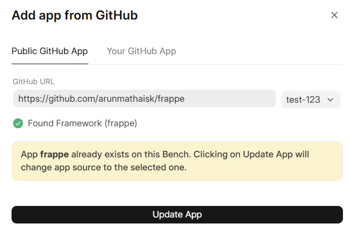

  

You can use your custom version/fork of the vanilla Frappe Framework.

> Note: We do not support modified versions of the framework.
> 
> 

  

You can do so by simply following the add app flow inside your Bench Groups.

  

This will replace the Vanilla Frappe Framework with your custom fork / version.

