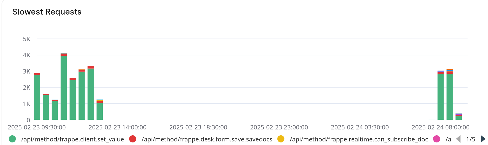
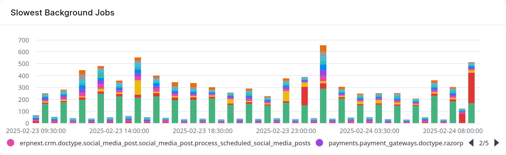
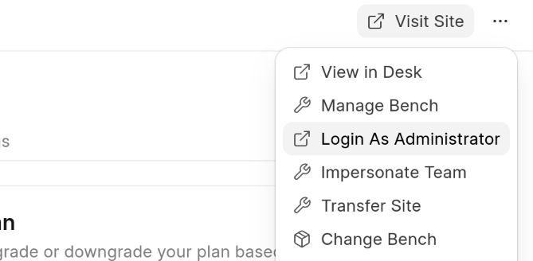
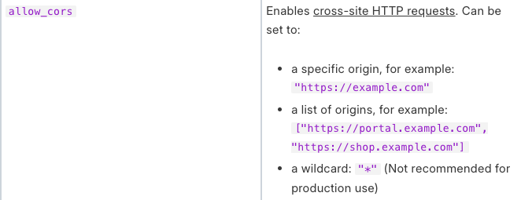
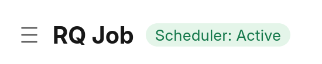
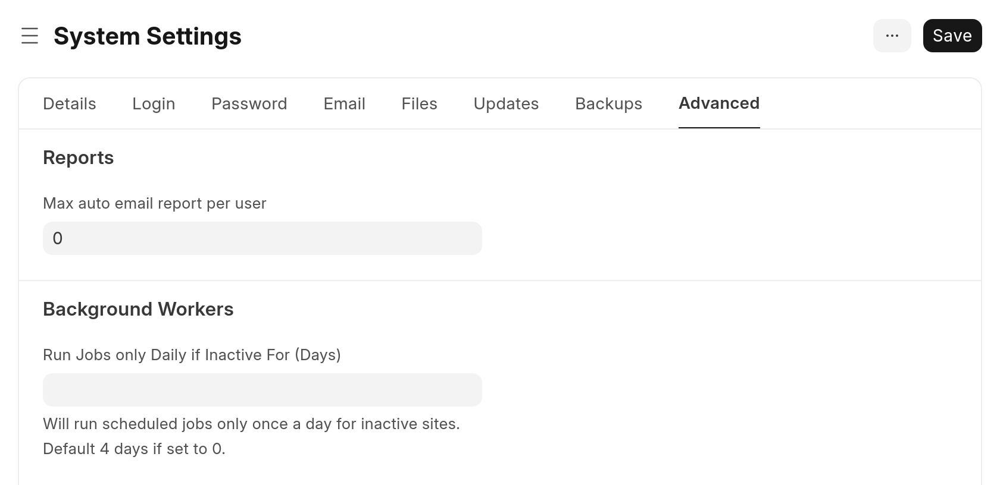
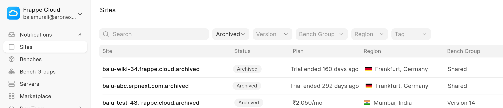
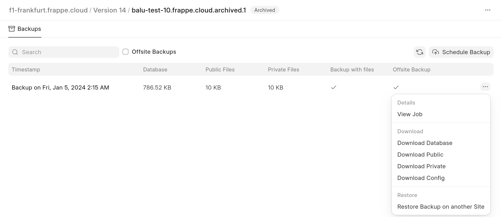

### My site is in **Inactive** state, why is it getting billed?

Both "Active" and "Inactive" sites are billed, you have to drop the site in order to suspend billing.

### My site is suspended, what do I do?

You can pay your pending invoices to unsuspend your site. You can do the same from the billing section in your FC dashboard

### What is using up all my database size?

You can see which tables/doctypes are using most space within your site itself. Search for **Database storage report** in the search bar and you will find report like follows 


#### Clearing logs

More often than not, log tables can take up a lot of space. You can control size of log tables with: [Log Settings](https://docs.erpnext.com/log-settings)


> It may take upto 1-2 hours for the size change to reflect in your Frappe Cloud dashboard
>
>

#### Clearing Comment and Version

It's **NOT RECOMMENDED** to clear these doctypes as they may be used for auditing purposes, but in the case of test sites, you may wish to do so. In such cases, deleting them from the ORM will be counterintuitive as deleting comment will create another comment saying the comment was deleted (lol). In such cases, deleting them from SQL is probably the easiest way.


> Use your own discretion for the above as the application may misbehave
>
>

### What is the difference between Database and Disk space?

When you create data in your site, for e.g., Sales Invoices it will consume database space. When you upload files and images, it will consume disk space.


> You might find database space used on dashboard is higher than your actual database size when you download it on your machine. This is because on Frappecloud it is sum of space consumed by each table and index of each table. Click here to know more about [database indexes](https://www.codecademy.com/article/sql-indexes).
>
>


| Space | Files |
| --- | --- |
| Database | Database + Indexes |
| Disk | Public + Private Files |


### Site Slow: Daily Usage limit reached

This happens when you exceed cpu hours alloted for your site. If you're confused as to how you reached your cpu hours limit, you can check the analytics tab of your site for past 24 hours. Especially, the **Requests Duration By Path** and **Background Job Duration By Path** graphs. This will give you an idea of which endpoints in your site take most time/requests. We can take a look at the following graphs as an example




Here, the red bars are seem to take relatively long and should be looked into.




It is sorted in descending order, so the first endpoints in the list are usually slowest.

### Site Slow: Gateway timeout

This can happen when [web workers](https://frappecloud.com/docs/servers/guidelines-for-choosing-a-server-plan#gunicorn-workers) on your site are all busy with previous requests. This is caused by slow apis. Most of the time these are reports which take too long to run. You can confirm the same from your analytics page by looking at **Slowest Requests** chart as shown above.

Some common endpoints and their meanings are given below


| Endpoint | Meaning |
| -------- | -------- |
| /api/method/frappe.desk.query\_report.run | Reports from **Report** doctype |
| /api/method/frappe.desk.reportview.get | Loading of report or List view of a doctype. In case lot of columns are being fetched with filters on various others, it can get slow depending on [indexes](https://frappecloud.com/docs/faq/mariadb-slow-queries-in-your-site#adding-database-indexes). |
| /api/method/run\_doc\_method | This indicates a whitelisted method in a Document controller is being called |


You can also use frappe's built in [Recorder](https://frappeframework.com/docs/user/en/profiling) in your site to figure out what's wrong. Remember to turn it off once you're done to prevent slowing down your site further.

If the endpoint is not something you can optimize, you can try converting the same into a [background job](https://frappeframework.com/docs/v14/user/en/guides/app-development/running-background-jobs).

If you own a dedicated server, you should also check your [server analytics](https://frappecloud.com/docs/servers/guidelines-for-choosing-a-server-plan) to see if you're reaching CPU limits for either of your servers (Application or Database)

#### Slow reports

if you see `/api/method/frappe.desk.query_report.run` at the top of the list. This is a good indication that you can convert such reports into [Prepared Reports](https://docs.erpnext.com/docs/user/manual/en/prepared-report) so they run in background and allow you to freely use your site.


#### What does "Other" mean in chart

“Other” bucket is attributed to all requests that aren’t the top slowest requests. When “Other” is most prominent, it usually means a specific pattern of endpoint is slow. For example:


Here, the **/custom_app/view/*** endpoint is slow and should be investigated by the developer for the same.

If you don't see a pattern of sorts and "Other" is still the slowest endpoint, then it's likely that the server itself is slow and should be looked into.

### What's causing request timed out error?

If a particular action in your site (not all), say submission of a document takes too long and eventually ends with a **Request Timed Out** popup, it's an application issue assuming normal functioning of the server. In most cases we can't do much other than try [increasing the default http timeout](https://frappecloud.com/docs/benches/bench-config) of 2 minutes of web requests.

Here, the slowness could be in your python application or be due to [slow queries](https://frappecloud.com/docs/faq/mariadb-slow-queries-in-your-site).

If the action you're performing is part of your custom app, we'd suggest you look into try and optimizing the code so that it finishes faster. If you're pressed for time, you may also run the particular action from `bench console` after [ssh](https://frappecloud.com/docs/benches/ssh) as a workaround.

If the action is guaranteed to take long, consider converting the same to a [background job](https://frappeframework.com/docs/v14/user/en/guides/app-development/running-background-jobs).

On the off chance that the app is not part of custom app and all other activities in the site are going smoothly, please reach out to [ERPNext Support](https://erpnext.com/pricing) for help.

### Request Timeout: Server was too busy to process this request

This happens when a SQL query times out due to not getting a lock. This indicates a bug in the application. Some other job may also be acquiring a lock on a related tables hence causing the issue.

### Work-horse terminated unexpectedly; Waitpid returned 9/15 (signal 9/15)

You may see this as the output of **RQ Job** . This happens when a background worker gets killed. Usually by the [OOM Killer](https://linux-mm.org/OOM_Killer) as the result of consuming too much memory. In such cases, you may consider optimizing your code to use less memory. If that is not possible, you'll have to upgrade your **application** server for more memory.

### Destination bench group does not have some of the apps installed

If you're updating site on public bench group and you face this error with respect to a marketplace app, it's because we've removed certain Marketplace apps from Public Bench Groups. They are still valid Marketplace apps, but due to technical difficulties and low usage, they were taken off of public bench groups. Please remove the marketplace app if you are not using it or create a Private Bench Group with the required apps and migrate your site to that Private Bench Group using this [tool](https://frappecloud.com/private-bench/create)

### Database Size increased after moving site to dedicated server

You may notice that after moving your site to dedicated server, the database usage of the server will seem higher than what used to be the database usage of your site. This is because when we consider database usage for dedicated servers, we consider the storage used by the entire server not just the [database](https://mariadb.com/kb/en/understanding-mariadb-architecture/#databases). The difference in size is largely due to the [binary logs](https://mariadb.com/kb/en/overview-of-the-binary-log/) that we collect.

### Row size too large error on migrate

At times, you may see this error upon updating/restoring a site:


```
pymysql.err.OperationalError: (1118, 'Row size too large. The maximum row size for the used table type, not counting BLOBs, is 65535. This includes storage overhead, check the manual. You have to change some columns to TEXT or BLOBs')
```

> TL;DR Convert your custom **Data** fields to **Text**
>
>

This most often happens in core ERPNext doctypes such as Sales Invoice, Stock Entry, etc. and this happens because of **custom fields**. There's nothing wrong with adding custom fields for your use case, but due to [limits placed by **MariaDB**](https://mariadb.com/kb/en/troubleshooting-row-size-too-large-errors-with-innodb/)**,** often times, you'll have to make some changes to the same.

As the error message points out, the way to circumvent this error is to change the datatype to TEXT or BLOB. Now, these are datatypes available in **MariaDB**. In Frappé, these correspond to the following field types:

* Small Text
* Text
* Password
* Attach
* Attach Image

You will want to convert your [**varchar** fields](https://github.com/frappe/frappe/blob/b5f38731779bfb06361d932d6ad27643da39ecac/frappe/database/mariadb/database.py#L158-L191) into one of the above so that they can be stored in [overflow pages in **MariaDB**](https://mariadb.com/kb/en/innodb-dynamic-row-format/#overflow-pages-with-the-dynamic-row-format) as we use the DYNAMIC row format.

### Data truncated for column

Sometimes, during migrate you may stumble upon this error:


```
pymysql.err.DataError: (1265, "Data truncated for column 'custom_column_name' at row 1")
```
This happens when you change the datatype of a field in a doctype. Here, the datatype of column was changed to a "smaller" field. Eg: from `Text` to `Data` . Since `Text` can hold more characters than `Data` there can be the case that there is existing data in the Doctype that cannot fit into `Data` field.

In such case, you should write a patch that retains the necessary data from this field or revert the field datatype change altogether.

Alternatively, you can also manually go find and update such data in your site. Though, you'll have to do this for all such sites. It is better to simply [write a patch](https://frappeframework.com/docs/user/en/database-migrations#writing-a-patch).

### Administrator password not working after restoring site

You can login as administrator to your site directly from your Frappe Cloud dashboard.




If you still wish to obtain the new administrator password set on your site, you may request for the same through our support portal.

### Apps missing after restoring site from backup

You may notice the apps installed in your sites disappear or change after restoring a backup onto the site. This is because restore is a **destructive** operation. Restoring a backup will completely overwrite the database with the contents of the backup. This includes the apps, and the same gets reflected in your Frappe Cloud dashboard.

### Cannot embed site in iframe (blocked by X-Frame-Options)

This should ideally be a feature in the framework itself, but until then you may use the following workaround with a private bench group. You can use the `after_request` hook in `hooks.py` to add a [Content-Security-Policy header](https://developer.mozilla.org/en-US/docs/Web/HTTP/Headers/Content-Security-Policy/frame-ancestors).

Here’s an example.


```
def after_request(response):
   response.headers.extend({"Content-Security-Policy": "frame-ancestors https://<site-name>"}) # where <site-name> is the site where you want to embed your frappe.cloud site in
```
As with any other hook, you’ll need to define it in [hooks.py](http://hooks.py) of your custom app. E.g:


```
after_request = ["custom_app..after_request"]
```
### CORS error when making API requests

If you try to access endpoints of your FC site from another site (or [localhost](http://localhost)) you will run into this error. To allow cross-origin requests to your site, you need to set `allow_cors` in your site config to all the sites from which you need to perform the requests.




ref: <https://frappeframework.com/docs/user/en/basics/site_config>

### Scheduler not running in my site

At times, it may seem that the scheduled jobs in your site aren't running at the specified time. This could be due to a lot of things. You can check the status of scheduler within your site by going to **RQ Job** doctype.


> For v13 and lower, you can view **Open** **Background Jobs** page for the same.
>
>

If scheduler is running, you'll see status like so


You can also check for bench scheduler [process](https://frappecloud.com/docs/benches/process-status) if you have a private bench group.

#### Dormant days setting

You should also check **Run Jobs only Daily if Inactive For (Days)** setting within **System Settings** as well. All your scheduled jobs will run once daily regardless of their specified frequency when no user **logs in** to the site in specified number of days.




### Need 4096 bit https certificate

You may need a 4096 bit tls certificate for some custom app integration. For this, you need to, first, get a [custom domain](https://frappecloud.com/docs/sites/custom-domains). This is because the certificate for the [frappe.cloud](http://frappe.cloud) or [erpnext.com](http://erpnext.com) domains are 2048 bit and is shared by all the sites.

Once you add a custom domain, you can raise a ticket asking to make the same 4096 bit. You can download the public certificate for sharing purposes as seen in [this SO answer](https://stackoverflow.com/questions/65433919/how-to-save-ssl-certificate-by-chrome-and-firefox-on-mac).

### Inbound and Outbound IPs

Often, you may need the IP addresses used by your site for whitelisting or blacklisting reasons.

You can get the same from within your site dashboard under the **Overview** tab.


When your site makes a request to an external endpoint, the endpoint sees the **Outbound IP.** This should be used for whitelisting your site's access to some 3rd party service.

**Inbound IP** is what should be used when adding **A** records to some DNS service. As the requests *to* your site go here first.

### Page Unresponsive

You may obtain an error with a popup with the above title. In this case, it's not an issue with the server, but rather with the client. This most often results due to a memory shortage on the client side; mostly due to some javascript memory leak. To resolve this, you should review your client scripts or the client side code in your custom app.

### How do you get MySQL / MariaDB root password

You don't. You don't need it. If you think you need it to create/delete sites on Frappe Cloud, then you're doing it wrong. You're not supposed to use bench commands to do this. You can use the dashboard to perform these actions.

### Restore dropped site / Site no longer visible

It may be the case that you dropped a site by accident or want to restore an old site. You can do this on your own from your site dashboard by setting the **status** filter to **Archived** to see a list of sites that you've dropped in the past.


> When 2 sites of same name are dropped a numeric suffix is added at the end. So between [abc.frappe.cloud](http://abc.frappe.cloud) and [abc.frappe.cloud](http://abc.frappe.cloud).1 , the latter will be the recently dropped site.
>
>


> If your trial site got dropped, then there is nothing we can do. We don't take backups of trial sites. You will have to start over from a new site.
>
>




Clicking on these will essentially allow you to access the **Backups** tab of your site, from where you can **Restore Backup on another Site** easily


### Outgoing requests blocked

Frappe Cloud imposes no restrictions on outgoing requests. You are free to place requests on whichever ports to whatever endpoints you like. If you do face any issues, please check your endpoint server's request logs and see what's the issue there. Perhaps you need to whitelist your Frappe Cloud [site's ip](https://frappecloud.com/docs/faq/site#inbound-and-outbound-ips)

### An error occurred while installing erpnext

ERPNext can only be installed on a fresh site where the setup wizard is not completed. You can reinstall this site (after saving your data) using: bench --site [sitename] reinstall

You can also reset your site's database to **a** clean state and retry installing the ERPNext app.
To perform this action you can go to your Frappe Cloud site dashboard>Actions>Dangerous Actions>Reset site.

**Note**:- This action will reset your database to a clean state.

### Job taking too long

Sometimes it may seem that a job (most often update site migrate) is taking too long to finish. At this point, it may seem that the job is stuck. In times like this you can have a look at your site's [processlist](https://frappecloud.com/docs/site-process-list) to see what's going on. Often, it is some ALTER query related to some new feature in one of your apps that's taking it's time. Just give it time to finish and you will be fine.

### Change notification email per site

You can change notification email per site from under your **Activity** tab:


### India Compliance credits not correct after restore from backup

After restoring a site from backup, you may notice from your India Compliance account page that the credits shown are not the same as it was on your previous instance. This happens due to a bug. In such case, you can logout and log back in to fix it.

### Allow Changing System Timezone within site

You cannot change timezone under system settings once it's set. However, you may change user timezone under user settings. This will convert time in user's timezone when showing it to the user.

### Increasing the database size availability for shared hosting

Currently, Frappe Cloud does not offer à la carte options. To increase your database capacity, you’ll need to upgrade your site to the next available plan. You can view the pricing [here](https://frappecloud.com/shared-hosting#shared-hosting-pricing). 
Also you can use the [Database Analyzer](https://docs.frappe.io/cloud/database-analyzer) tool to see which tables/doctypes are using the most space within your site itself. More often than not, log tables can take up a lot of space. You can control the size of log tables with: [Log Settings](https://docs.erpnext.com/log-settings).


