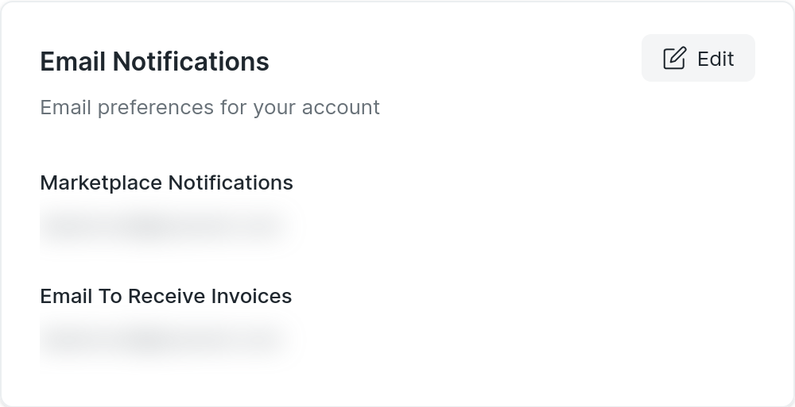
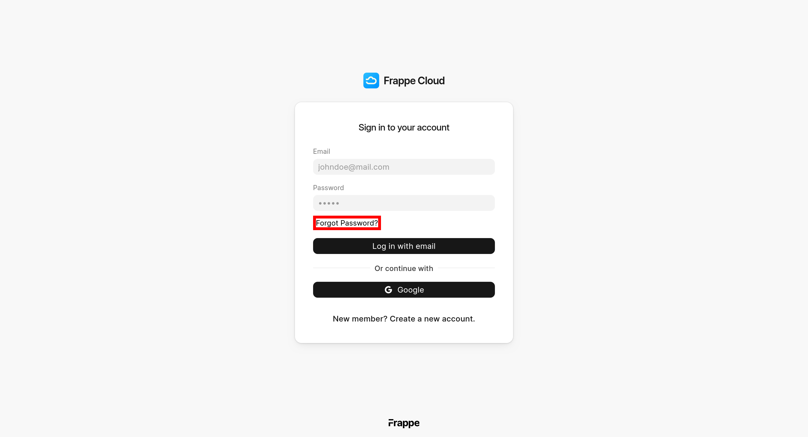

### Is there a User limit?

Sites created with any of the plans do not have any user limit. However, these sites are limited by CPU hours per day. This means if there are a lot of users using the site, the site may slow down if the CPU usage limit is reached. For a detailed explanation read this [blog post on Pricing](https://frappecloud.com/blog/frappe-cloud/frappe-cloud-pricing).

### Internal Server Error in my site

More often than not, this error represents some application related issue. If your site is on custom bench group, then you can investigate the same with [logs](https://frappecloud.com/docs/logs) or [ssh access](https://frappecloud.com/docs/benches/ssh). It is a possibility that your custom app is throwing an error. You can view the same in **web.error.log**. Refer our [docs](https://frappecloud.com/docs/benches/debugging) for the same.

If you occassionally get a pop-up with the same message, it is likely that a background job is failing. In such cases, checking your **Scheduled Job Log, Error Log** and **worker.err.log** file should help.

### Can I change email used for receiving notifications?

Yes, you can do the same from <https://frappecloud.com/dashboard/settings>

  

### Forgot password to Frappe Cloud

If you've forgotten your Frappe Cloud password, you can use the **forgot password** link in the login page to obtain instructions to recover your account

  

### Is there any firewall imposed for outgoing connections

As of now, we do not have any restrictions for outgoing requests.

