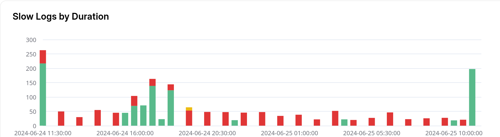
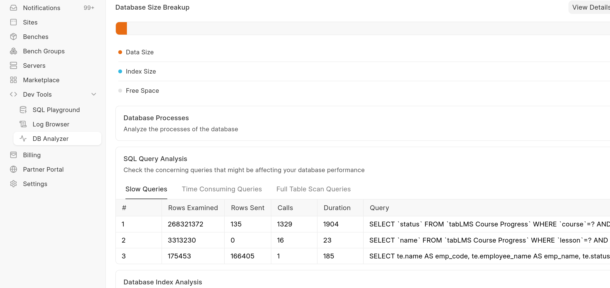

[Slow queries](https://mariadb.com/kb/en/slow-query-log-overview/) take up lots of CPU on your database server. Ideally there should be none.

In the **analytics** tab of your site dashboard, you'll be able to see slow queries (tracked by MariaDB) being run on your site database. These usually mean that the queries can be optimized to improve performance (and reduce CPU usage!)

  


You can also see queries that aren't necessary slow, but frequent enough to increase cpu usage from the **Database Analyser** tab of your site dashboard:

  


> Prerequisites: You need to be on a [private bench](https://frappecloud.com/docs/benches#private-benches) and on Version 14 or higher for the following
> 
> 

### Adding composite database indexes


> Version 15 users can also follow the doc here for easier experience: <https://frappeframework.com/docs/user/en/profiling#query-optimization-using-recorder>
> 
>   
> Version 14 users can also try out this [feature](https://frappecloud.com/docs/performance-tuning) out on Frappe Cloud
> 
> Note: The above feature only adds singular indexes and may be suboptimal. Please try out below steps to add **composite** indexes if it doesn't yield good results.
> 
> 

One of the easier ways to speed up queries is to add indexes to the filtered columns. Usually, adding composite indexes rather than single column indexes is a good idea. MariaDB has an [article](https://mariadb.com/kb/en/compound-composite-indexes/) explaining the same.

You can see existing indexes on your site with:


```
SHOW INDEXES FROM `tab<doctype_name>`;
```
after going to mariadb console with:


```
bench --site <site_name> mariadb
```
In frappe (since v14), it's easy to index columns with the **bench add-database-index** command. Simply find the columns that need indexing and run


```
bench --site <site_name> add-database-index --doctype "<doctype_name>" --column <column_1> --column <column_2> ...
```
This index creates a **Property Setter** document as well, so the changes persist across migrations and restores.


> Note: Adding too many indexes will slow down insertion of records into the table. If you run into any problems, you can remove indexes added by deleting them from the **Property Setter** doctype and running **bench migrate** on your site
> 
> 

### Side effect of coalesce

Use of [COALESCE](https://mariadb.com/kb/en/coalesce/) on an index column and most other functions in mysql tends to not make use of the index and hence slow down the query. If you're writing the query with frappe ORM, you can set `ignore_ifnull=True` in your `get_list` query to remove the COALESCE from the generated query.

If you're running report from report view, you may want to consider writing a [custom report](https://frappeframework.com/docs/user/en/desk/reports/query-report) in SQL by modifying the SQL query (without the COALESCE functions) you got from the slow query reports.

  


