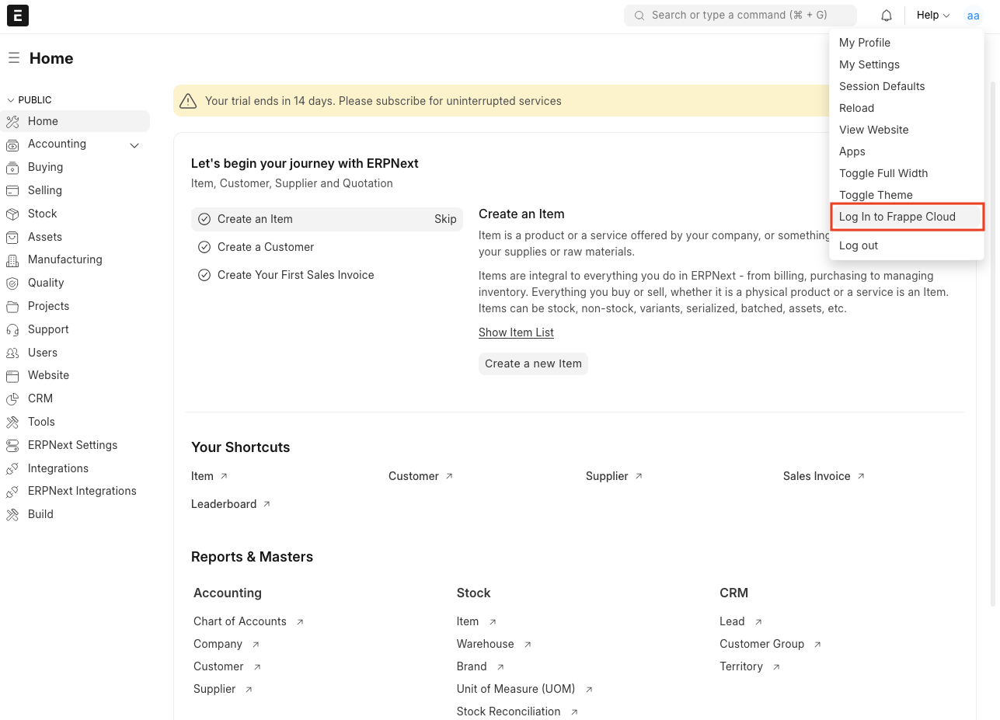
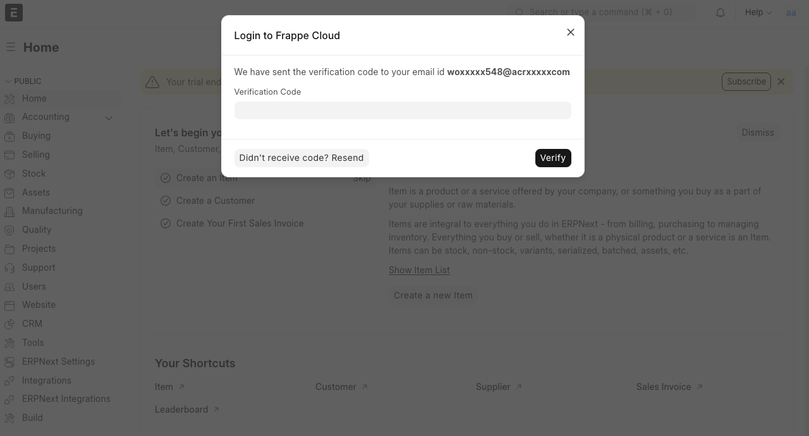
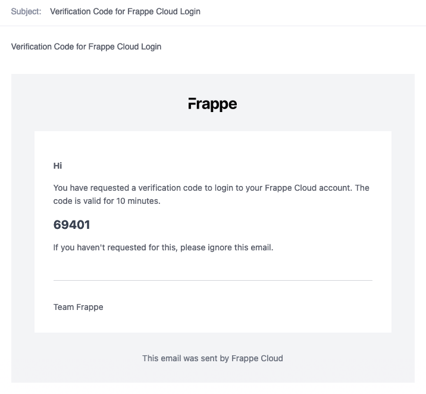
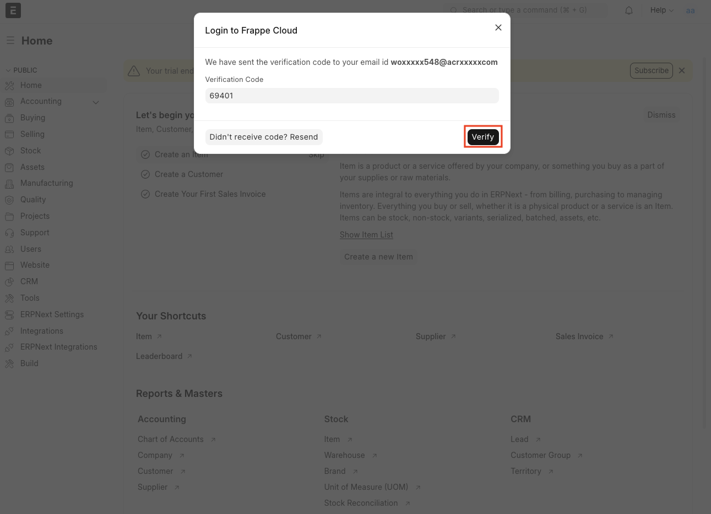
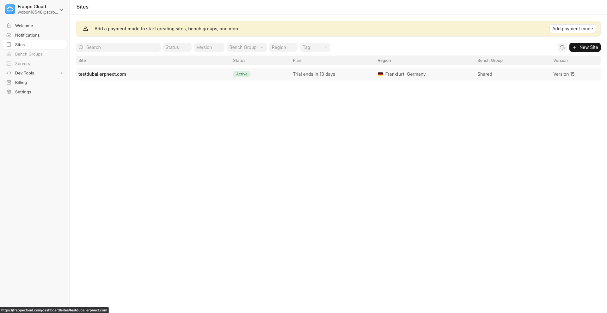
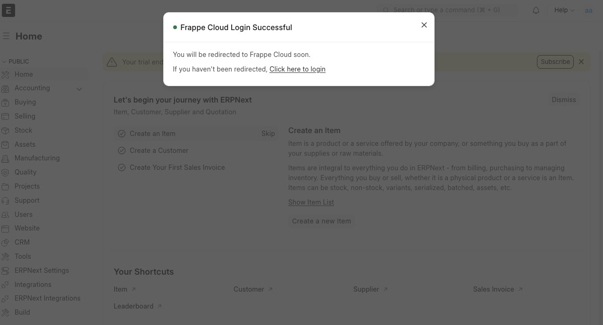
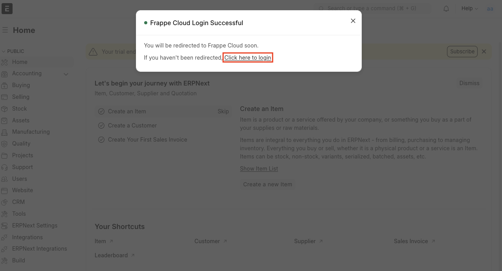
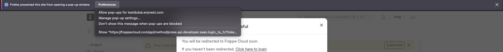

> This feature is only available for sites created through SaaS flow (i.e. [frappecloud.com/erpnext/signup](http://frappecloud.com/erpnext/signup)).
> 
> 

1. Go to desk of your site.
2. Click on `Login to Frappe Cloud` button inside the menu.

3. It will take few seconds to initiate the login request, after that you will be presented a modal like this

4. Check your mailbox. You will recieve an e-mail with a verification code.

5. Put the verification code in input box and click on `Verify`  

6. You should be now logged-in and redirected to Frappe Cloud dashboard

7. You will also get a `Login Successful` banner

  

  

> Sometimes many browser block url redirection. In that case, there are two solutions -
> 
> 
> 	1. Tap on `Click Here to login` link inside the modal.
> 	
> 	
> 	2. Your browser will show a message that popup has been blocked. This message can be vary based on the browser.
> 	
> 	  
> 	
> 	
> 	In case of firefox, you can choose `Show https://....` option.
