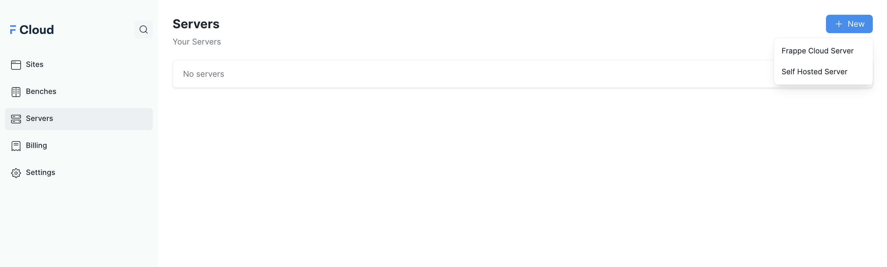
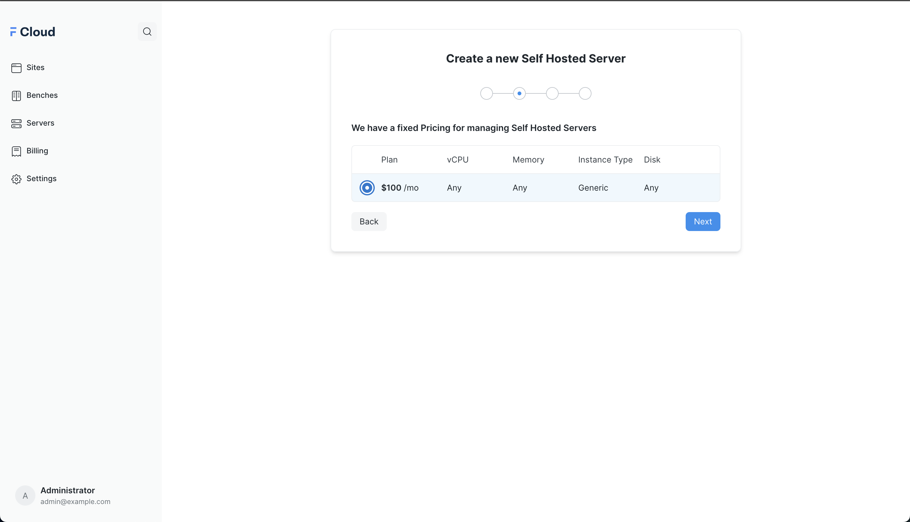
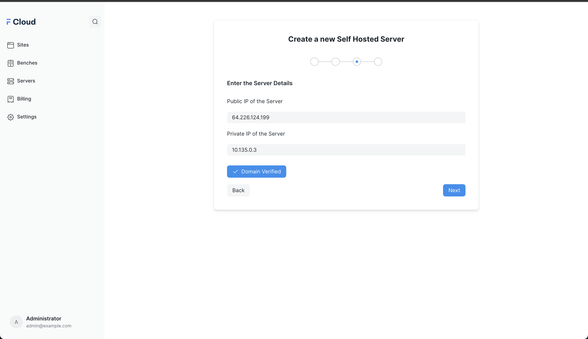
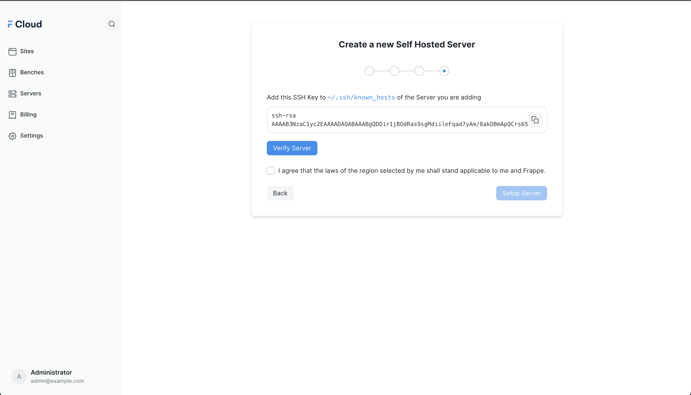
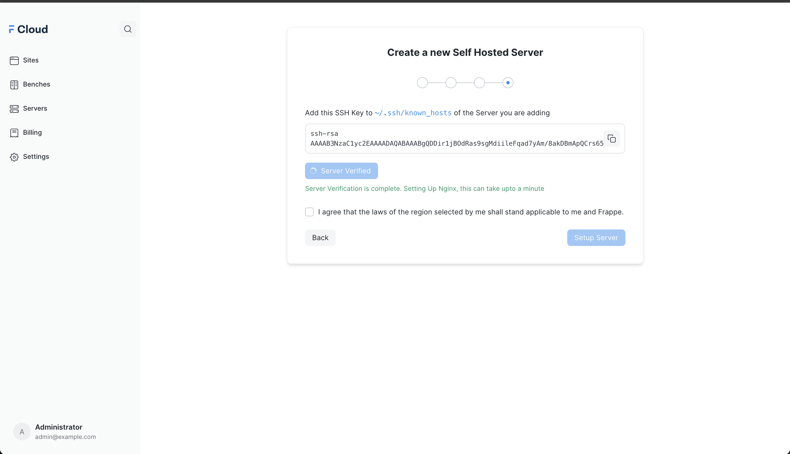
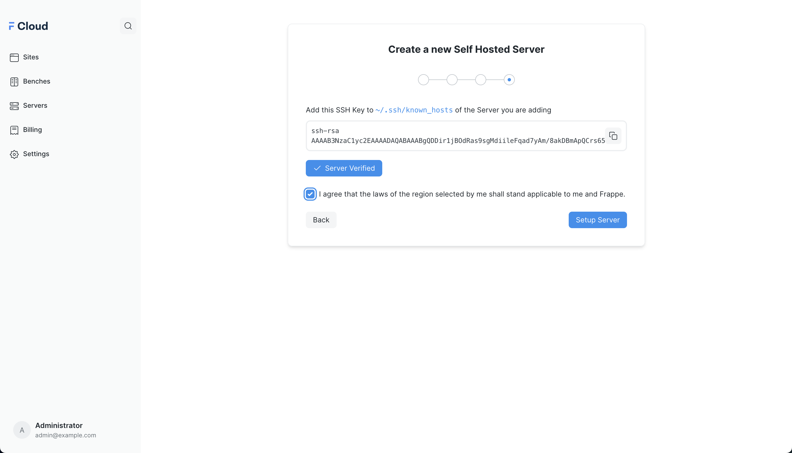
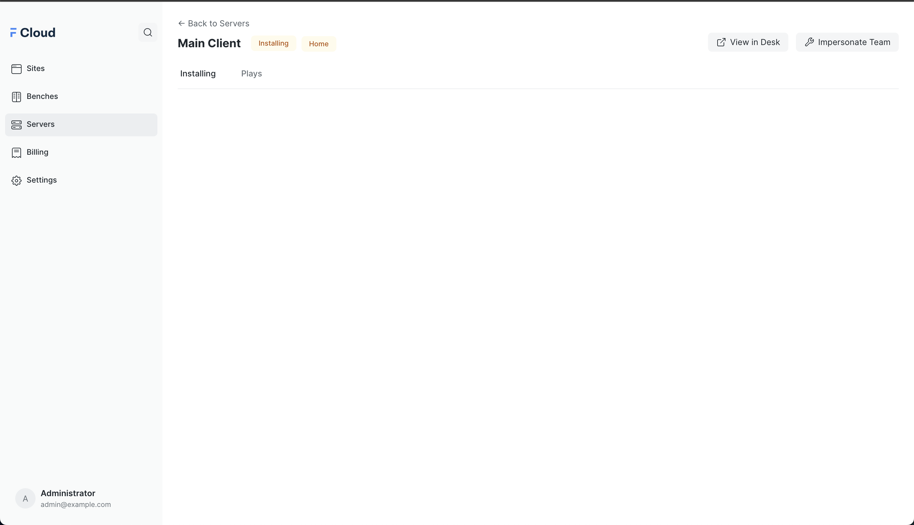
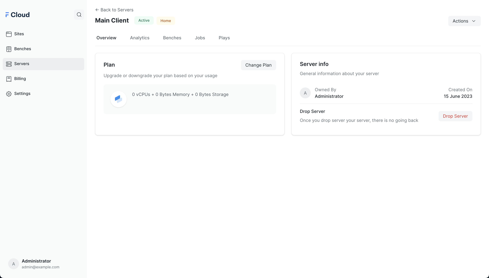

Creating new Self Hosted Server/Hybrid Servers are similar to creating new Frappe Cloud Servers. If you want to enable this feature in your account, please [raise a support ticket](https://frappecloud.com/support).

The flow is a little bit different compared to Frappe Cloud Servers and requires more details on the Servers

Prerequisites
-------------

1. The server must have a Public IP and a Private IP and should be accessible via Public IP
2. The server must have a **subdomain** of the domain pointed to the IP. An `A` record in the DNS is how you can do that, read more about it [here](https://in.godaddy.com/help/add-an-a-record-19238)
3. The server must be running **Ubuntu 20**
4. No other user other than root should be present. If any other user is present, make sure to change the UID and GID of that user from 1000 to 1001 or any other ID. You can read how to do it [here](https://www.cyberciti.biz/faq/linux-change-user-group-uid-gid-for-all-owned-files)
5. Open the 80 and 443 ports
6. The SSH user should be `root` and the SSH Port should be `22`

> The Minimum server specifications to run everything smoothly is 4GB RAM, 50GB Storage and 2vCPU. We suggest you to get servers with the same specifications from https://frappecloud.com/pricing#dedicated
> 
> 

Setup
-----

From the [Servers](https://frappecloud.com/dashboard/servers) tab on the dashboard, click on **New**.

A dropdown with Frappe Cloud Server and Self Hosted Server as options will come up, select the Self Hosted Server option.

  

Provide a Name for your Server and add a subdomain of a URL pointing to the server.

  

Select the Plan of the Hybrid Server Setup. A single plan is available for Hybrid Server. If you have more complex setups/requirements please raise a [support ticket](https://frappecloud.com/support).

  

Once you select the plan, Please enter the Public and Private IP of the server. Once this is done, we will do a DNS verification to verify if the domain is pointed to the IP

  

After the DNS verification is complete, we will be doing an access verification to the Server, this requires you to add the SSH Public specified in the page to the `~/.ssh/authorized_keys` file. You can read on how to do this [here](https://docs.digitalocean.com/products/droplets/how-to/add-ssh-keys/to-existing-droplet/#manually)

  

Once the verification is complete, we will proceed onto adding an Nginx config for generating SSL certificate for the domain.

  

After the verifications are complete, you can go ahead to start the Server Setup.

  

Once the Setup Server button is clicked, you'll be taken to a page which will initially show a "Pending" state but you can reload it after a minute and the status will be changed to "Installing"

  

Here we will be running two Ansible Playbooks for setting up the Database and for Setting up the Server. Once the Ansible Playbooks are complete, the Status will be changed to **Active**

  

Now you will be able to create new bench groups and new sites with this Server. You can read more about the creating new bench groups with the server [here](https://frappecloud.com/docs/servers/new_bench).

> New Sites from Hybrid Servers will be created in the Bangalore region.
> 
> 

