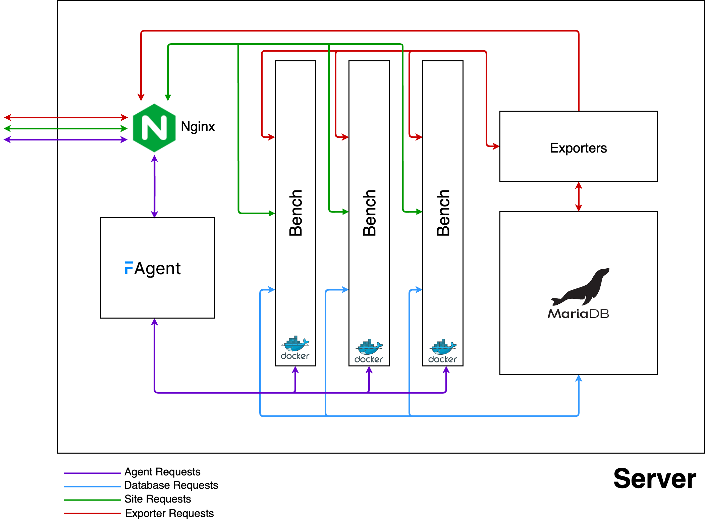

Architecture
------------

This is a simple architecture diagram of a Self Hosted Server/Hybrid Cloud setup with Frappe Cloud

  

  

  

> This image assumes there are 3 benches in the server, thus 3 docker containers. Each bench is a docker container. Multiple Sites can be on the same bench and a bench can have multiple apps in it.
> 
> 

### Request Flows

* **Agent Requests**(Purple) are directly sent to the server. They are http requests and they execute a site operation and once that is finished, sends out a JSON Response directly back to Frappe Cloud
* **Site Requests**: Are channeled to the server via Proxy Server. This Proxy server is currently in Mumbai Region and the Traffic is routed to the end server via an Nginx Proxy. These site requests are handled by the Nginx present in the Self Hosted Server and sent to the Docker container with the site.
* **Exporters**: Collect the monitoring data from the server and notifies the Frappe Cloud team if anything anomalous is happening
* **Database Requests**: These are direct database calls from the sites.

### What will be installed on your machine?

We will installing the basic requirements for running a site with Frappe Cloud. These include

* Docker
* Nginx
* MariaDB
* Agent
* Exporters

We will also be creating a user called `frappe` which will hold all the bench and configurations for the site.

