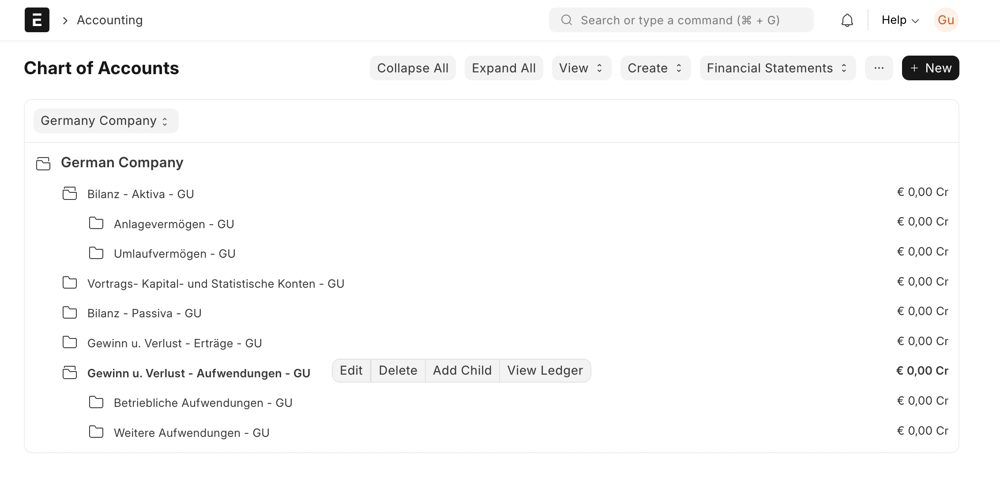
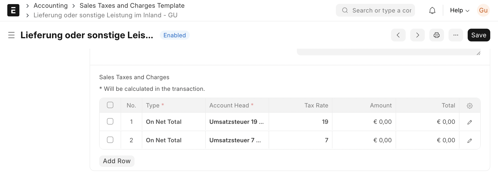
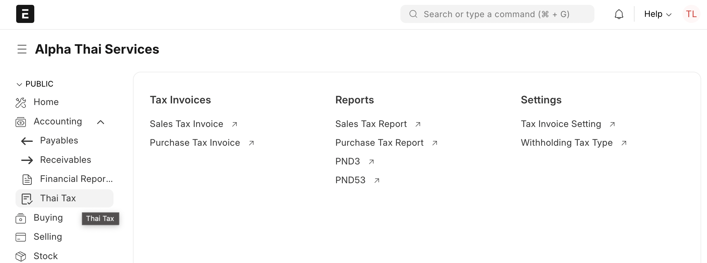
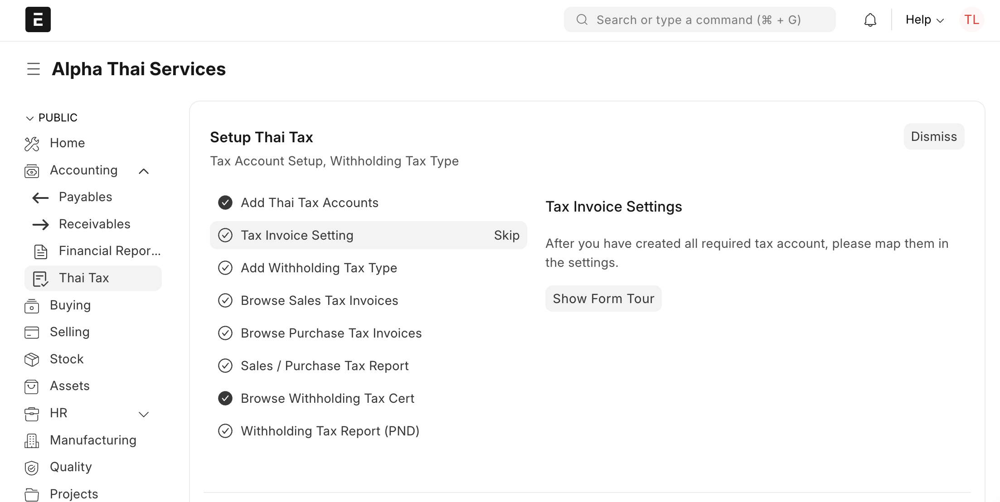

Each country has a statutory tax compliance which businesses need to fulfil. ERPNext has an accounting module that offers core functionalities like maintaining Chart of Accounts, creating tax invoices and collecting payments. Additional feature development is required to ensure these core features are also to handle regional compliances as well. These features can be developed and maintained in a separate Frappe application. For example, [India Compliance](https://frappecloud.com/marketplace/apps/india_compliance) is an application that ensures users can generate e-invoices, e-ways bills and get GST reports as per the statutory compliance of government of India.

Chart of Accounts
-----------------

With ERPNext, you get set of ledgers auto-created in a master called Chart of Accounts. If your country follows a Chart of Accounts that differs from the standard one, you should first have your Chart of Accounts applied over the standard Chart of Accounts. This will ensure the Chart of Account has all the tax accounts required for creating tax masters, which will be eventually applied in the accounting transactions.

You can contribute the regional Chart of Accounts in the core repo of ERPNext, in [this particular folder](https://github.com/frappe/erpnext/tree/develop/erpnext/accounts/doctype/account/chart_of_accounts/verified)

Sales and Purchase Tax Templates
--------------------------------

For the ease of application of taxes in transactions, ERPNext allows you to set Taxes Template in the sales and purchase transactions. If your country requires the application of specific standard account and %, you should have Sales Tax and Purchase Tax templates auto-created for it. This will ensure new users can easily apply taxes in the new invoices, and get invoices compliant to regulations.

Workspace for Regional Taxation
-------------------------------

Your regional compliance application will have several DocTypes like:

* Setting page
* Integrating your ERPNext site with regional tax authorities
* Additional masters and transactions are required for creating compliant invoices
* Link of Reports
* Link of User manual and help videos

We sugest you to create a Workspace or sub-workspace, listing all the additional DocTypes, grouped based on it's context. This will ensure easy accesss of these features to the users. You can also add links here to refer user to help manual and videos.

Onboarding Help
---------------

For the step-wise onboarding, you can create an onboarding as well. For the reference, you can refer to the Onboarding flow created in Thai Taxation app.

Reviewing Process:
------------------

Your regional app will be reviewed from following aspects.

**Technical Review:** This review will ensure that best practises suggested for building a Frappe app is followed. Also, review will ensure that your app doesn't expose a site to security vulnerability.

**Functional Review:** This review will ensure that features built in the app are functionining as expected. Also, it will be include a persoalised session with the app builders to ensure we understand the taxation system in the country, and ensure the features and reports built are fulfill those requirements. If an app already has accredition from the tax authority, it will be helpful in review. If not, we could request community members in your country to use, review and comment on the coverage of the app.

