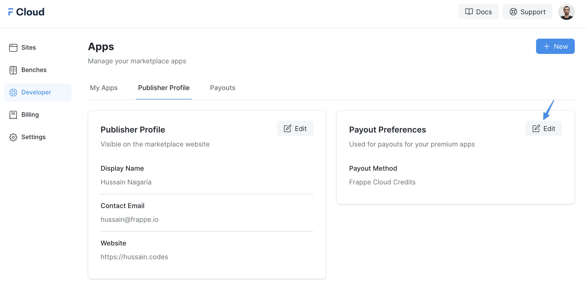
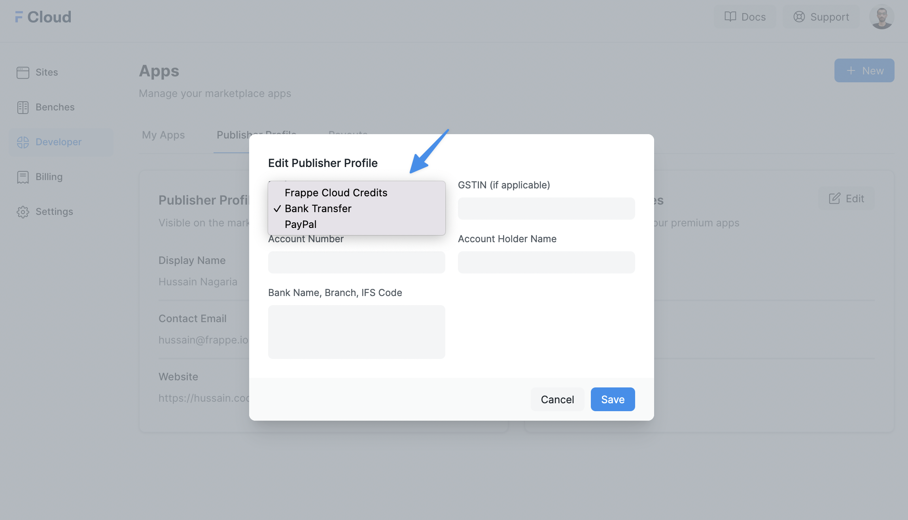
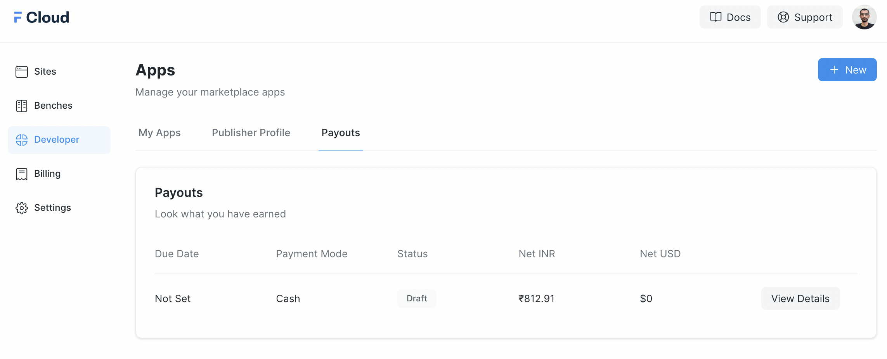

For Marketplace apps that are non-free, we do a payout to the publisher at the **end of every month**. The payout contains all the payments we have collected from the customers over that month.

Setup Payout Preferences
------------------------

If you want to publish a paid app, please visit the **Publisher Profile** page and edit your payout preferences:

  

You can select from one of the following payout methods:

  

> If you are based from outside India, the only option available as of now is Paypal. You need to raise an PayPal invoice at the end of the month.
> 
> 

Payout Orders
-------------

You can visit the **Payouts** page from your Developer dashboard to see the history of payouts with an option to view more details. A payout is in draft mode until the payment is processed from our side:

  

Payout Terms
------------

Frappe Cloud takes the first $500 of the revenue the app makes. After that the payment will be split 80-20, where 80% will go to you and 20% to Frappe Cloud.

> Payout Terms are effective from 1st April 2023.
> 
> 

