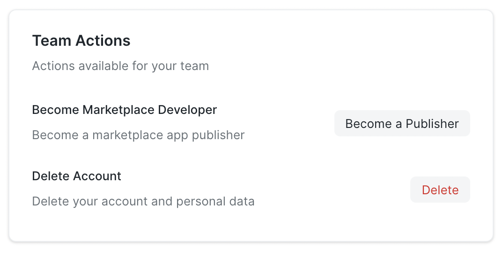

## Marketplace Developer Account

To be able to publish and manage apps on Frappe Cloud Marketplace, you will need to get a marketplace developer account. You can do this by going to the **settings page of your Frappe Cloud dashboard**. Open the `Profile` tab and click on the `Become a Publisher` button:

Once the Developer account is enabled (not to be confused with Developer Mode on Frappe Sites), you will be able to see a new **Marketplace** 
tab on dashboard, as shown below:

## Adding your Frappe App

Just click on the `+ Add App` button and you will see a dialog open with a list of apps that you 
own (you might have added it to your bench group before):

Select the app you want to add to the marketplace or if you want to add an app from GitHub, click on the **Add from GitHub** link.

Clicking on the **Add from GitHub** link will open a new page, where you can authorize and add any of your Frappe Apps from your 
GitHub account. Once your app is validated, you can select the version of Frappe with which your app is compatible and click on 
the `Add to Marketplace` button:

A marketplace app will be created with the selected app and a new page will open where you will be able to manage your 
marketplace app:

> Notice that your app is in `Draft` state. It will be published to marketplace once we approve it from our side.

You should also be able to see your app on the list of apps in **Marketplace** tab:

## Managing the profile of your App

The first tab on the Marketplace App page is the **Overview** tab. Here, you can edit all the details related to your app like App image, descriptions, links etc. which will
be displayed on the marketplace website:

### Details Required for Publishing

Before our team publishes your app on marketplace, the details mentioned on [this](/docs/marketplace/marketpace-guidelines) page must be filled via your app overview page.

## Next Steps

After you have added the marketplace app along with the required details, you need to publish a particular release of your app, which is discussed in detail [here](/docs/marketplace/manage-marketplace-app).

We will approve the release (and the app, if its the first release) and your marketplace app will be live!

> SLA: Apps will be reviewed or published in 10 days time. If your app is still in Draft state after 10 days of adding it to marketplace. Please raise a ticket on [Support Portal](frappecloud.com/support)