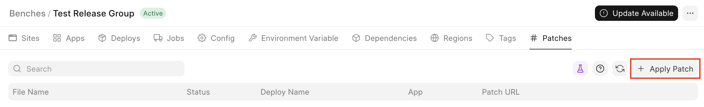
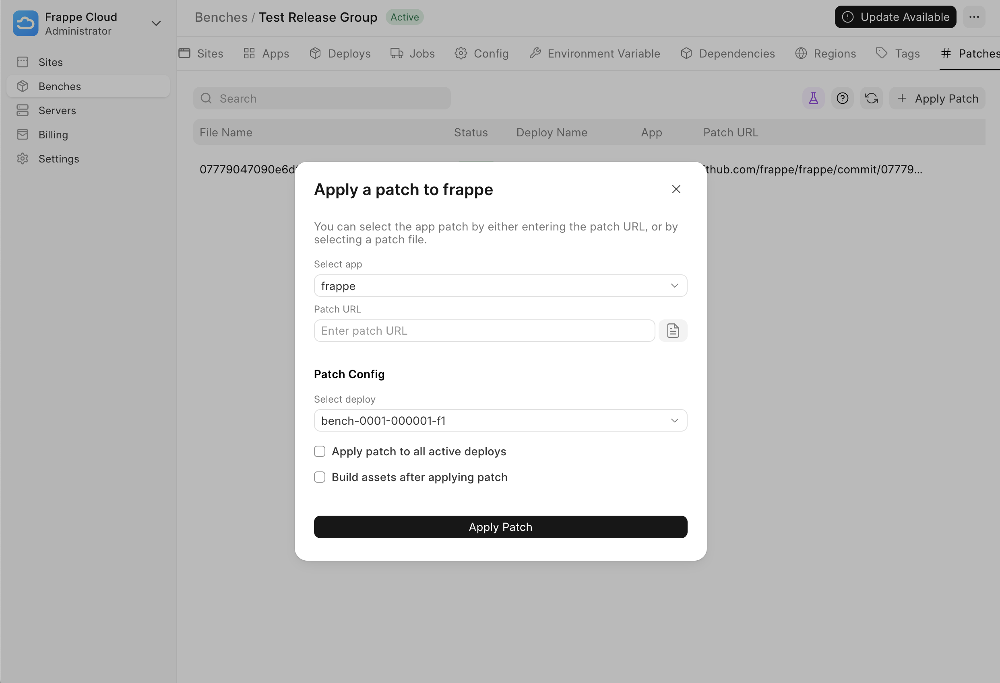
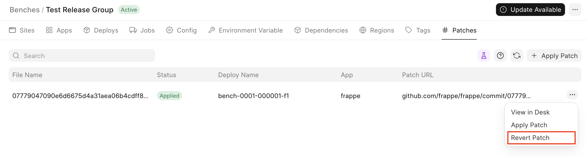
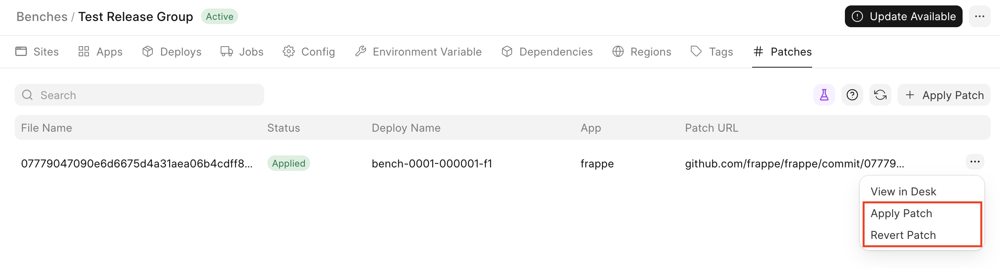

> **Note**: This is an experimental feature, please view the Limitations section before using it.
> 
> 

The App Patch feature allows you to apply a change to an app on your Bench. It's meant to be used for quick but tentative and small fixes. You can choose to apply the patch across all the deploys on the Bench or to just a single Deploy.

Limitations
-----------

App patches are meant to be quick but very tentative fix, do not use to push changes that are meant to persist.

Changes applied to your app using **App Patch** will not persist. If your server or container is restarted the app patch will be removed, and the **Status** displayed will not be in sync.

If you want the change to persist, you should commit the patch code to your repository and create a new deploy.

If your server or container has restarted, you might have to apply the patch again. You can do so by clicking **Apply Patch** from the **Patch** context menu, under the **Patches** tab, under you **Bench Group**.

Applying a patch
----------------

There are two ways to apply a patch:

1. Clicking **Apply Patch** from an **App**'s context menu in the **Apps** tab under your **Bench Group**.
2. Clicking **Apply Patch** from the **Patches** tab under your **Bench Group**.

On clicking on **Apply Patch**, the following Dialog will be displayed:

  
  

* **Select app:** Select the app the you would like to patch. This is not visible if opened from an **App**'s context menu.
* **Patch URL:** Enter the URL of the patch. Here is an [example patch](https://github.com/frappe/press/pull/1302.patch).
* `File button`: Select a patch file instead of selecting a **Patch URL.**
* **Select deploy:** Select a bench under the current **Bench Group** to patch.
* **Apply patch to all active deploys**: Ignores **Select Deploy** and applies the patch to all active benches under the current **Bench Group**.
* **Build assets after applying patch:** Rebuild assets (calls `bench build`) after applying the patch. To be used if for instance the patch alters a JavaScript file.

Once the values have been set, click on Apply Patch to create a **Job** to apply a patch. You can open the App Patch job to view the status:

  

Reverting a patch
-----------------

To revert a patch, you can click on the **Revert Patch** button under **Patches** tab, under your **Bench**. This will create a new **Job** to revert the patch.

  

Deleting a patch
----------------

A patch can be deleted only if its status is **Not Applied.**

**On Failure**
--------------

To avoid a **Failure**, ensure that the patch can be applied to the **Deployed** commit of the **App**.

If you do see a failure such as this:

  
  
  

Fret not! It either means that:

1. The **App Patch** has already been applied or reverted and the **Job** tried to re-apply or re-revert it.
2. The **App Patch** cannot be applied.

In case of point 1, you can try running the opposite action, i.e. if an **Apply Patch** failed then try **Revert Patch** first before re-applying it; and vice-versa:

  

