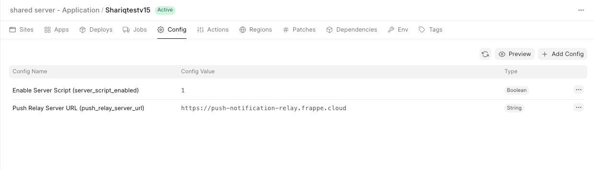
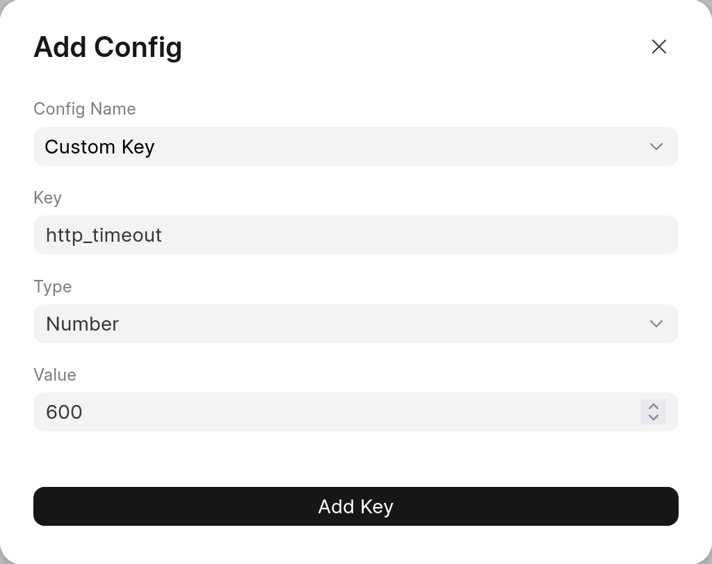

You may set site config variables on a bench group so that it [applies for all the sites](https://frappeframework.com/docs/user/en/basics/sites#common-site-config-json) under that bench group.

  

### Special case: http timeout

You may also set **http\_timeout** in seconds (default: 120)as a special case to specify time gunicorn workers wait for request to process before throwing 504 request error. This will affect the custom api endpoints you define.

  

