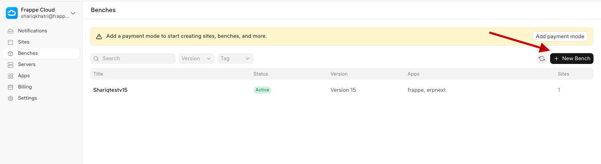
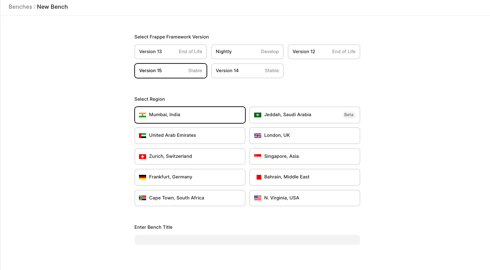
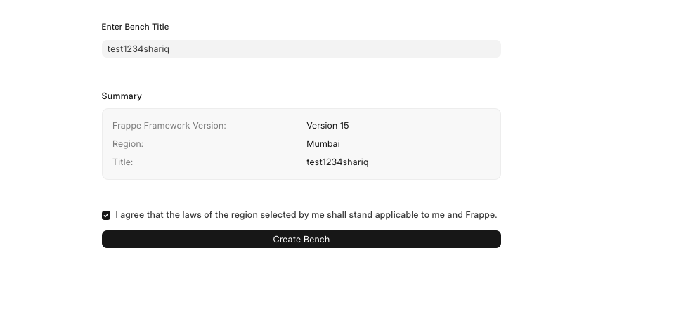
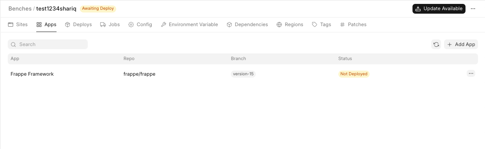
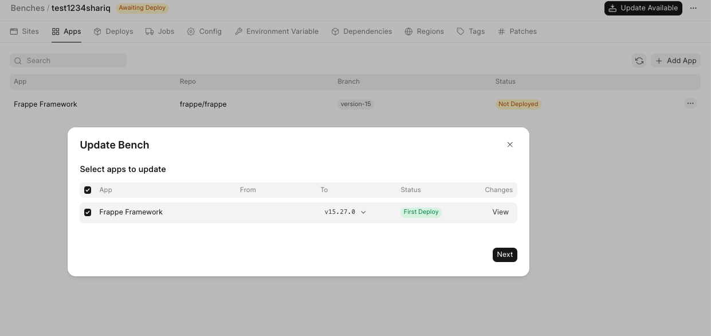

Click on the `+ New` button from your Frappe Cloud dashboard and select Bench Group:  

Select the Version of the bench group you want, select the Region for the bench group and name the bench group as per your requirement and click on create bench group  

  

Then click on the `Create Bench Group` button. Once the bench group is created, you will be navigated to the bench group dashboard page. A bench is not automatically deployed, you have to click on the `Updates Avaliable` button.

  

and click on `Next`: and then deploy

  

You can check the deployment status in the **Deploys** tab. Once deployed, you have your own shiny new private bench group ready for some magic!

