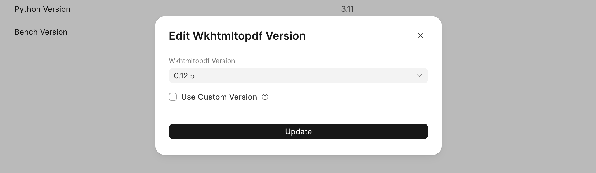
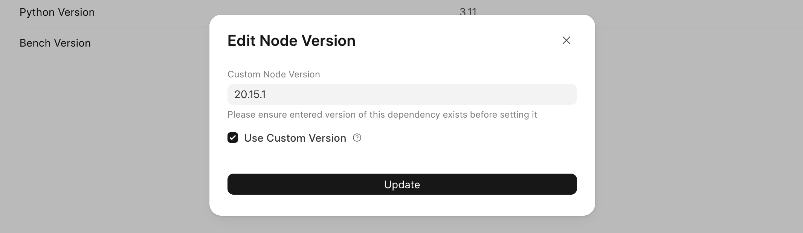

Your Frappe Cloud bench has a few dependencies such as Python, Node, etc. The versions of these can be viewed and edited by navigating to the **Dependencies** tab under your Bench Group:

  

> **ℹ️ Info**
> 
> The "!" mark in the circle shows that the version is custom.
> 
> 

Changing the version
--------------------

To change the version of the dependency, click on the `...` menu button on a dependency row and click on **Edit**. This will show a version edit dialog:  

Select a version from the drop-down menu and click on Update.

Setting a custom version
------------------------

To set a custom version, check the **Use Custom Version** checkbox:

  

Enter your custom version and then click on Update.

> ⚠️ **Warning**
> 
> Ensure that the version you update to actually exists and is supported. If it does not exist, future deploys might fail.
> 
> Check the following links for dependency versions:
> 
> * [Node Versions](https://nodejs.org/en/about/previous-releases#looking-for-latest-release-of-a-version-branch)
> * [Python Versions](https://devguide.python.org/versions/#supported-versions)
> * [Bench Versions](https://github.com/frappe/bench/releases)
> * [Wkhtmltopdf Versions](https://github.com/wkhtmltopdf/wkhtmltopdf/releases)
> 
> A **custom dependency version** might not work as expected. Please test it locally before you update it on Frappe Cloud.
> 
> 

When is my dependency version changed?
--------------------------------------

For your dependency version change to reflect, you have to [Update your Bench Group](https://frappecloud.com/docs/benches/updating_a_bench). After the update is complete, the new bench will be using the updated version.

> **ℹ️ Info**
> 
> Once you click on **Update** in the **Edit Dependency** dialog. The dependency version is updated in our system and is applied on subsequent deploys.
> 
> The current deploy remains unchanged.
> 
> 

  

