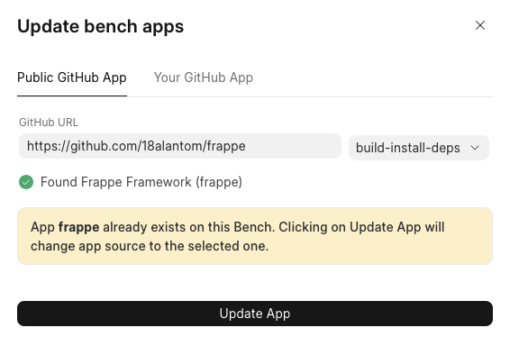

Frappe Cloud allows you to add custom apps only on private bench groups so that they don't interfere with public bench groups which are shared among users.

To install your custom app, you must first get your private bench group. Go through [these](https://frappecloud.com/docs/benches/create-new) steps to create a new bench group.

After you get your private bench group, come back here.

Now, to add custom apps to this bench group follow these steps:

1. Visit your bench group's dashboard.
2. Click on Apps tab and then Add App.
3. Click on **Add from GitHub** at the bottom, you should see the Add App screen.
4. Click on Connect To GitHub, and then go through the GitHub authentication flow to allow Frappe Cloud access to your apps.
5. Select the organization, and then click on the app you want to install, select the branch you want to deploy from the dropdown.
6. Click on **Validate App** and then click on the **Add app** button
7. Now you will see your app listed in the Apps tab.
8. Your bench group is still not deployed yet. Click on Show updates button and click on Deploy.

> After pushing updates to your app, you need to deploy a new version of your bench group, then update your site as well to see the changes in your site.
> 
> 

> ### Note about private repositories
> 
> Yes, you can add apps that are private repositories on Frappe Cloud, and even publish them on marketplace. But, please do note that since we offer SSH access to custom bench groups, those users **will be able to view** your private repository code using the same.
> 
> 

How to change github repo URL
-----------------------------

To update the source of an app on a bench group, you go through the same flow as above. The only difference is that you will see a banner in the **Update bench group apps** dialog:

  

Instead of the **Add App** button it will now say **Update App**. Clicking on this will replace the app source to the link you have selected.

  

