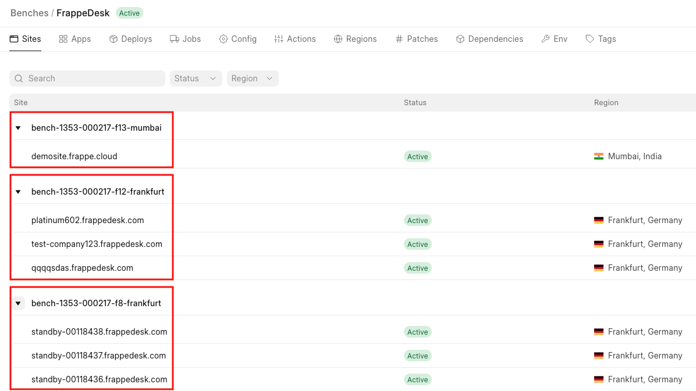
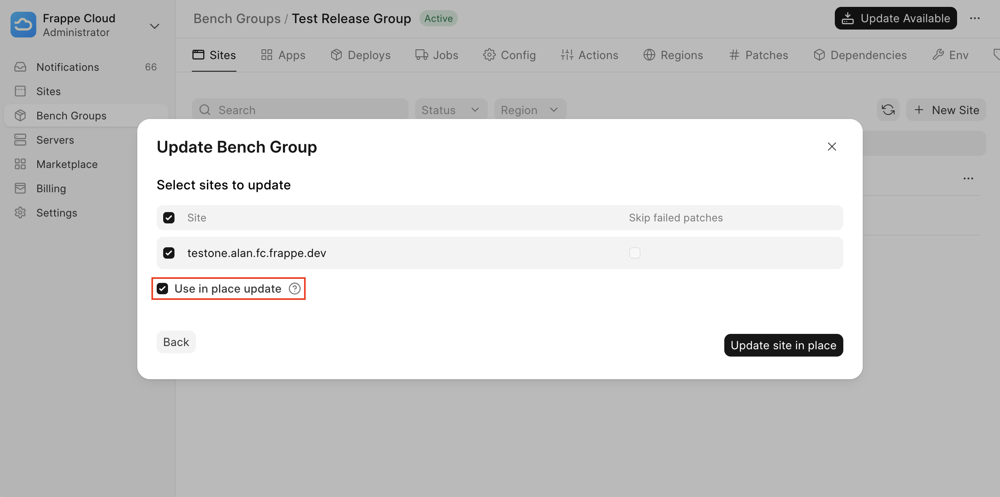
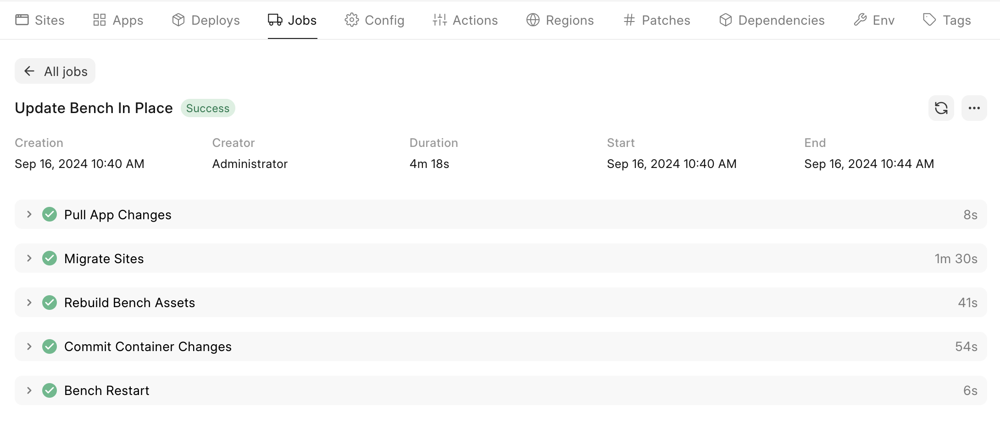
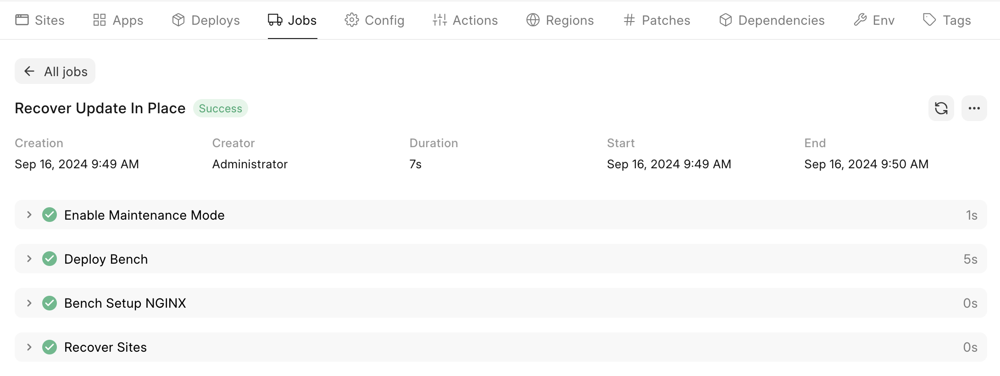

In place updates is an experimental feature that allows you to update your bench without having to wait for a regular update to take place.

The targeted use case for in place updates are:

1. Shipping small changes (that will not break a site) quickly to production.
2. Shipping changes to few number of targets (few sites and a single bench).

> ℹ️ **Info**
> 
> A regular update does the following:
> 
> 1. Build new image with updated apps
> 2. Create new Bench from the newly built image
> 3. Move site from old Bench to the new Bench
> 
> An in place update instead updates the old Bench without building an image which is a time consuming step.
> 
> 

Enabling in place updates
-------------------------

You will have to contact the Frappe Team to enable In Place Updates. Due to the caveats we do not enable for all users.

> ℹ️ **Info**
> 
> This does not mean all updates will be run in place. Certain conditions need to be met for an update to occur in place.
> 
> 

Required conditions for an in place update
------------------------------------------

After you have enabled in place updates, a few conditions need to be met:

1. All Sites under a bench have to be updated.
2. Only sites under a single site group can be updated.
3. Apps cannot be removed from a bench.
4. Selected bench should have been successfully updated in place (or should not have been in place updated).

To understand points 1. and 2. please see the image below:

  

Here 7 **sites** under 3 **site groups** under the **FrappeDesk** Bench Group have been highlighted by red squares. When running an in place update only sites under one of these groups can be updated.

For instance sites *demosite.frappe.cloud* and *test-company123.frappedesk.com* cannot be updated with an in place update. For this a regular update will have to be used.

Caveats of an in place update
-----------------------------

There are a few reasons for why you would not want to use a regular update:

1. In place update is **less safe than a regular** update because if the update fails, your site can go down. This does not happen in a regular update because we create a separate container for each update.
2. **Failing patches are skipped by default**. This is to prevent failing patches from interrupting the migration procedure.
3. **Backups are not taken** before an in place update.

> ⚠️ **Warning**
> 
> Due to the mentioned caveats, it would behoove you to ensure that there are no breaking changes before running an in place update.
> 
> 

Using an in place update
------------------------

To use an in place update for deployment, follow this [document](https://frappecloud.com/docs/sites/how-to-update-an-app-site-on-a-private-bench) until step 2. If all the above mentioned conditions have been met, the dialog box you see will be a bit different:

  

Enable the **Use in place update** checkbox. The action button will now say **Update site in place** instead of **Deploy and update site**.

Once you click the **Update site in place** button, you will be redirected to the update job:

  

> ℹ️ **Info**
> 
> If the Update Bench In Place job fails, Frappe Cloud will try to recover your bench by running the Recover Update In Place job:
> 
>   
> 
> 
> If this occurs, you cannot use in place update to update this bench.
> 
> 

