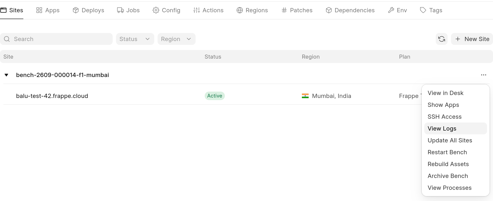
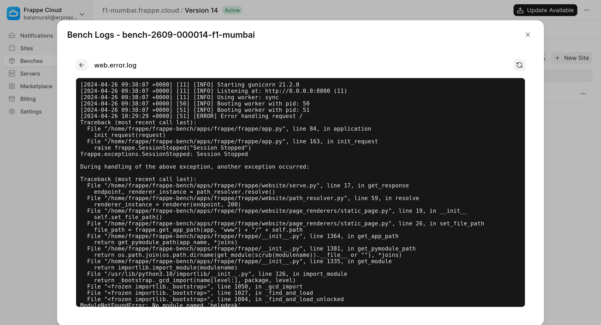

Frappe Cloud allows you to see the logs of your processes right from your dashboard.

From your bench group dashboard, you can view logs for a particular **bench**

  

Reading the logs
----------------

After ssh-ing into the bench, you will see certain files in the `logs` directory that are of interest

1. `web.log` and `web.err.log`. These correspond to the STDOUT and STDERR streams of the web process. These handle the individual web requests to your site.
2. `worker.log` and `worker.err.log`. These correspond to the STDOUT and STDERR streams of the background workers. These run the background jobs.

The above files are usually the areas of interest when you're debugging. But similarly, all the files in the `logs` directory correspond to the processes listed when you do `supervisorctl status` in your bench. Different issues will have you looking at different logs in your bench.

Site specific logs
------------------

For site specific logs check out: <https://frappeframework.com/docs/user/en/logging>

  

