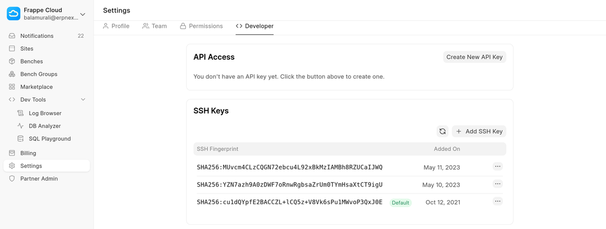
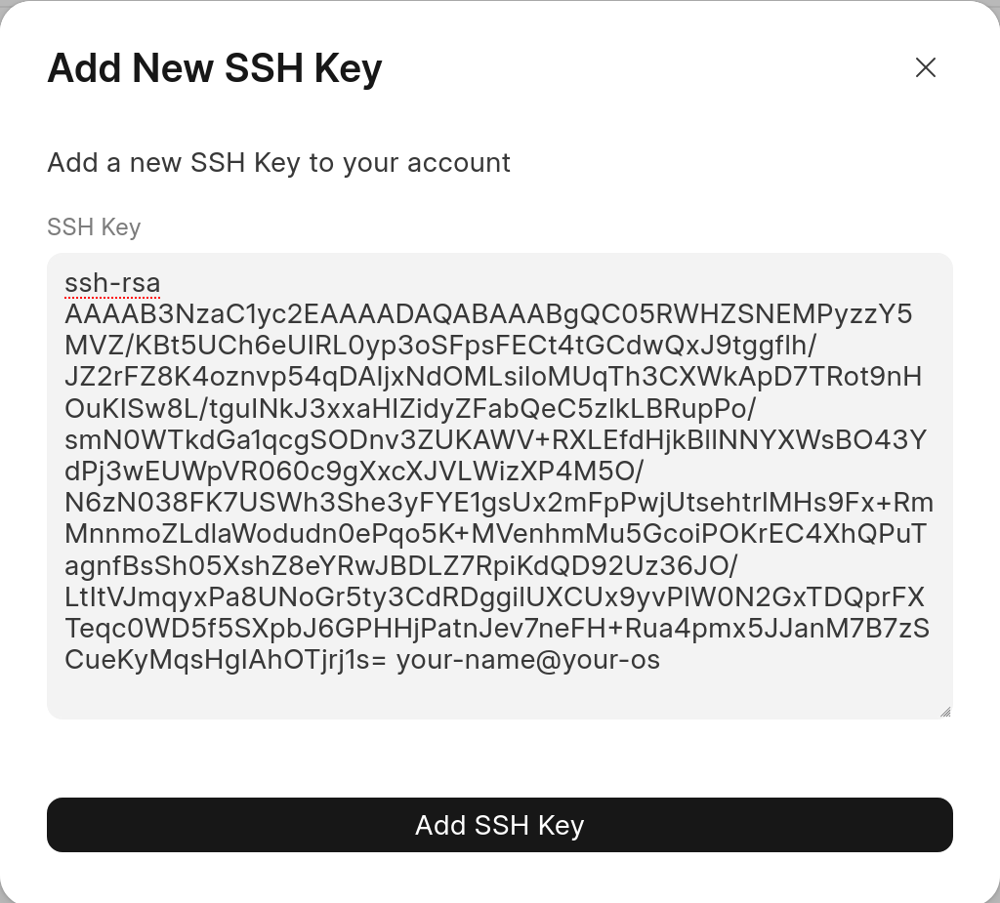
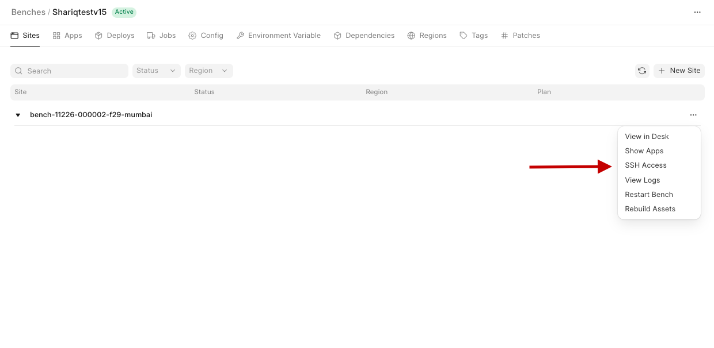
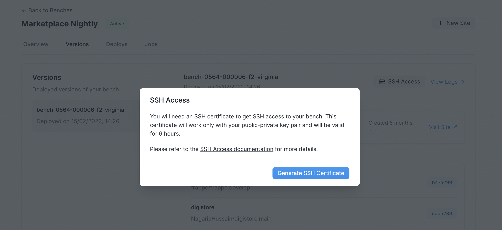
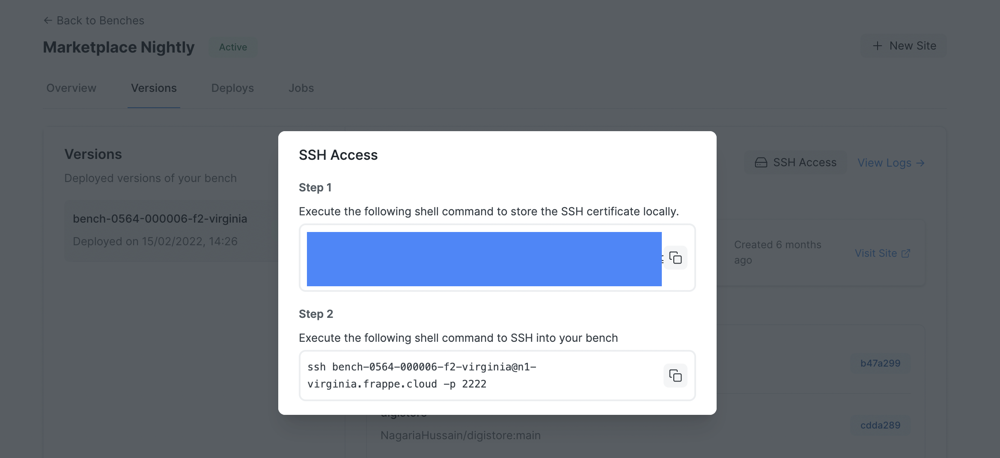
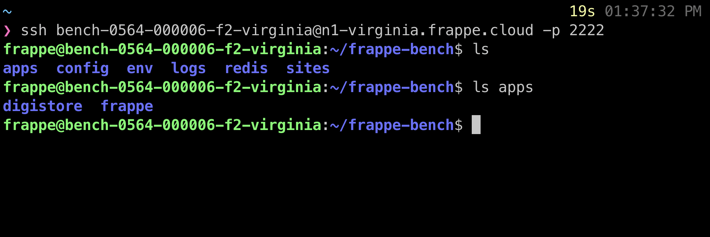
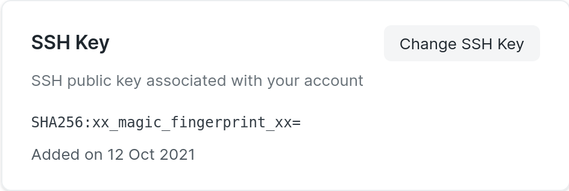
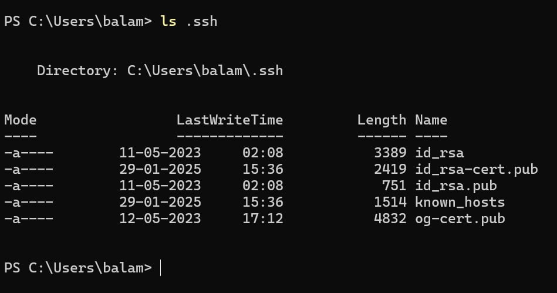

With **private bench** groups, comes a whole new power to SSH into your bench group and run arbitrary commands. You can SSH into a particular version of your Bench Group using this feature. Here are the steps required to SSH into a particular bench group:

What is SSH?
------------

If you're unfamiliar with SSH, we highly recommend watching this [video](https://www.youtube.com/watch?v=v45p_kJV9i4) to get started.

Add SSH key to your Frappe Cloud account
----------------------------------------

Visit the **Settings** page in your FC dashboard and scroll to the "SSH Key" section:




Clicking on "Add SSH Key" button should open up a dialog with an input box. Enter your **SSH public key** in this input box

  


### About copy/pasting keys

It's in your best interest to use one of the following commands to reliably copy your ssh key into your clipboard. Afterward, you can simply paste into the above input box.

#### Mac OS


```
pbcopy < ~/.ssh/id_rsa.pub
```
#### Linux

Pre-requisite: [wl-clipboard](https://github.com/bugaevc/wl-clipboard)


```
wl-copy < ~/.ssh/id_rsa.pub # Wayland
```
If the above command fails, try below. Needs: [xsel](https://launchpad.net/ubuntu/+source/xsel)


```
cat ~/.ssh/id_rsa.pub | xsel -ib
```
#### Windows (Git Bash)


```
clip < ~/.ssh/id_rsa.pub
```

> Manually selecting from text editor and copying can lead to invalid keys. If you *have* to select the key, please **cat** the file and copy the output.
> 
> 
> ```
> cat ~/.ssh/id_rsa.pub
> ```
> 

Generate SSH certificate & SSH
------------------------------

Navigate to your bench group dashboard and click on the three dots beside your bench group as shown in the below screenshot. You will see a drop-down with multiple options you can click on the SSH Access. If you have correctly [added your SSH key](https://frappecloud.com/docs/benches/ssh#add-ssh-key-to-your-frappe-cloud-account), the SSH Access option should be visible.

  


Clicking on the button will open up a dialog:

  


Now, click the **Generate SSH Certificate** button. This will generate an SSH certificate for you, valid for 6 hours, which you can then use to SSH into your bench group:


> Note: These commands only work on Linux and macOS machines.
> 
> 

  


> Note: Everytime you need SSH access to a particular version of a bench group, you will need to generate a new SSH certificate. This certificate is valid for 6 hours. After that, you will have to regenerate the certificate from the bench group dashboard.
> 
> 

Follow the instructions shown in the dialog (copy-paste the commands into your terminal). After you have successfully added the certificate locally, you should be able to run the given `ssh` command to gain access to your bench group:

  


That's it! You can now run commands you like `bench restart`, `bench build` and more. Have a look at the [debugging](https://frappecloud.com/docs/benches/debugging) guide for things you can and shouldn't do.

FAQ
---

### Access denied on SSH: Private key contents do not match public

If you see the following error on your local machine.


```
identity_sign: private key /home/user/.ssh/id_rsa contents do not match public
  

```
This is probably because the key you've added on Frappe Cloud does not match the one you're using for ssh on your local.

The fingerprint you see in your dashboard

  


should match the output of `ssh-add -l` (as ran on a linux environment)

If they don't match, please review your local setup. [Github's ssh docs](https://docs.github.com/en/authentication/connecting-to-github-with-ssh) are pretty good.

### Received disconnect from host: Too many authentication failures

If you receive this error even after adding the correct keys, and it is likely that you have 3 or more keys in your system, it's possible that the ssh certificate doesn't get the chance to be tried out before all the other keys and thus end with auth failure.  
  
To circumvent this, you can add the following options to pick your key corresponding to the certificate only


```
ssh -o "IdentitiesOnly=yes" -i <path_to_key> 
```
where **path\_to\_key** is path to the private key of the key you added on Frappe Cloud. Should be something like **~/.ssh/id\_rsa**

> Please **DON'T** rename the files. Both your private key, and the certificate should have matching names. i.e if private key is **id\_rsa**, certificate filename should be **id\_rsa-cert.pub**. If either filename is changed, the ssh will fail with Permission denied (publickey) error

### SSH from powershell on windows does not work

Windows users using Powershell (or Windows Terminal) need to execute the following command ***before*** pasting the certificate:


```
$PSDefaultParameterValues['*: Encoding'] = 'utf8'
```
If you're using command prompt, the above command is not required. Please checkout this [issue](https://github.com/frappe/press/issues/798) for details

The certificate should be pasted in the `.ssh` directory under your user folder like so:

  


where `id_rsa.pub` is the certificate generated and copied from Frappe Cloud for the public key `id_rsa.pub` with private key `id_rsa`

Here, the username is `balam`. Your user directory will be based on your username.

### Cannot copy files over SSH (SCP)

Our ssh sessions are provided over a proxy connection and thus scp and other tools that depend on it will not work.

Alternatively, you can upload the files to an external service such as Google Drive (as a zip) and download the same using [wget](https://github.com/tldr-pages/tldr/blob/main/pages/common/wget.md) after ssh-ing into your bench group.

For downloading files (eg: logs), you may zip the required files and put them under the **/public/files** directory of any of your sites and download the same from **/files/filename** route of your site.


> NOTE: Above action should be done with care so as to not replace any existing files in the directory.
> 
> 

### VS Code over ssh does not work

Same reason as above. VS Code uses scp to make this happen.

### You must supply a key in OpenSSH public key format

Your ssh key should look something like:


```
ssh-rsa AAAAB3NzaC1yc2EAAAADAQABAAABgQC05RWHZSNEMPyzzY5MVZ/KBt5UCh6eUIRL0yp3oSFpsFECt4tGCdwQxJ9tggflh/JZ2rFZ8K4oznvp54qDAIjxNdOMLsiloMUqTh3CXWkApD7TRot9nHOuKISw8L/tguINkJ3xxaHIZidyZFabQeC5zlkLBRupPo/smN0WTkdGa1qcgSODnv3ZUKAWV+RXLEfdHjkBllNNYXWsBO43YdPj3wEUWpVR060c9gXxcXJVLWizXP4M5O/N6zN038FK7USWh3She3yFYE1gsUx2mFpPwjUtsehtrlMHs9Fx+RmMnnmoZLdlaWodudn0ePqo5K+MVenhmMu5GcoiPOKrEC4XhQPuTagnfBsSh05XshZ8eYRwJBDLZ7RpiKdQD92Uz36JO/LtItVJmqyxPa8UNoGr5ty3CdRDggilUXCUx9yvPlW0N2GxTDQprFXTeqc0WD5f5SXpbJ6GPHHjPatnJev7neFH+Rua4pmx5JJanM7B7zSCueKyMqsHgIAhOTjrj1s= your-name@your-os
```
The **your-name@your-os** part is optional

### What is username for PuTTY

Given the ssh command looks like


```
ssh username@hostname -p 2222
```
* username is the bench group name. Eg: **bench-0001-000001-f1-mumbai**
* port is 2222
* host is the proxy name, which should be something like **n1-mumbai.frappe.cloud**

### I can't ssh and none of the FAQs help

Don't panic. Please create a ticket on [support.frappe.io](http://support.frappe.io) with the following details:  
  


1. Output of your ssh command with the `-vvvv` option. Eg:


```
ssh <bench-name>@nx-region.frappe.cloud -p 2222 -vvvv
```

> Do not copy the above command as is. This is an example. Add `-vvvv` to the command you get from dashboard.
> 
> 

2. Output of


```
ssh-add -l
```
3. Information about your operating system and your SSH Client


> OS: Windows / Mac OS / Ubuntu  
> Terminal (Windows): Powershell / Command Prompt / Windows Terminal / Git bash
> 
> 

4. A screenshot of running the command and the output

### No sudo privileges

We do not provide root access within the bench. You very likely do not need it. If you need dependencies installed. You can [add them in your app](https://frappecloud.com/docs/faq/installing-app-apt-dependencies) itself.

