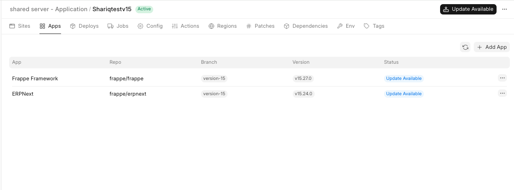
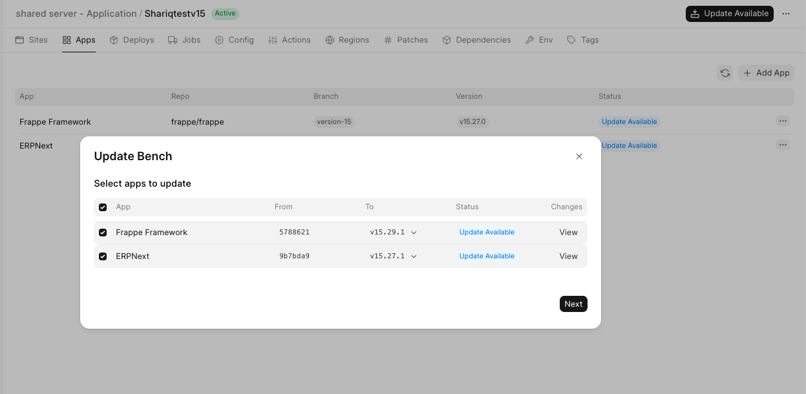

You will see an update banner on your bench group dashboard whenever an update is available for any of the apps installed on that bench group:

  

Clicking on the **Show Updates** button will open up a dialog box where you can choose which apps to update (yes, we do have selective app updates!). Deselect the apps you don't want to update and click **Deploy**:

  

You can monitor the progress of your deploy in the **Deploys** tab:

  

> Note: You cannot deselect **Frappe Framework** if you want to update **ERPNext**

> After Bench is updated, the sites (as long as auto update is enabled) shall auto update during non-working hours. (1 AM - 4 AM)