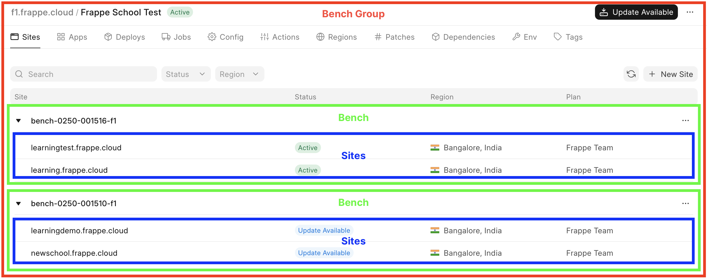
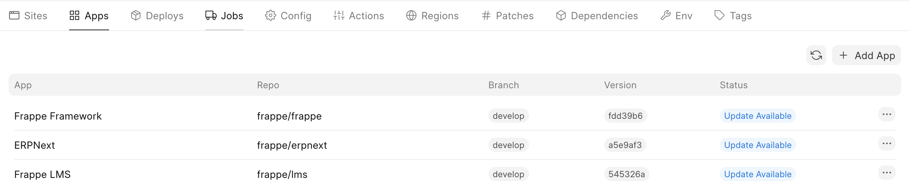
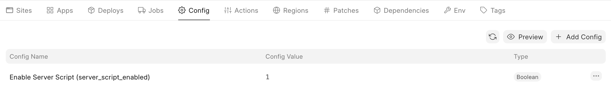
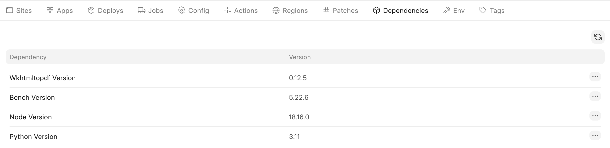
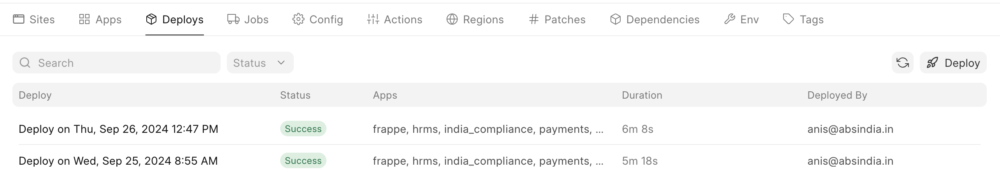

  

* **Bench** is a collection of apps and sites.
* **Bench Group** is a collection of **Benches**.

**Bench**
---------

A **Bench** is a collection of apps and sites. All sites on a **Bench** share the same configuration, such as the version of apps, or version of dependencies.

Frappe Cloud creates **Benches** from information stored on a **Bench Group**.

> For a more technical explanation of what a **Bench** is, see the [Bench confusion](#bench-confusion) section.
> 
> 

**Bench Group**
---------------

A **Bench Group** is not only a collection of **Benches** but it also consists of the template from which these **Benches** are created.

And so, it holds information such as:

* Which apps to install.
* What common site config flags to be set.
* The version of dependencies to be used.

> **Private Bench Groups**
> 
> If you are using a [private bench group](https://frappecloud.com/docs/benches) then all of the above information can be set and updated by you.
> 
> 

### **When is a Bench created?**

A **Bench Group** by itself does not run your site. For this you have to *deploy* a **Bench**. This takes place when you click on *Deploy* or *Update Available* on your **Bench Group** page.

1. Doing so creates a *Deploy* which builds a **Bench:**
2. After the *Deploy* succeeds, a New Bench job, which initializes and runs the **Bench**, is created:

Once the **Bench** is running, a new site is created on it, or an existing site is moved on to it from another **Bench**.

**Bench confusion**
-------------------

If you are familiar with [Frappe Framework](https://frappe.io/framework) development then term "bench" may not be a new one and might cause some confusion. This is a perfectly sane response to our shortcomings when it comes to naming things. To help clear this, I'll try and differentiate between the different benches:

| **Term** | **Context** | **Description** |
| --- | --- | --- |
| *Frappe Bench* | Frappe Framework | Directory that holds a collection of Frappe Framework apps and sites on which they may be installed. |
| `frappe/bench` | Frappe Framework | [CLI tool](https://github.com/frappe/bench) used to manage a *Frappe Bench*. |
| **Bench** | Frappe Cloud | *Frappe Bench* running inside a container from which your site is served. |

In the context of Frappe, all benches are conceptually linked (unless you are talking about a [regular bench](https://en.wikipedia.org/wiki/Bench_(furniture))).

### **How are all the benches related to each other?**

I'm stupefied that you asked, but here you go:

A **Bench** [image](https://docs.docker.com/get-started/docker-concepts/the-basics/what-is-an-image/) is built by running `frappe/bench` commands inside a Docker build to instantiate a *Frappe Bench* folder into which your apps are installed by—once again—running `frappe/bench` commands.

Once this Docker build completes, we run the **Bench** image as a [container](https://docs.docker.com/get-started/docker-concepts/the-basics/what-is-a-container/) and then do one of the following:

* Create a new site for you.
* Move your existing site from another **Bench** to the current one.
