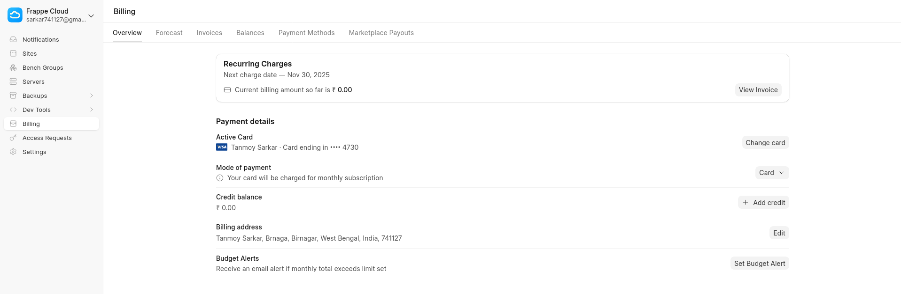

A **Server** in Frappe Cloud is the physical or virtual machine that runs one or more Sites. It provides the computing environment required for handling requests, executing background jobs, and storing data. While a Site is your ERP workspace, the Server is the underlying engine that keeps it alive and responsive.

Servers come with predefined resource capacity such as CPU, RAM, disk, and network throughput. Multiple Sites may run on a single Server depending on their size and load, or a Site can be allocated to a dedicated Server for high performance or isolation.

---

## What a Server Includes

| Component | Role |
|----------|------|
| Compute (CPU + RAM) | Runs processes, workers, and requests |
| Storage | Holds databases, files, logs, backups |
| Network Layer | Handles client access, routing, and security |
| Workers | Execute scheduled and asynchronous tasks |

---

## When a Dedicated Server Makes Sense

- Your site needs constant high performance  
- You run heavy workloads or large data volumes  
- You want isolation from other tenant activity  
- You need room to scale without resource contention  

---

## Summary

A **Server** is the foundation that powers your Frappe Sites. It provides processing power, memory, storage, and network resources. Choosing the right server ensures smooth operation, scalability, and reliability for your applications.