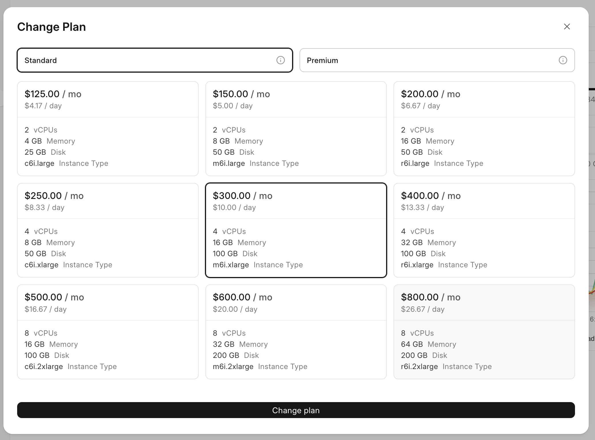
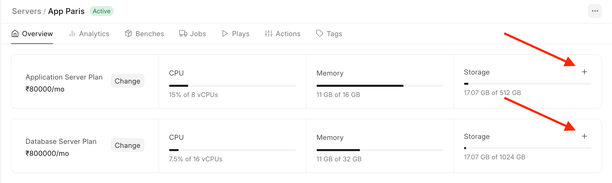
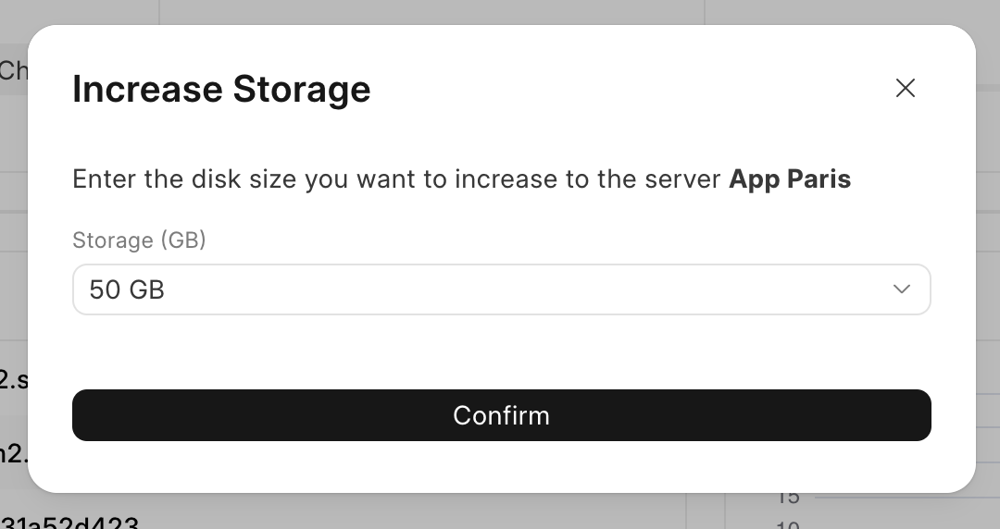

Server Plan
-----------

You can change your server plan to resize the server. Application and Database server plans can be changed independently.

> Note: Changing plan will result in a minor (~5 minutes) downtime on the server.
> 
> 

Go to the Server Overview tab and find the Plan card. Click on **Change** button.

  

Choose new plan. Click on Change plan.

### AWS Instance types

For all regions other than KSA, we currently use AWS VMs for dedicated servers. The instances seen in the above plan correspond to `c6i`, `m6i` and `r6i` machines as seen [here](https://aws.amazon.com/ec2/instance-types/)

In general, the CPU:Memory ratio vary across these instances:

  
c6i: These are Compute optimized instances where CPU:Memory ratio is 1:2

m6i: These machines have CPU:Memory ratio of 1:4 (General Purpose)

r6i: These have CPU:Memory ratio of 1:8 (Memory optimized)

Storage Add-on Plan
-------------------

You can increase the storage of your server without upgrading your server's plan through Storage Add-ons. To buy Storage Add-on

1. Go to the Server Overview and click on the + button beside storage
2. Select the amount of storage you want to buy and click on confirm

> Note: You can't reduce/revert the storage you've bought for your server
> 
> 

