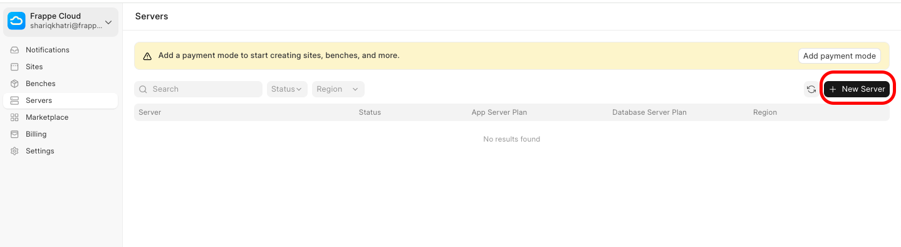
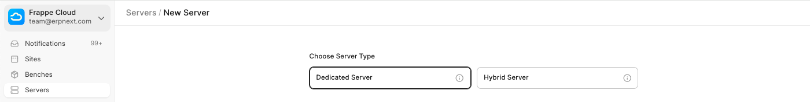
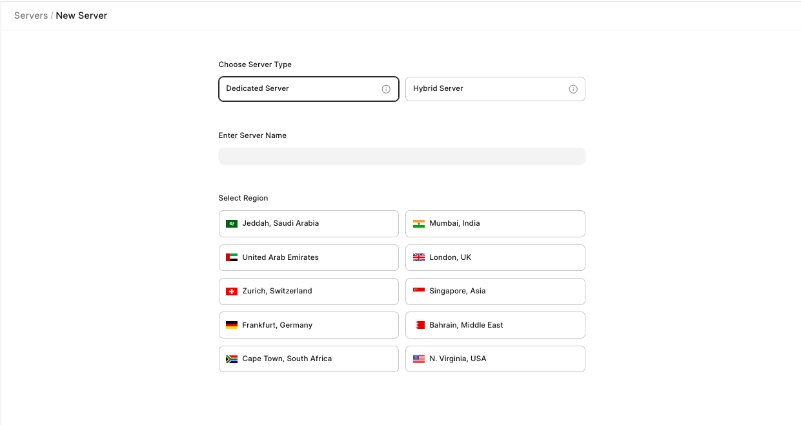
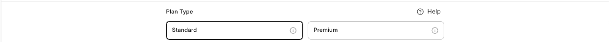
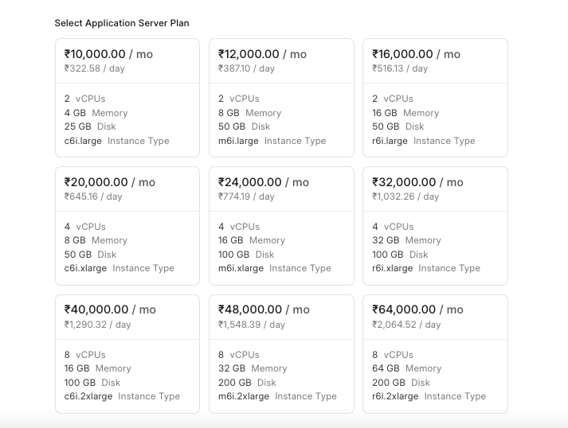
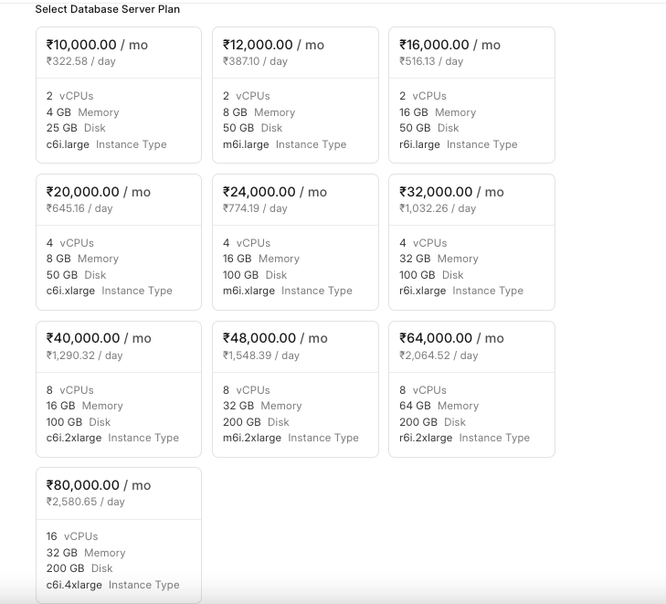
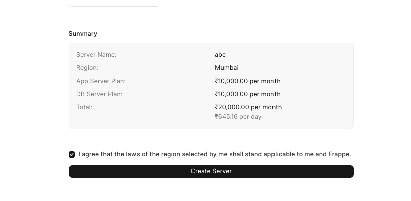

#### **Creating a dedicated server:-**

From the [Servers](https://frappecloud.com/dashboard/servers) tab on the dashboard, click on **New** **Server**  

Click on the **dedicated server** button.  

Enter the name of your new server you want and select the region for the same.  

Select the plan type **standard server** or **premium server** hosting.  

Next, select the plan for the **Application** **server** and **database** **server**.  

Once you have selected the plans, you will see a summary at the bottom you can confirm and click on **Create Server** to continue.  

