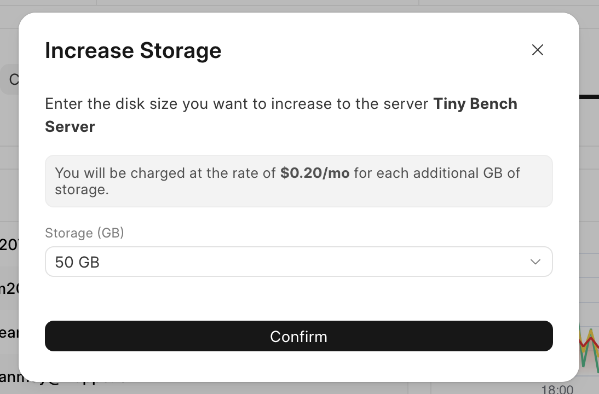
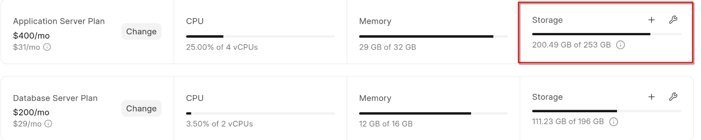
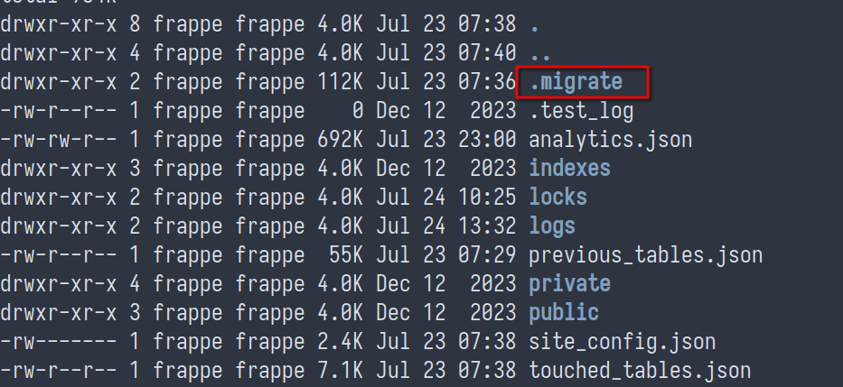

Introduction
------------

In case the base storage included in the Server's plan is not enough, you can always add more storage to your server as required at an additional cost of $0.2/GB per month. Note that [AWS does not allow us](https://repost.aws/questions/QUPe0ekJ79TpaI-TNGoPXIKQ/can-i-reduce-an-over-sized-ebs-volume) to revert the storage added to a volume. So, if it turns out that you don't need the additional storage that's been added to your server, you can create a new server and move your sites over to the same.

Steps
-----

1. Click on the + button adjacent to the server you want to add storage to

2. Select the amount of storage you want to add. Note that you can't add storage again for a period of 6 hours.

3. Select confirm to increase the storage

> Before the addons were introduced, Frappe Cloud itself was handling the additional storage being added on the server. The system automatically adds additional storage as and when required in order to prevent downtimes and other issues (mainly redis) from happening. If you wish to opt-out of this feature, you can disable it following the below steps. Note that if you do choose to do this, the downtimes on the server will be ignored by the system.
> 
> 

Steps to disable Auto Increase Storage
--------------------------------------

1. Click on the spanner icon adjacent to the server you want to disable auto add storage

2. Uncheck the box

3. Click on confirm to disable the feature.

FAQ
---

### Why does application server storage take so much more than sum of sites' storage

  

You may notice that the storage consumed in your application server is much larger than sum of storage of all the sites you have on the same. This is because the total storage consumed also includes all the benches (and therefore code and it's dependencies) deployed on your server.

Once you drop a Bench Group, you may notice that the storage doesn't go down immediately. This is because of docker cache. This should get cleared [within 6 hours](https://github.com/frappe/press/blob/873be0859355f2328dd0b265608d38022554acc1/press/hooks.py#L248-L249) when scheduled cleanup for the same happens.

### Why does storage increase during bench/site update

This happens majorly as we take table-wise backup of the site during update. This is done so that in case of any failure during migration (eg: some breaking patch), all the changes done so far to the tables can be quickly rolled back. They're stored in the .migrate folder. This files in this folder should **NOT** be removed/updated manually as this can cause data loss

You may therefore find it useful to update sites one at a time to reduce this increase in storage.

Moreover, deploying new bench also downloads a new image onto the app server. This has the newer code deployed in your updated apps. This will also take some space.

### Why does storage increase more than the limit

The feature automatically increases available storage as it reaches over <b>90%</b> of its capacity. The limits apply for each such increase and does not impose an overall limit as of now. This is done to ensure uptime. In the future, we will allow imposing a hard limit on storage increased automatically.

