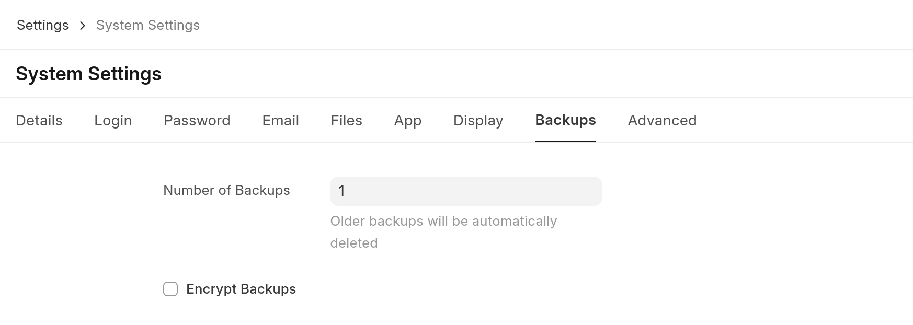
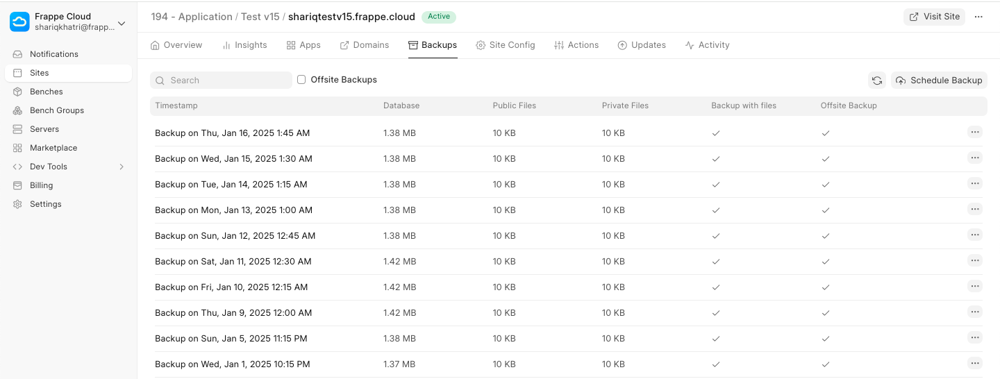
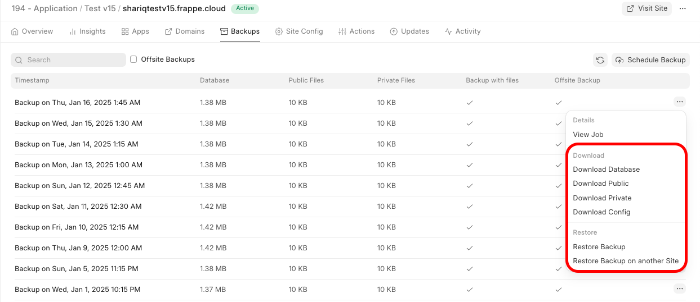
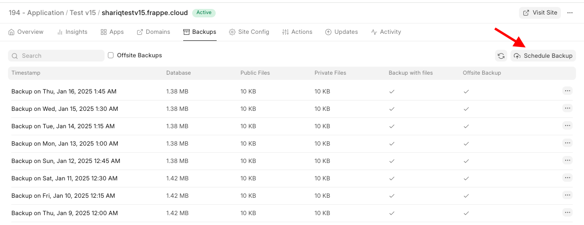

> Automated backups are only available for sites on the $25 plan or higher.
> 
> 

Backup Frequency
----------------

Frappe Cloud takes automated backups of your sites every **24** hours. There is no setting to increase this setting as of now. 

The setting inside **System Settings** is for how many onsite backup files to keep within the sites directory, provided multiple backups have been taken. This will **NOT** change the number of automated backups taken by Frappe Cloud  

 

Downloading backups
-------------------

From the Frappe Cloud site dashboard, go to the **Backups** tab. Here you will see the list of backups that were taken of your site. Every backup consists of a database backup, public files backup and private files backup.

  

Trigger on-demand backup
------------------------

You can also trigger a manual backup operation for your site anytime from the **Backups** tab by clicking on the **Schedule Backup** button.

The job will be queued and it will take a few minutes to complete.  

Offsite Backups
---------------

> Offsite backups are available for sites on USD 25 and above plans.  
>   
> Only the backup marked as "offsite" can be downloaded directly from Frappe Cloud dashboard  
>   
> The onsite backups can only be downloaded from within the site
> 
> 

Automated backups are stored offsite, which means the files are stored on a different server than the site. This ensures that you can access your backups even in the unfortunate event of server downtime.

Offsite backups are marked as such in the Backups tab.

### Offsite Backup Rotation

For each site, a certain number of offsite backups are kept at all times. The frequency of backups is as shown below:

* 7 daily
* 4 weekly
* 12 monthly
* 10 yearly

This is done to store backups efficiently. For example, if the current day is Jan 13, then the backups available will be like so:

  

  

(Monthly and yearly backups before December 2020 not shown in picture)

* Weekly backups are taken every Sunday
* Monthly backups taken every 1st day of the month
* Yearly backups taken every 1st day of the year

FAQ
---

### Why is my backup size so much smaller than database usage I see in dashboard?

This is because we store backups in compressed form as it is static and no operations are being done on it. We use standard unix tool called gzip for compressing the backups. The difference is in size is thanks to the same.

You can download the backup and decompress it with gzip to compare the size for yourself. It should be almost same as the size you see in your dashboard.

### Forbidden: You need System Manager Role to access backup

This happens when you try to download onsite backup, and you are not logged in to your site with a user of role System Manager or higher. You can simply login as adminstrator from your FC dashboard and then try to download again.

### **What are the scheduled times for these backups?**

There's no scheduled time. We do backups for all sites on a round-robin basis. But if they want a scheduled time for backup to run, we can set it.

### **How can I access and download the backed-up data?**

You can access your backups from the Frappe Cloud dashboard>Backups tab.

### **What is the storage capacity for backups?**

We don't charge for these. They're uploaded to AWS s3 storage. So the limit is as high as they allow, which is 5 TB

### **What is the policy for archiving or deleting old backups?**

You can refer to our Frappe Cloud Policy page [here](https://frappecloud.com/privacy)

### **How is backup data secured?**

HTTPS is used for all communications. Encryption is opt-in. You can add a backup encryption key in the site config for this. [Here](https://frappeframework.com/docs/user/en/guides/basics/how-to-enable-backup-encryption) is how you can enable backup encryption.

### Where to find backup of particular date? The backup for the date I want is missing

We only keep backups as per our backup policy. You can take a look at our [rotation policy above](#offsite-backup-rotation) to get an idea of why certain dates' backups are available. Offsite backups are only available for $25 plan and above. No, you cannot request for a specific date's backup as we don't have them.

  

  

