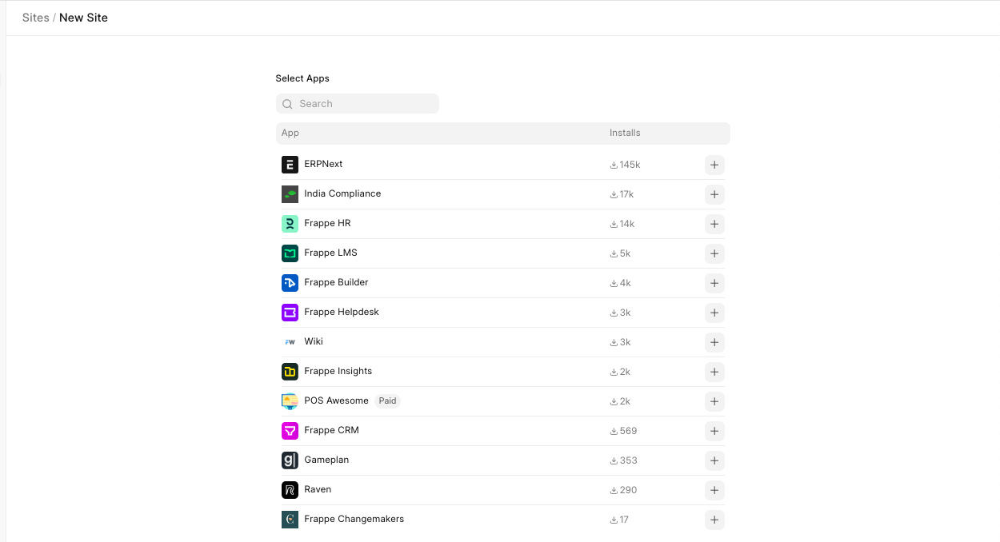
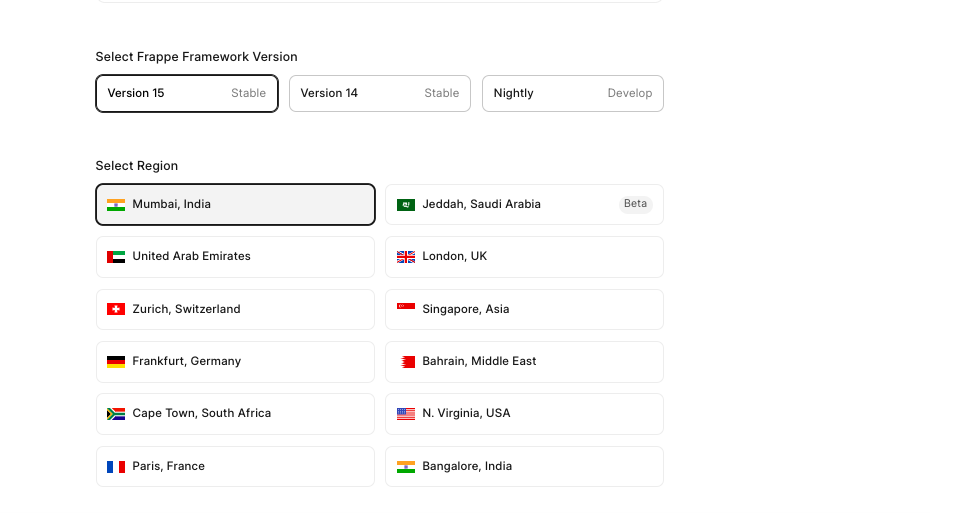
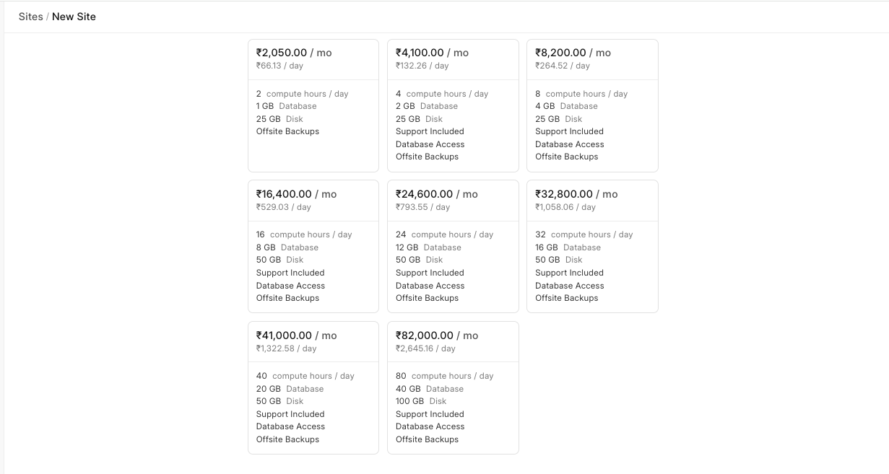
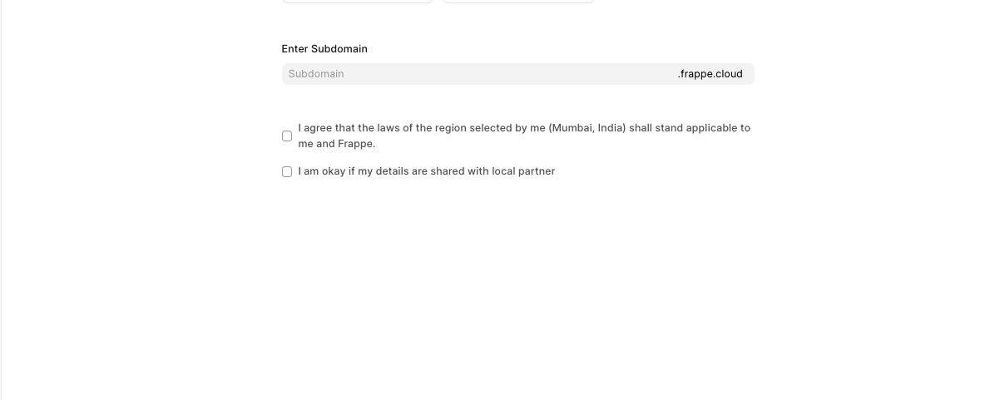

Simplest guide to creating a new site on Frappe Cloud

1. From the Sites tab on the dashboard, click on **New Site**.
2. Select the apps you want to install on your site 

3. Select the site version you want, and the site region you want.
4. Select the appropriate plan you want for your site. For more details visit our [pricing page](/pricing).

5. Choose a unique hostname for your site. Subdomain could be 5 to 32 characters long and contain lowercase alphabets, numbers, and hyphens. A subdomain can not start or end with hyphens.
6. It will take a few seconds for site creation depending on the apps you have chosen.
7. Click on Visit Site at the top of the page to access your site.
8. After site creation you will see a message, you can proceed to complete the setup wizard by clicking on login. You must log in and complete the setup wizard on your site. Analytics will be collected only after the setup is complete.

> Note: All sites are only available on HTTPS.
> 
> 

