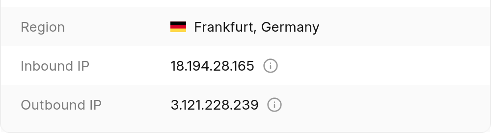
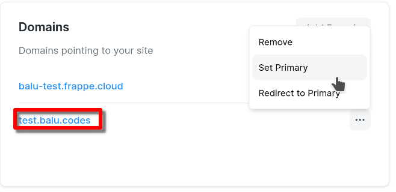
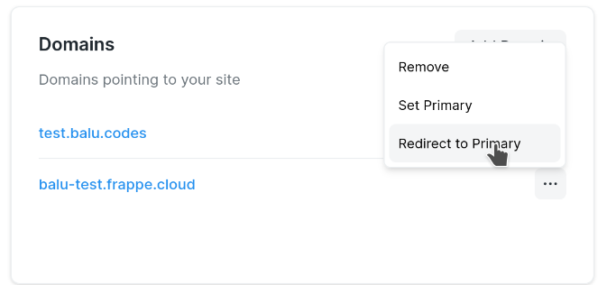
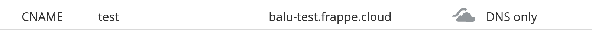
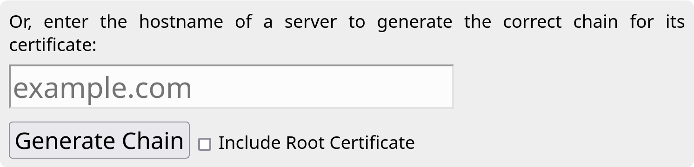

<h2>Adding a custom domain</h2>
Frappe Cloud allows you to map custom domains that you own in a few simple steps.
<ol><li>
Create DNS records from the dashboard of your domain provider. Follow one of the steps below:  

<strong>Subdomain</strong>: To point a subdomain to your site, add a <strong>CNAME record</strong> pointing your subdomain to your site. For example, if you want to use <code>www.example.com</code> for your site <code>example.frappe.cloud</code> then add CNAME record for <code>www.example.com</code> pointing to <code>example.frappe.cloud</code>. For the instructions to add such a record, please contact your domain provider.  

<strong>Naked domain</strong>: To point a naked domain like <code>example.com</code> to your site, simply add an <strong>A</strong> <strong>record</strong> pointing to the IP address of your site. You can get this IP from <strong>Inbound IP</strong> of your dashboard 

One caveat to adding naked domains is that you will have to update the DNS record if the IP of your site changes.
<blockquote>
<strong>NOTE: </strong>Only add 1 record. If you're adding multple <strong>A</strong> records for the same domain, you're doing it wrong.
</blockquote>
There are some DNS providers such as Cloudflare that allow adding CNAME records for naked domains. If so, you won't need an A record. Simply follow the same steps as in the Subdomain section above, replacing <code>www.example.com</code> with <code>example.com</code>.  
</li><li>
After adding the DNS record, open your site dashboard.
</li><li>
From the site overview page, go to <strong>Domains</strong> card.
</li><li>
Click on Add Domain.
</li><li>
Enter the custom domain.
</li><li>
Click on Verify DNS.
</li><li>
If the verification succeeds, you have correctly added the CNAME record, and you will see Add Domain button. Click on Add Domain.

 
</li></ol><blockquote>
Note: We obtain an SSL certificate for the custom domain. So you will be able to use HTTPS with your domain.
</blockquote><blockquote>
You are able to add both naked and subdomains to your site  
</blockquote><h2>Redirecting domains</h2>
In some cases, you may not want the user to see certain domains that direct you to your site. You may even want to hide your fancy <strong>.frappe.cloud</strong> domain that we provide. This is also possible.
<ol><li>
You need to set one domain as primary domain. This is the domain where the "redirected domains" will redirect to
</li></ol>
 
<ol start="2"><li>
Next, you need to enable redirection for domains that you wish to hide
</li></ol>
 

That's it. Your users will be able to access your site from the redirected domains, but they will be redirected to the <strong>primary domain</strong> which will show up in their address bar
<blockquote>
This redirection will also prevent the redirected domains from appearing in search engine results. Eg: Google Search
</blockquote><h2>Search Engine Optimization (SEO)</h2><h3>Prevent my site from showing up in search engine/google search results</h3>
Please follow the steps in <a target="_blank" rel="noopener noreferrer nofollow" href="https://developers.google.com/search/docs/crawling-indexing/block-indexing">this documentation</a> and update your <strong>Website Settings </strong>accordingly<strong>.</strong>
<h3>Site Name/Title in search result shows as "Frappe Cloud"</h3>
This seems to happen when google crawls your site when it was deactivated/suspended. You can <a target="_blank" rel="noopener noreferrer nofollow" href="https://developers.google.com/search/docs/crawling-indexing/ask-google-to-recrawl">ask google to recrawl your site</a> in such cases. If you continue to face issues, you may try the instructions <a target="_blank" rel="noopener noreferrer nofollow" href="https://developers.google.com/search/docs/appearance/site-names#how-to-add-structured-data">here</a>
<h2>FAQ</h2><h4>DNS verification failed even after adding DNS record on Cloudflare</h4>
Currently, the custom domains you add on FC don't work when Cloudflare proxy is enabled. Please use the <strong>DNS only</strong> option for your DNS record.  

Note that if you have multiple A records and one of them is <strong>proxied</strong> <a target="_blank" rel="noopener noreferrer nofollow" href="https://developers.cloudflare.com/dns/manage-dns-records/reference/proxied-dns-records/#dns-only-records">all records will be proxied</a>.
<h3>Add custom https certificate / CSR File Request</h3>
We don’t support adding arbitrary SSL certificates. You may add a custom domain, and we can generate a 4096-bit certificate for the same if that is the requirement. We’ve done so similarly for other customers.
<h3>I want to whitelist my site's IP on a 3rd party service</h3>
You can use the <strong>outbound IP t</strong>o whitelist on any 3rd party services.

 
<h3>Certificate information for ICICI Bank Integration</h3>
We cannot provide this for <a target="_blank" rel="noopener noreferrer nofollow" href="http://Frappe.Cloud">Frappe.Cloud</a> or <a target="_blank" rel="noopener noreferrer nofollow" href="http://ERPNext.com">ERPNext.com</a> domains due to security concerns. You will need to add a custom domain for the same
<h3>I want to change url or name displayed in outgoing emails and pdfs</h3>
Only the <strong>primary</strong> domain is sent within outgoing emails and PDFs. In order to change this to your custom domain, you can set the domain as <strong>primary</strong>

 
<h3>Can I move a domain that I use elsewhere to Frappe Cloud?</h3>
Yes, if you have bought the domain from a domain provider (E.g: Namecheap) , you can use it on Frappe Cloud by updating the DNS record as shown at the top of this documentation
<h3>How to get full chain of SSL certificate?</h3>
Some browsers (eg: Firefox) allow you to download full chain of certificates easily. Otherwise, you may use this site to download the same easily: <a target="_blank" rel="noopener noreferrer nofollow" href="https://whatsmychaincert.com">https://whatsmychaincert.com</a> 

 

 

 

----------------------

Frappe Cloud allows you to map custom domains that you own in a few simple steps.

1. Create DNS records from the dashboard of your domain provider. Follow one of the steps below:  
  

**Subdomain**: To point a subdomain to your site, add a **CNAME record** pointing your subdomain to your site. For example, if you want to use `www.example.com` for your site `example.frappe.cloud` then add CNAME record for `www.example.com` pointing to `example.frappe.cloud`. For the instructions to add such a record, please contact your domain provider.  
  

**Naked domain**: To point a naked domain like `example.com` to your site, simply add an **A** **record** pointing to the IP address of your site. You can get this IP from **Inbound IP** of your dashboard  

One caveat to adding naked domains is that you will have to update the DNS record if the IP of your site changes.

> **NOTE:** Only add 1 record. If you're adding multple **A** records for the same domain, you're doing it wrong.
> 
> 

There are some DNS providers such as Cloudflare that allow adding CNAME records for naked domains. If so, you won't need an A record. Simply follow the same steps as in the Subdomain section above, replacing `www.example.com` with `example.com`.
2. After adding the DNS record, open your site dashboard.
3. From the site overview page, go to **Domains** card.
4. Click on Add Domain.
5. Enter the custom domain.
6. Click on Verify DNS.
7. If the verification succeeds, you have correctly added the CNAME record, and you will see Add Domain button. Click on Add Domain.

> Note: We obtain an SSL certificate for the custom domain. So you will be able to use HTTPS with your domain.
> 
> 

> You are able to add both naked and subdomains to your site   
> 
> 
> 

Redirecting domains
-------------------

In some cases, you may not want the user to see certain domains that direct you to your site. You may even want to hide your fancy **.frappe.cloud** domain that we provide. This is also possible.

1. You need to set one domain as primary domain. This is the domain where the "redirected domains" will redirect to

  

2. Next, you need to enable redirection for domains that you wish to hide

  

That's it. Your users will be able to access your site from the redirected domains, but they will be redirected to the **primary domain** which will show up in their address bar

> This redirection will also prevent the redirected domains from appearing in search engine results. Eg: Google Search
> 
> 

Search Engine Optimization (SEO)
--------------------------------

### Prevent my site from showing up in search engine/google search results

Please follow the steps in [this documentation](https://developers.google.com/search/docs/crawling-indexing/block-indexing) and update your **Website Settings** accordingly**.**

### Site Name/Title in search result shows as "Frappe Cloud"

This seems to happen when google crawls your site when it was deactivated/suspended. You can [ask google to recrawl your site](https://developers.google.com/search/docs/crawling-indexing/ask-google-to-recrawl) in such cases. If you continue to face issues, you may try the instructions [here](https://developers.google.com/search/docs/appearance/site-names#how-to-add-structured-data)

FAQ
---

#### DNS verification failed even after adding DNS record on Cloudflare

Currently, the custom domains you add on FC don't work when Cloudflare proxy is enabled. Please use the **DNS only** option for your DNS record.   

Note that if you have multiple A records and one of them is **proxied** [all records will be proxied](https://developers.cloudflare.com/dns/manage-dns-records/reference/proxied-dns-records/#dns-only-records).

### Add custom https certificate / CSR File Request

We don’t support adding arbitrary SSL certificates. You may add a custom domain, and we can generate a 4096-bit certificate for the same if that is the requirement. We’ve done so similarly for other customers.

### I want to whitelist my site's IP on a 3rd party service

You can use the **outbound IP t**o whitelist on any 3rd party services.

  

### Certificate information for ICICI Bank Integration

We cannot provide this for [Frappe.Cloud](http://Frappe.Cloud) or [ERPNext.com](http://ERPNext.com) domains due to security concerns. You will need to add a custom domain for the same

### I want to change url or name displayed in outgoing emails and pdfs

Only the **primary** domain is sent within outgoing emails and PDFs. In order to change this to your custom domain, you can set the domain as **primary**

  

### Can I move a domain that I use elsewhere to Frappe Cloud?

Yes, if you have bought the domain from a domain provider (E.g: Namecheap) , you can use it on Frappe Cloud by updating the DNS record as shown at the top of this documentation

### How to get full chain of SSL certificate?

Some browsers (eg: Firefox) allow you to download full chain of certificates easily. Otherwise, you may use this site to download the same easily: <https://whatsmychaincert.com>  

### How to to verify DNS changes

You can use [this site](https://toolbox.googleapps.com/apps/dig/) to check if the DNS change you made have reflected on the internet.