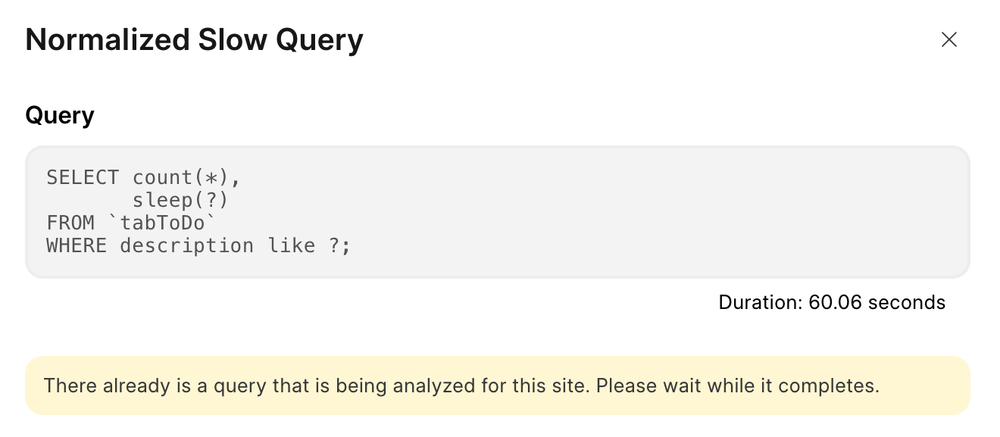
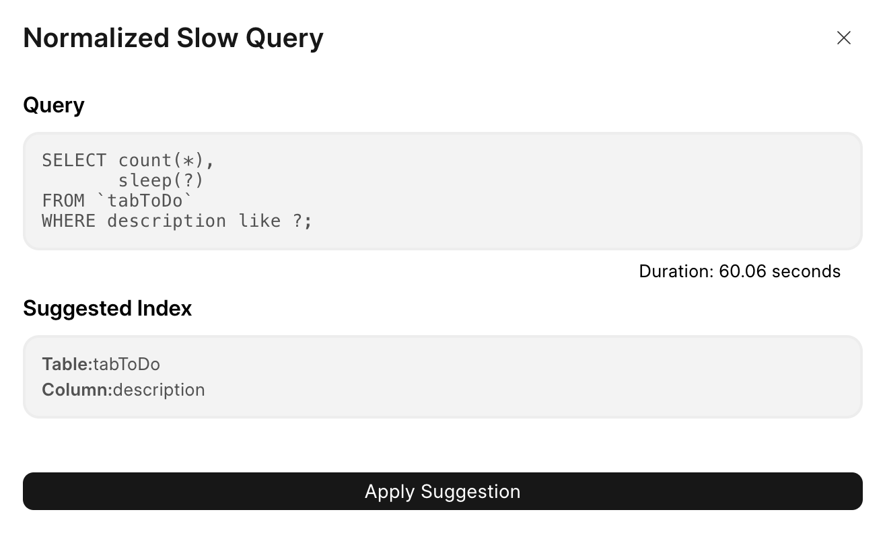
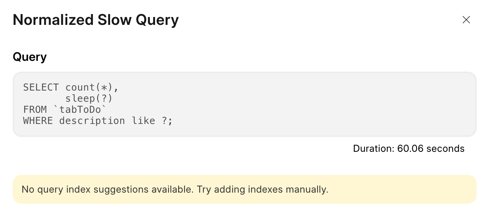
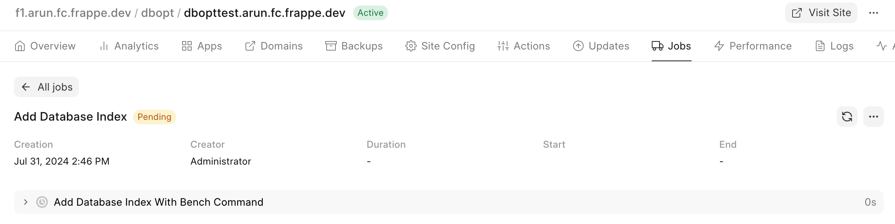

This page consists of all the performance tuning options available to your site.  
  
For more context refer:  
<https://frappecloud.com/docs/faq/mariadb-slow-queries-in-your-site>  
<https://mariadb.com/kb/en/compound-composite-indexes/>  
  

### Add Database Index

1. Click on the row containing the query you would like to analyze and the Normalized Slow Query dialog should open.
2. Click on the Analyze Query button and a toast should appear stating that the Analyze query has started in the background.
3. The above process might take time, anywhere between (10s to 5m) depending on how big the query is and how big the actual tables in the database are.

> You wont be able to analyze multiple queries at once, because this process is rather CPU intensive.  
> If you do so, you will be presented with the below warning.
> 
>   
> 
> 
>
4. Once the analyze query operation is completed, you will be able to see the suggested index.  
  

> If there is no suggested index, you will be shown the below message. There is nothing much you can do at this point apart from adding database indexes manually.  
> 
> 
>
5. Click on Apply Suggestion to add the suggested index. This will create an "Add Database Index" job, whose status you can track from the jobs tab.  
  

> Note : You will be able to add only one index at a time for any given site.
> 
>
