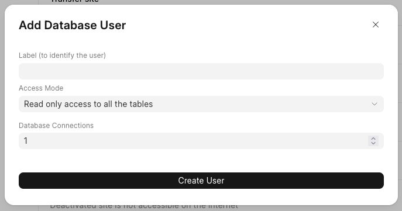
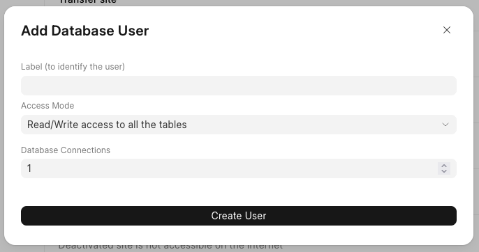
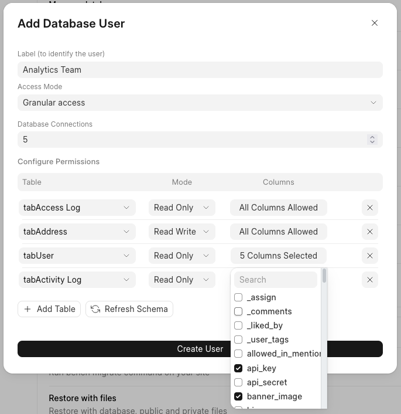
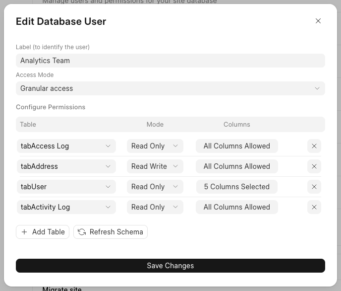
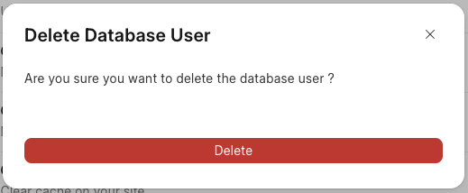

> Database Access is available for sites on USD 50 and above plans
> 
> 

Available Permissions
---------------------

There are three types of permissions that can be assigned to database users:

1. **Read Only**: The user can view data but cannot modify it. They have access to all tables and columns in the database for reading purposes only.
2. **Read Write**: The user can both view and modify data. They have full access to all tables and columns in the database for reading and writing.
3. **Granular**: This permission mode allows for fine-grained control over a user's access. You can grant access to specific tables and, if needed, even restrict access to specific columns within those tables.

Manage Database Users
---------------------

Go to Site Dashboard > Actions > Manage database users

From here, you can view all the existing users of your site's database and manage their permissions and access settings.

  


Create Database User
--------------------

Click on `Add User` button to open the modal for creating database users.

1. **Read Only Mode :**


2. **Read Write Mode :**


3. **Granular Mode :**


> When you begin configuring `Granular Access`, the system will load your database's table schema. This process may take anywhere from 30 seconds to 5 minutes, depending on the number of tables in your database.
> 
> 

You can set the **Read Only** or **Read Write** mode for each table individually. Additionally, if needed, you can restrict access to specific columns within a table by selecting the columns you want to grant access to.

  




Edit Database User
------------------

If you want to modify the permissions for a specific database user, you can easily do so by selecting the **Configure User** option in the row menu. This will allow you to adjust the user’s access levels and permissions as needed.

  


You can make the changes to the user's permissions and save them. Once saved, it may take some time for the updates to take effect.


> Please note that if the database user previously had **Read Only** or **Read Write** global privileges, any changes you make to their permissions will not take effect immediately. These changes will only apply to new connections created after the update.
> 
> 

View Database Credential
------------------------

Click on the three dots in the row and select **View Credential** to view the details for that specific user’s credentials.

  


After selecting **View Credential**, a modal will appear displaying all the necessary information to connect to your site database.

  


Delete Database User
--------------------

Click on the three dots in the row and select **Delete User** to remove the database user.

  


When you click to delete a user, a confirmation modal will appear. Once you confirm the deletion, the selected database user will be deleted.

  


Access Logs
-----------

If you want to view all the SQL query pass through FC SQL Proxy service, you can click on `View Logs` button.


You can filter search result by some keywords or client IP.


Connect External Tools to the Database
--------------------------------------

### Connect Popular Analytics or Business Intelligence tool


| **Tool Name** | **Documentation** |
| --- | --- |
| Frappe Insights | [Click Here](https://frappecloud.com/docs/frappe-insights) |
| Metabase | [Click Here](https://frappecloud.com/docs/connect-metabase) |
| Apache Superset | [Click Here](https://frappecloud.com/docs/connect-apache-superset) |
| Looker Studio | [Click Here](https://frappecloud.com/docs/connect-looker-studio) |
| Power BI Desktop | [Click Here](https://frappecloud.com/docs/connect-power-bi-desktop) |
| Zoho Analytics | [Click Here](https://frappecloud.com/docs/connect-zoho-analytics) |

  


### Other Analytics or Business Intelligence tool

Copy the credentials shown to your analytics tool.

We only allow TLS connections. If you're having issues while connecting then please ensure that the analytics tool is using SSL/TLS and our certificate [chain.pem](https://frappecloud.com/files/chain.pem) for `*.frappe.cloud` (Signed by [Let's Encrypt](https://letsencrypt.org/)).

### MariaDB command line client

  


Copy the command to your console and paste the password when prompted.

You will need to install [mariadb-client or mysql-client](https://mariadb.com/docs/server/connect/clients/mariadb-client/) on your machine.

### 

### 

  


---

FAQ
---

Error when running mysql query
------------------------------

Sometimes you may get errors such as


```
lost connection to server during query
```
In such cases, the application with which you're connecting to the database may not be showing the exact error mysql server is throwing. If you run into any errors when running queries, it's best to try the same query over [mysql client](https://frappecloud.com/docs/sites/database-access#mariadb-mysql-command-line-client) in the command line.  
  
With the error thrown there, you'll be able to tell what exactly went wrong, and if anything is needed from our end, you can take a screenshot of the same and raise support ticket with it.

Timezone doesn't match the timezone of the site
-----------------------------------------------

The [system-time-zone](https://mariadb.com/kb/en/time-zones/#system-time-zone) mariadb variable will not be set to the timezone you see under System Settings. This is simply because that is not how timezone is implemented in Frappe. This is not an issue.
