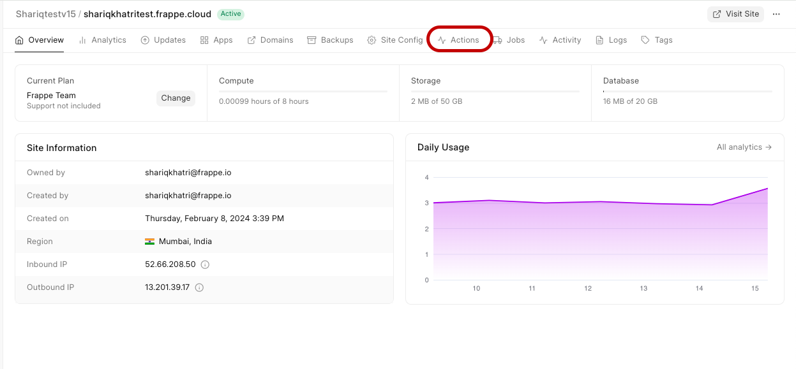
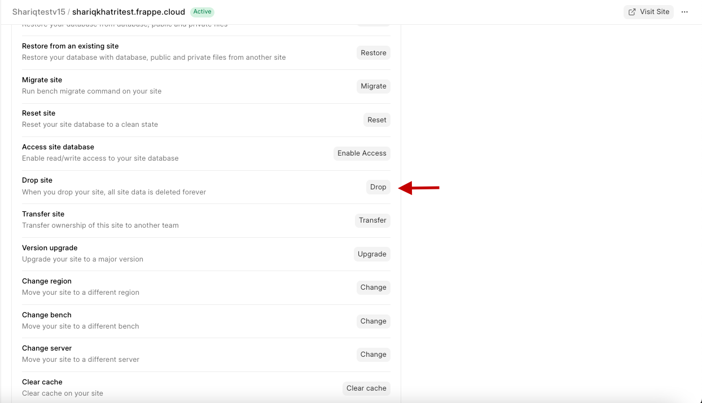
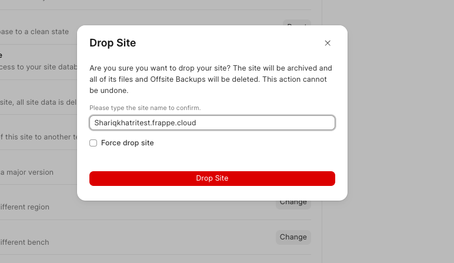

> Note: You will lose all the data in your site as you proceed with these steps
> 
> 

If you don't want need your site anymore (including all the data in the site) and don't want to be billed for the same, you can drop your site from your Frappe Cloud dashboard.

1. From your Frappe Cloud site dashboard click on the **Actions** button
2. Scroll down and click on the Drop button beside the Drop site option 

  
  
3. Type in the name of your site for confirmation and proceed to **permanently** delete your site 
