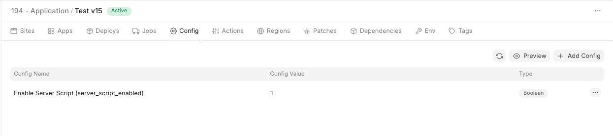

Starting from version 15, Server Scripts are disabled by default to improve security on shared bench groups.

You need to [create a private bench](https://frappecloud.com/docs/benches) to enable server scripts. Public shared bench groups **DO NOT** allow the use of server scripts.

You can refer to this [documentation](https://frappeframework.com/docs/user/en/desk/scripting/server-script) for more information regarding server scripts.  
  
Once your v15 site is moved from public/shared to private bench group, server script will be enabled automatically.  

  

