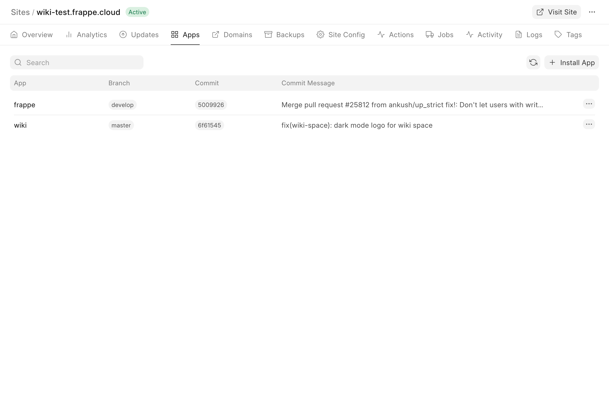
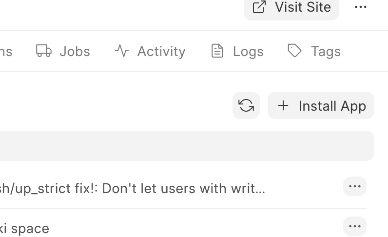
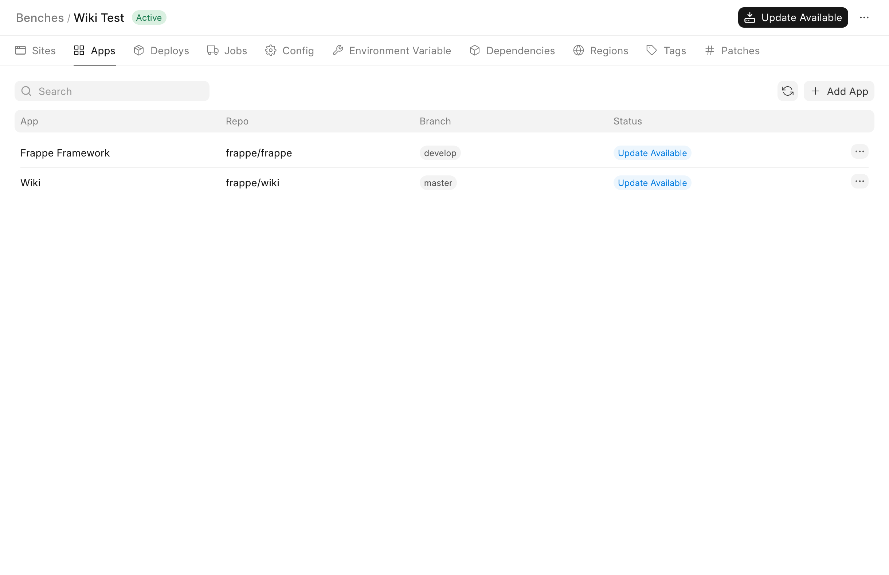
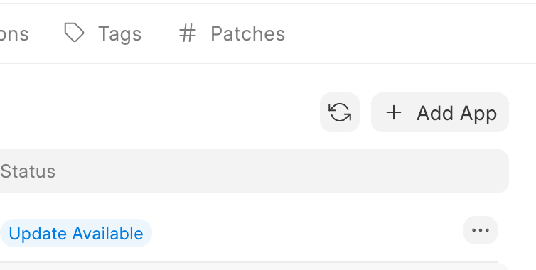
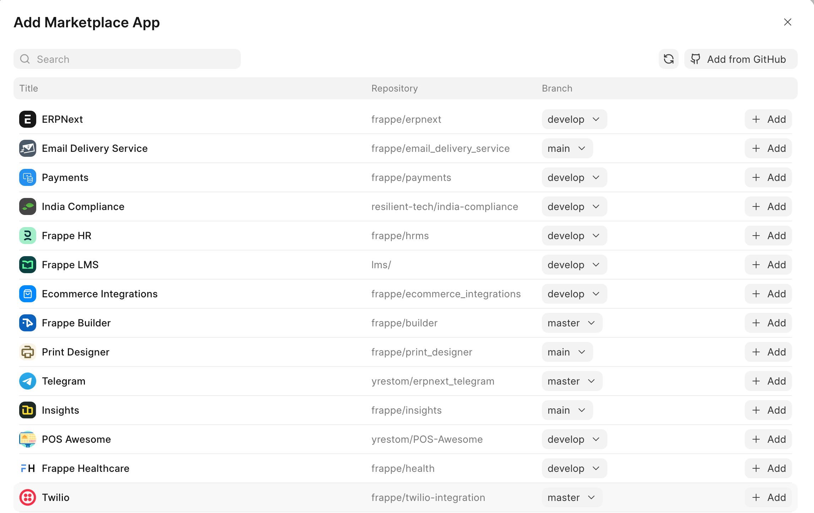
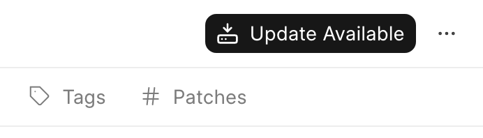
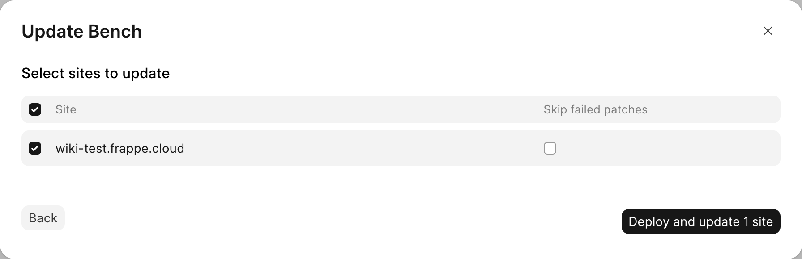

Public sites
------------

You will be able to install featured apps from the [marketplace](https://frappecloud.com/marketplace) only for your site. To install an app

1. Click on Apps tab of your Site's dashboard

2. Click on Install App

3. Select the app you need to install

Sites on Private bench groups
-----------------------------

You can add custom apps or any app from the [marketplace](https://frappecloud.com/marketplace) to your bench group and then install to your site. To install an app on a site on private bench group you have to add app in 2 places.

### Bench Group

1. Click on Apps tab of your Bench Group's dashboard

2. Click on Add App

3. Select any marketplace app or follow [this guide](https://frappecloud.com/docs/benches/custom-app) to install a custom app.

4. Click on the Update Available button to create a new deploy so that your site can install the app

5. Select your site while doing the update and click on deploy and update

### Site

1. Once the update is done click on Apps tab of your Site's dashboard

2. Click on Install App

3. Select the app added earlier to install

  

