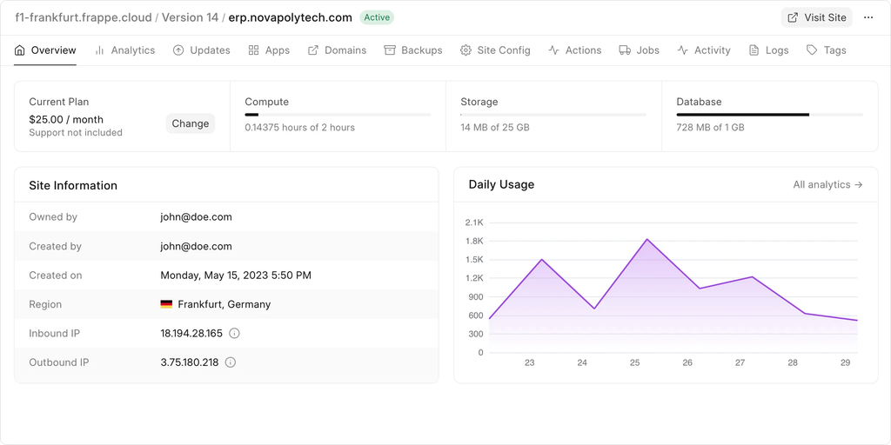

# What is a Site in Frappe Cloud?

A **Site** in Frappe Cloud is a self-contained workspace where your ERPNext or Frappe applications run.  
It is the main unit that contains your data, configurations, apps, and files.

Test changes4

---

### What a Site Includes

| Component | Description |
|----------|-------------|
| Database | Stores all doctypes, logs, fields, permissions, configurations |
| Files | Public/Private uploaded files and attachments |
| Installed Apps | ERPNext, HRMS, or any custom Frappe apps |
| Settings | Email, custom fields, workflows, domains, scheduler |
| Customizations | Scripts, print formats, web pages, report modifications |

---

### How a Site Works

- Each site has its **own database**
- Multiple apps can be installed on one site
- Allows custom code, fields, UI changes without affecting other sites
- Accessible using a custom domain or frappe.cloud subdomain
- Backups, scaling, resources, and updates are managed per site

---

### Site vs App

| Site | App |
|-----|-----|
| Workspace where the system runs | Code that provides features |
| Contains data and configurations | Contains logic, UI, functionality |
| You can install multiple apps on one site | One app can be used across many sites |

---

### What You Can Do With a Site

- Install or remove apps  
- Restore or download backups  
- Manage DNS, SSL, version, server resources  
- Customize ERPNext (fields, scripts, pages)  
- Configure email, users, roles, permissions

---

### In Short

A **Site** is your complete ERPNext/Frappe environment —  
it holds your data, apps, settings, users, and everything else required for your system to run.
