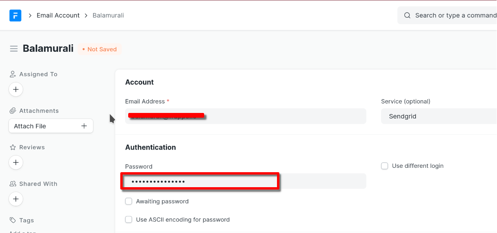
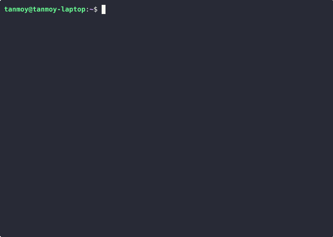

Restore an existing site by uploading backup files or by using a bench from your local setup or from your cloud provider.


> While migrating existing sites using the Frappe Cloud dashboard, some users miss the step to restore the site config details. If you're using the bench command, you won't have to worry about this.
> 
> 

Restore from Backup Files
-------------------------

The easiest way to migrate an existing site on Frappe Cloud is to restore it from backup files.

1. Backup your site using the [bench backup](https://frappeframework.com/docs/user/en/bench/reference/backup) command.
2. You must have 3 files that should be named like the following:


	* 20210817\_125915-sitename-database.sql.gz (Database)
	* 20210817\_125915-sitename-files.tar (Public Files)
	* 20210817\_125915-sitename-private-files.tar (Private Files)
	* 20210817\_125915-sitename-site\_config\_backup.json (Site Config)
3. Create a **New Site** from the Sites tab in the Frappe Cloud Dashboard.
4. Fill out the subdomain and select the version.
5. Once the site is created and active, go to the Actions tab.
6. Click on the **Restore with files** option in the Dangerous Actions group.
7. Now, upload each file you got in Step 2 in their corresponding upload boxes.
8. Click on **Restore**.
9. When the site reaches Active state, you should be able to access the restored site.


> This method is ideal if your backup file's size is less 200MB. If you have larger backup files, you should use the `bench` command to migrate your site.
> 
> 

### Encryption Key

This key is used to encrypt passwords. This key is created automatically on a fresh site. Upon restoring a site from backup, this key will have to be copied into the site config as well to be able to use existing passwords.

In cases where you have lost your previous encryption key, and system has already generated a new key for you (you can verify this in your Frappe Cloud dashboard), you may stumble upon an "Encryption Key error". This is because certain password fields were encrypted using the old key. Now when then system tries to use those passwords, it fails as it tries to decrypt those passwords with the new key. In such cases, re-entering the value in those password fields will fix the problem (same password as before is fine). This works as re-entering the password will again encrypt the password using the new key.


> TLDR; Re-enter all password fields to encrypt them with new encryption key.
> 
> 

Eg: **Email Account** is a common doctype who's document has a password field. You will want to re-enter the annotated password field if you face errors while sending email.

  


### Restoring an encrypted backup

If you are experiencing this error while restoring your existing backup to Frappe Cloud.


```
Encrypted backup file detected. Decrypting using site config. Decryption failed. Please provide a valid key and try again.
```

To fix this `backup_encryption_key` should be added in [site config](https://frappecloud.com/docs/sites/site-config) before restoring.


Migrate using FC Restore CLI
------------------

### Setup FC Restore CLI

**Setup on Windows**

1. Open a powershell window.
2. Run this command to download the CLI

   ```
   Set-ExecutionPolicy -ExecutionPolicy Bypass -Scope Process
   Invoke-WebRequest -Uri "https://raw.githubusercontent.com/frappe/fc-scripts/refs/heads/develop/fcrestore/cli.ps1" -OutFile cli.ps1
    .\cli.ps1
   ```

> In some cases, Windows Defender can flag the CLI with `trojan:Win32/Sabsik.FL.A!ml` virus. It's a false positive. You can safely whitelist the binary or disable windows defender tmeporarily.

**Setup on Linux / MacOS**

1. Open a new terminal
2. Run this command to setup the CLI

    ```bash
    curl -fsSL https://raw.githubusercontent.com/frappe/fc-scripts/refs/heads/develop/fcrestore/cli.sh | bash -
    ```
    
### User Guide

#### Login to CLI

You need to login to CLI using your Frappe Cloud account.




#### Restore Site

The CLI will guide you through the restoration process. You’ll need to choose what you want to restore — database, public files, or private files and upload the corresponding files.

Watch the video below for a step-by-step overview:


> If you have restored the database, please make sure to collect the encryption key from backup's site_config.json and set it on the new site. Please check above for the guide,


#### Cleanup
1. If you want to logout, you can just open up the CLI and it will ask you whether you want to logout. You can use that option.
2. Also there will be a `sessio.json` file in the same folder. You can just remove it for cleanup.


Migrate using Bench
-------------------

If you are running Frappe sites, most likely you have `bench` installed. You can run the following command to restore a site from your bench to Frappe Cloud.


```
bench migrate-to
```
You can run this command even from your local setup. If your site is hosted on a cloud provider like Digital Ocean or Amazon AWS, you must SSH into your server, and run this command.

The bench command provides a form similar to the dashboard UI. It's probably the easiest way to migrate your site to Frappe Cloud.  
  
It is prompt-based and even allows you to pass external backup files, this way there is no need to restore a site from backup, just to migrate it again somewhere else.  
  


> If you are migrating a site from external backup files, pass the absolute path to said files.
> 
> 


> This method will work only if your sites are on Version [**v14.78.2**](https://github.com/frappe/frappe/releases/tag/v14.78.2) (for v14) or [**v15.36.1**](https://github.com/frappe/frappe/releases/tag/v15.36.1) (for v15) or [greater](https://github.com/frappe/frappe/pull/27115). If you are on an older version or this command didn't work for you, you can try the Python Script method explained later.
> 
> 

Migrate using Python Script
---------------------------

If you are on an older version of Frappe (older than version 11) or the Bench command didn't work for you, you can try this method.

Make sure you have `wget` installed. Run the following commands from your bench directory:


```
wget https://frappecloud.com/assets/press/migrate
chmod +x migrate
./migrate
  
```
Restore Backup on another site
------------------------------
You can restore backup on another site by following the given steps:-  
  
1. Click on the Backups tab from your site dashboard on which you have the offsite backup stored.  
  
2. Click on the three dots of the offsite backup you wish to restore it on another site.  
  
3. Once you click on the option you will be asked to select the site you want to restore it on, you can click the site and click on restore to continue.


Migrate using site URL
----------------------

While creating a new site using the new site creation wizard, you can go the **Migrate from Site URL** tab while in the **Restore from Existing Site** step and follow the given steps:

  


* Enter your existing site URL
* Enter your old site user credentials
* Click on Get Backups

Get Backups will fetch backup files from your old site to restore on Frappe Cloud.

FAQ
---

### tar/gzip command fails with unexpected EOF

This is a common error faced by many users. We believe this happens due to a corrupt file in the tarball. If this happens to you during site restore, please try again with a fresh backup of the site.


> If you continue to face the error with fresh backup. Try taking a backup after putting your site on maintenance mode.
> 
> 

### Uploading files backup that's too large

Sometimes, it maybe the case that your private and public files are too large to be uploaded from the UI. You may also have stopped hosting the site elsewhere so both **Migrate using site URL** and **Migrate using Bench** would become unfeasible. In such cases, you if you have a [private bench group](https://frappecloud.com/docs/benches/create-new), you can upload the files separately over [ssh](https://frappecloud.com/docs/benches/ssh)  
  


1. First you need to upload the files backup to some storage service such as Google Drive
2. Afterwards, you can ssh into the bench with your site and navigate to the files directory of the same
3. Then you can use a command like `wget` to get the backups from a link to the aforementioned storage service
4. After getting the backup, you can extract the same with `tar` command
