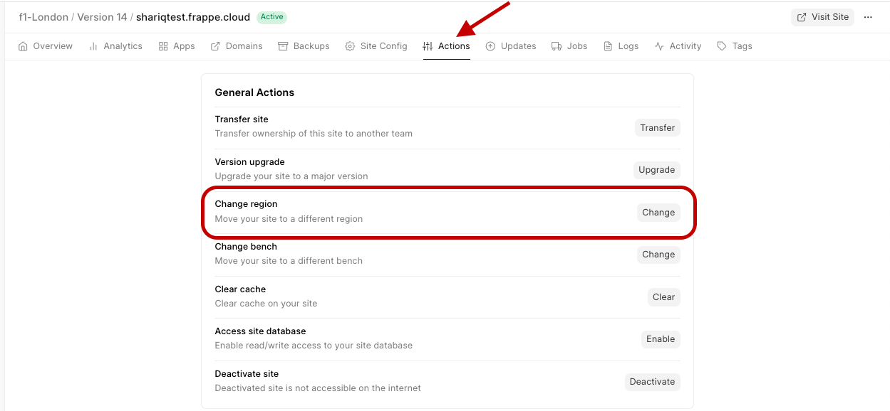
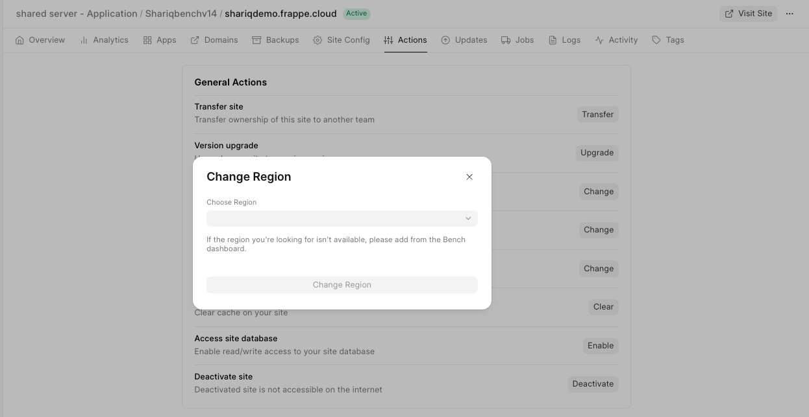
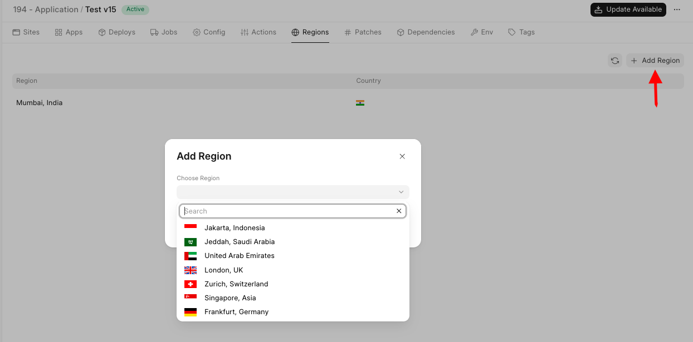
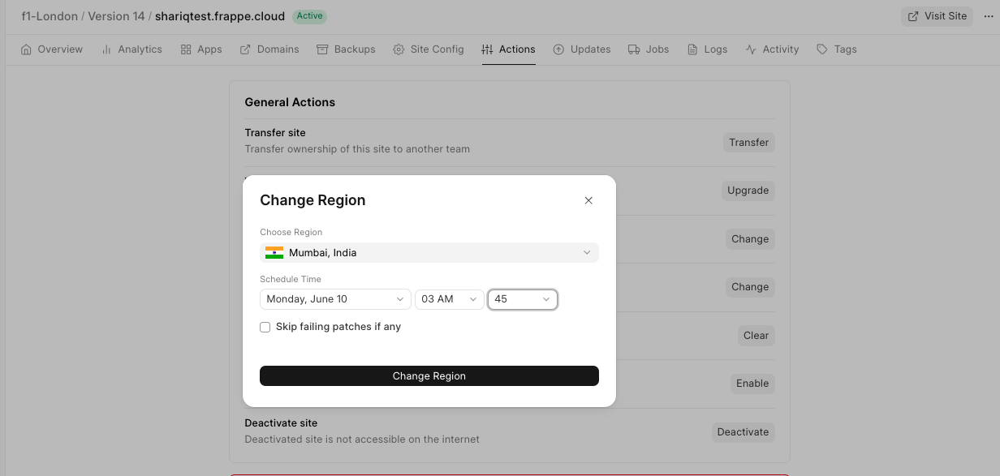

You can directly schedule Site Migration across region from a site's dashboard.

> Sites on public bench groups won't be able to add region to the bench group. Contact us [support.frappe.io](http://support.frappe.io) to add them.
> 
> 

1. Go to your site Dashboard → Actions → Change Region.

  

2. Select the region you want to migrate your site.  
  

> If the region is not available, you can add a region to your bench group from your Bench group dashboard → Regions → Add Region.   
> 
> 
>
3. If the region is available in the current bench group, input an appropriate date and time (leave it untouched if you want the migration to happen immediately) and then click on Change Region and the Site Migration will be done in the scheduled time.

  

