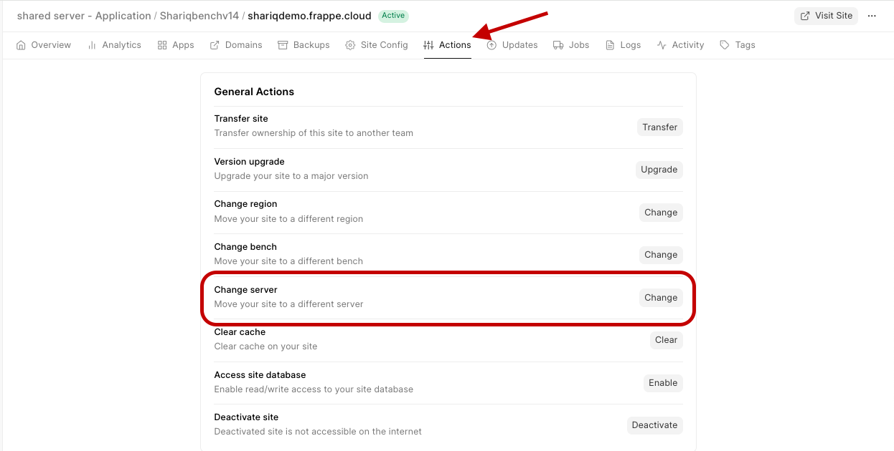

You can directly schedule Site Migration across server from a site's dashboard.

> For moving your site to a dedicated server from a public bench group
> 
> 1. Use [Change Bench Group](https://frappecloud.com/docs/sites/move-site-to-private-bench) option to move the site to a private bench group
> 2. Follow the below steps to move the site to your dedicated server
> 

1. To change the server for the site go to your site Dashboard>Actions>Change Server.

2. Select the server you want to move to (Your team should own the server).

3. If the selected server isn't added to the bench group add it by clicking on Add Server to Bench Group.

4. Click Migrate Site to Server if the target server is added to the bench group and the Site Migration will be done in the scheduled time (or leave it untouched if you want it to start immediately).

  

### Why is so much additional storage required when moving site to dedicated server?

  
The reason for storage that is much larger than backup size is because during site/backup restore, the backup files are uncompressed, due to which the disk storage spikes much higher than your database size. To avoid any failure during the restore, it is recommended you have enough storage on the server.   
  
In such cases, you can add the required add-on storage on the server to continue with restoration.

  

