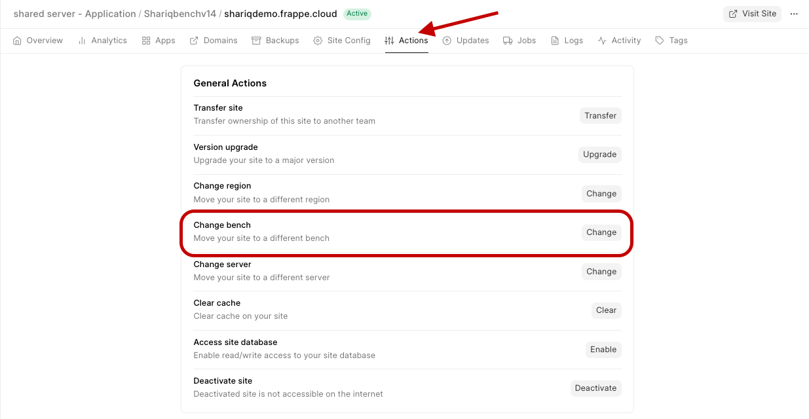
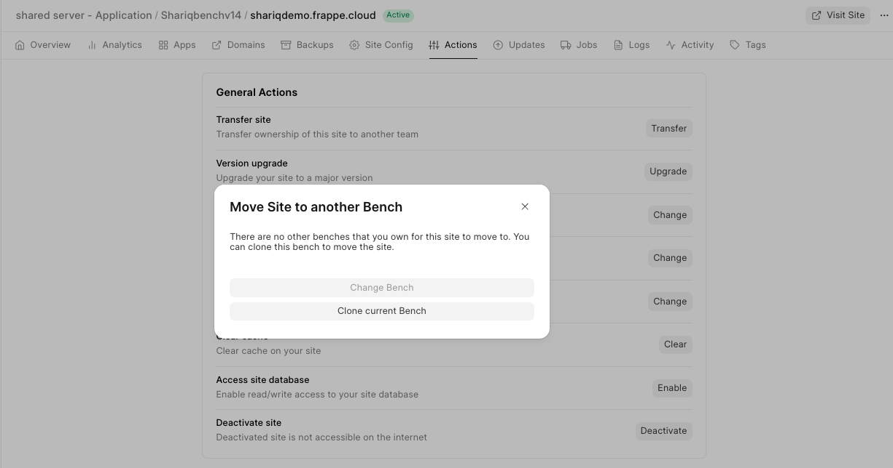
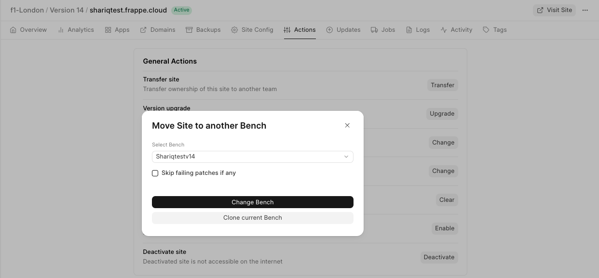

> If you want to move to a dedicated server refer [Move site across server](https://frappecloud.com/docs/sites/move-site-across-server)
> 
> **Note:** If you need to move to a bench group on another server, you need to move the current bench group [to the server](https://frappecloud.com/docs/sites/move-site-across-server) first, and after that is done, do **Change bench group** by following this doc.
> 
> 

You can directly schedule Site Migration to a private bench group from a site's dashboard.

1. To change your site to a private bench group, go to your site Dashboard>Actions>Change Bench Group

  

2. If you don't have an available private bench group, click on Clone current Bench Group to create a compatible private bench group for your site to move to.

  

3. If there's a compatible private bench group, click on Change Bench Group to start moving the site to the chosen bench group.

  

  

