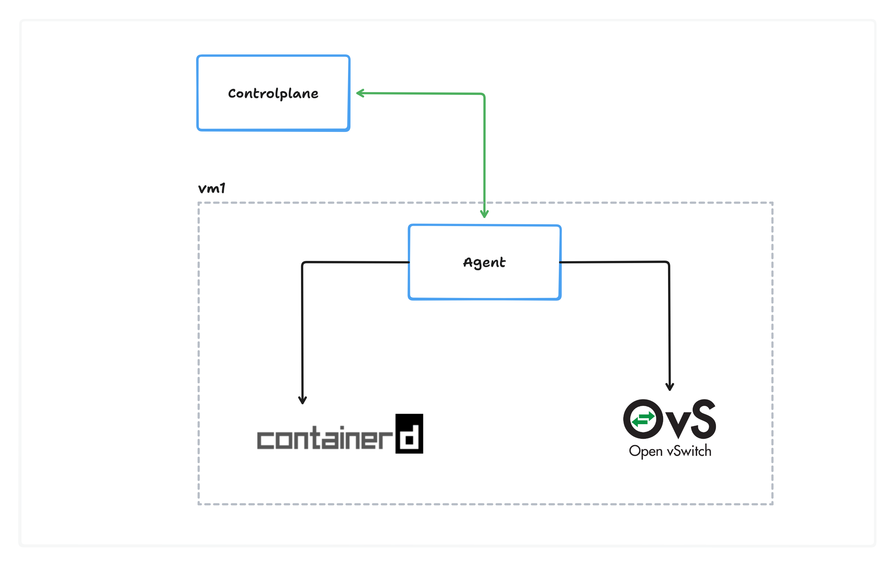

To obtain a static IP, you will need to migrate your site to a dedicated server and request a static IP to be assigned to your site in advance. (You can request us via support portal)

Note:- The IP that you will get by default will not be static

